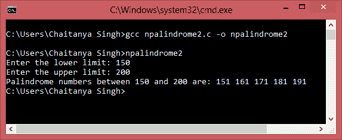

# C 程序：查找给定范围内的回文数

> 原文： [https://beginnersbook.com/2015/02/c-program-to-find-palindrome-numbers-in-a-given-range/](https://beginnersbook.com/2015/02/c-program-to-find-palindrome-numbers-in-a-given-range/)

在上一个教程中，我们学习了[如何检查数字是否是回文](https://beginnersbook.com/2015/02/c-program-to-check-if-a-number-is-palindrome-or-not/ "C Program to check if a number is palindrome or not")。在本教程中，我们将学习如何在给定范围内找到回文数。

#### C 程序 - 在给定范围内生成回文数

```c
#include<stdio.h>
int main(){
   int num, rem, reverse_num, temp, start, end;

   printf("Enter the lower limit: ");
   scanf("%d",&start);

   printf("Enter the upper limit: ");
   scanf("%d",&end);

   printf("Palindrome numbers between %d and %d are: ",start,end);
   for(num=start;num<=end;num++){
      temp=num;
      reverse_num=0;
      while(temp){
         rem=temp%10;
         temp=temp/10;
         reverse_num=reverse_num*10+rem;
      }
      if(num==reverse_num)
         printf("%d ",num);
   }
   return 0;
}
```

**输出：**
