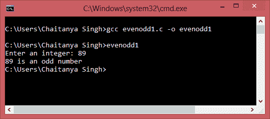

# C 程序检查数字是偶数还是奇数

> 原文： [https://beginnersbook.com/2015/02/c-program-to-check-if-number-is-even-or-odd/](https://beginnersbook.com/2015/02/c-program-to-check-if-number-is-even-or-odd/)

如果一个数字可以被 2 整除，则它是偶数，否则它是一个奇数。在本文中，我们分享了两种方式（两个 C 程序）来检查输入数字是偶数还是奇数。 1）使用模数运算符（％）2）使用按位运算符。

#### 程序 1：使用模数运算符

```
/* Program to check whether the input integer number 
 * is even or odd using the modulus operator (%)
 */
#include<stdio.h>
int main()
{
   // This variable is to store the input number 
   int num;

   printf("Enter an integer: ");
   scanf("%d",&num);

   // Modulus (%) returns remainder
   if ( num%2 == 0 )
      printf("%d is an even number", num);
   else
      printf("%d is an odd number", num);

   return 0;
}
```

**输出：**


#### 程序 2：使用按位运算符

```
/* Program to check if number is even or odd
 * using bitwise operator
 */
#include<stdio.h>

int main()
{
   int n;

   printf("Enter an integer: ");
   scanf("%d",&n);

   if ( n & 1)
      printf("%d is an odd number", n);
   else
      printf("%d is an even number", n);

   return 0;
}
```

**输出：**
