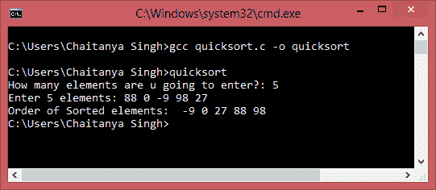

# C 中的快速排序程序

> 原文： [https://beginnersbook.com/2015/02/quicksort-program-in-c/](https://beginnersbook.com/2015/02/quicksort-program-in-c/)

快速排序是一种分而治之的算法。步骤如下：1）从数组中选取一个元素，该元素称为支点元素。 2）将两个数组中未排序的元素数组除以第一个子数组中小于数据透视的值，而值大于数据透视的所有元素都在第二个子数组中（相等的值可以是任意一种）。此步骤称为分区操作。 3）递归地重复步骤 2（直到子数组被排序）到具有较小值的元素的子数组，并且分别重复到具有较大值的元素的子数组。我们在以下 C 程序中实现了相同的逻辑。

#### C 程序 - 快速排序算法实现

```c
#include<stdio.h>
void quicksort(int number[25],int first,int last){
   int i, j, pivot, temp;

   if(first<last){
      pivot=first;
      i=first;
      j=last;

      while(i<j){
         while(number[i]<=number[pivot]&&i<last)
            i++;
         while(number[j]>number[pivot])
            j--;
         if(i<j){
            temp=number[i];
            number[i]=number[j];
            number[j]=temp;
         }
      }

      temp=number[pivot];
      number[pivot]=number[j];
      number[j]=temp;
      quicksort(number,first,j-1);
      quicksort(number,j+1,last);

   }
}

int main(){
   int i, count, number[25];

   printf("How many elements are u going to enter?: ");
   scanf("%d",&count);

   printf("Enter %d elements: ", count);
   for(i=0;i<count;i++)
      scanf("%d",&number[i]);

   quicksort(number,0,count-1);

   printf("Order of Sorted elements: ");
   for(i=0;i<count;i++)
      printf(" %d",number[i]);

   return 0;
}

```

**输出：**
