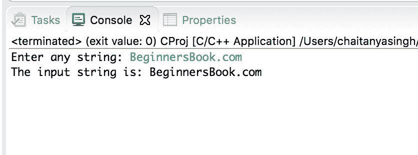

# C 程序：使用指针打印字符串

> 原文： [https://beginnersbook.com/2019/02/c-program-to-print-string-using-pointer/](https://beginnersbook.com/2019/02/c-program-to-print-string-using-pointer/)

在本教程中，我们将编写一个 C 程序，使用指针变量逐个字符地打印字符串。要了解此程序，您应该具备以下主题的基本知识：

*   [C 指针](https://beginnersbook.com/2014/01/c-pointers/)
*   [C 数组](https://beginnersbook.com/2014/01/c-arrays-example/)

## 使用指针打印字符串的程序

在下面的程序中，我们声明了一个`char`数组来保存输入字符串，并且我们已经声明了一个`char`指针。我们已经将数组基地址（数组的第一个元素的地址）分配给指针，然后我们通过在[`while`循环](https://beginnersbook.com/2014/01/c-while-loop/)中递增指针来显示`char`数组的每个元素。

```c
#include <stdio.h>
int main()
{
    char str[100];
    char *p;

    printf("Enter any string: ");
    fgets(str, 100, stdin);

    /* Assigning the base address str[0] to pointer
     * p. p = str is same as p = str[0]
     */
    p=str;

    printf("The input string is: ");
    //'\0' signifies end of the string
    while(*p!='\0')
        printf("%c",*p++);

    return 0;
}
```

**输出：**


#### 相关 C 示例

1\. [C 程序：用指针交换两个数字](https://beginnersbook.com/2019/02/c-program-to-swap-two-numbers-using-pointers/)
2\. [C 程序：创建，初始化并访问指针变量](https://beginnersbook.com/2019/02/c-program-to-create-initialize-and-access-a-pointer-variable/)
3\. [C 程序：查找前`n`个自然数的总和](https://beginnersbook.com/2017/10/c-program-to-find-the-sum-of-first-n-natural-numbers/)
4\. [C 程序：找到两个数的平均值](https://beginnersbook.com/2017/09/c-program-to-find-the-average-of-two-numbers/)