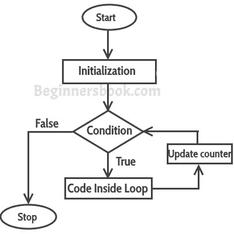

# C 编程中的循环

> 原文： [https://beginnersbook.com/2014/01/c-for-loop/](https://beginnersbook.com/2014/01/c-for-loop/)

循环用于重复执行语句块，直到给定条件返回`false`。

## C `for`循环

这是 [C 编程](https://beginnersbook.com/2014/01/c-tutorial-for-beginners-with-examples/)中最常用的循环之一。

**`for`循环语法：**

```c
for (initialization; condition test; increment or decrement)
{
       //Statements to be executed repeatedly
}
```

### `for`循环流程图



**步骤 1：**首次初始化发生，计数器变量初始化。

**步骤 2：**在第二步中检查条件，其中计数器变量由给定条件测试，如果条件返回`true`则执行`for`循环体内的 C 语句，如果条件返回`false`，则`for`循环终止，控制流退出循环。

**步骤 3：**成功执行循环体内语句后，计数器变量会递增或递减，具体取决于操作（`++`或`--`）。

### `for`循环的示例

```c
#include <stdio.h>
int main()
{
   int i;
   for (i=1; i<=3; i++)
   {
       printf("%d\n", i);
   }
   return 0;
}

```

输出：

```c
1
2
3

```

### C 中的各种形式的`for`循环

我在以下所有例子中使用变量`num`作为计数器：

1）这里使用`num = num + 1`而不是`num ++`。

```c
for (num=10; num<20; num=num+1)
```

2）初始化部分可以从循环中跳过，如下所示，计数器变量在循环之前声明。

```c
int num=10;
for (;num<20;num++)
```

**注意：**即使我们可以跳过初始化部分但是分号（`;`）必须保留，否则你将得到编译错误。

3）与初始化一样，您也可以跳过增量部分，如下所示。在这种情况下，分号（`;`）必须在条件逻辑之后。在这种情况下，增量或减量部分在循环内完成。

```c
for (num=10; num<20; )
{
      //Statements
      num++;
}
```

4）这也是可能的。计数器变量在循环之前初始化并在循环内递增。

```c
int num=10;
for (;num<20;)
{
      //Statements
      num++;
}
```

5）如上所述，计数器变量也可以递减。在下面的示例中，每次循环运行时变量都会递减，直到条件`num > 10`返回`false`。

```c
for(num=20; num>10; num--)
```

### C 中的嵌套`for`循环

循环嵌套也是可能的。让我们举个例子来理解这个：

```c
#include <stdio.h>
int main()
{
   for (int i=0; i<2; i++)
   {
	for (int j=0; j<4; j++)
	{
	   printf("%d, %d\n",i ,j);
	}
   }
   return 0;
}

```

Output:

```c
0, 0
0, 1
0, 2
0, 3
1, 0
1, 1
1, 2
1, 3
```

在上面的例子中，我们在另一个`for`循环中有一个`for`循环，这称为循环嵌套。我们使用嵌套`for`循环的示例之一是[二维数组](https://beginnersbook.com/2014/01/2d-arrays-in-c-example/)。

## 在 C 中循环内部进行多次初始化

我们可以在`for`循环中进行多次初始化，如下所示。

```c
for (i=1,j=1;i<10 && j<10; i++, j++)
```

**上面的循环和简单的`for`循环有什么区别？**

1. 它正在初始化两个变量。注意：两者都用逗号（`,`）分隔。

2. 它有使用 与（`&&`）逻辑运算符连接在一起的两个测试条件。注意：您不能使用以逗号分隔的多个测试条件，您必须使用逻辑运算符，例如`&&`或`||`连接条件。

3. 增量部分有两个变量。**注意：**应以逗号分隔。

### 具有多个测试条件的`for`循环的示例

```c
#include <stdio.h>
int main()
{
   int i,j;
   for (i=1,j=1 ; i<3 || j<5; i++,j++)
   {
	printf("%d, %d\n",i ,j);
   }
   return 0;
}
```