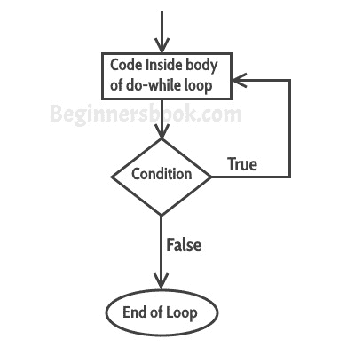

# C 编程的`while`循环

> 原文： [https://beginnersbook.com/2014/01/c-dowhile-loop/](https://beginnersbook.com/2014/01/c-dowhile-loop/)

在上一个教程中，我们在 C 中学习 [while 循环。 do while 循环类似于 while 循环，但有一个例外，它在检查条件之前执行 do-body 体内的语句。另一方面，在 while 循环中，首先检查条件，然后执行 while 循环中的语句。所以你可以说如果条件在第一个位置是假的那么 do while 会运行一次，但是 while 循环根本不会运行。](https://beginnersbook.com/2014/01/c-while-loop/)

## C - `do..while`循环

do-while 循环的语法

```
do
{
    //Statements 

}while(condition test);
```

### `do..while`循环的流程图



### `do..while`循环的示例

```
#include <stdio.h>
int main()
{
	int j=0;
	do
	{
		printf("Value of variable j is: %d\n", j);
		j++;
	}while (j<=3);
	return 0;
}

```

**输出：**

```
Value of variable j is: 0
Value of variable j is: 1
Value of variable j is: 2
Value of variable j is: 3

```

## C 中的`while` vs `do..while`循环

**使用 while 循环：**

```
#include <stdio.h>
int main()
{
    int i=0;
    while(i==1)
    {
	printf("while vs do-while");
    }
    printf("Out of loop");
}
```

**Output:**

```
Out of loop
```

**使用 do-while 循环**的相同示例

```
#include <stdio.h>
int main()
{
   int i=0;
   do
   {
	printf("while vs do-while\n");
   }while(i==1);
   printf("Out of loop");
}
```

**Output:**

```
while vs do-while
Out of loop
```

**说明：**正如我在本指南开头所提到的，do-while 至少运行一次，即使条件为 false 因为条件被评估，执行循环体之后也是如此。