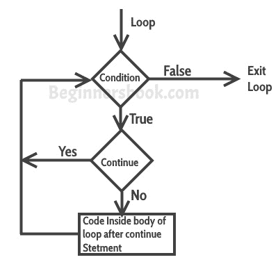

# C - 用例子继续声明

> 原文： [https://beginnersbook.com/2014/01/c-continue-statement/](https://beginnersbook.com/2014/01/c-continue-statement/)

**继续声明**用于[循环](https://beginnersbook.com/2014/01/c-loops-examples/)。当在循环内遇到 continue 语句时，控件跳转到循环的开头以进行下一次迭代，跳过当前迭代循环体内语句的执行。

## C - 继续声明

句法：

```
continue;
```

### 继续声明的流程图



### 示例：在 for 循环中继续语句

```
#include <stdio.h>
int main()
{
   for (int j=0; j<=8; j++)
   {
      if (j==4)
      {
	    /* The continue statement is encountered when
	     * the value of j is equal to 4.
	     */
	    continue;
       }

       /* This print statement would not execute for the
	* loop iteration where j ==4  because in that case
	* this statement would be skipped.
	*/
       printf("%d ", j);
   }
   return 0;
}

```

输出：

```
0 1 2 3 5 6 7 8
```

输出中缺少值 4，为什么？当变量 j 的值为 4 时，程序遇到一个 continue 语句，它使控件在 for 循环的开头跳转以进行下一次迭代，跳过当前迭代的语句（这就是 printf 在 j 时没有执行的原因）等于 4）。

### 示例：在 While 循环中使用 continue

在这个例子中，我们在 while 循环中使用`continue`。当使用 while 或 do-while 循环时，需要在`continue`上方放置一个递增或递减语句，以便在下一次迭代时更改计数器值。例如，如果我们不在“if”的主体中放置反陈述，那么 counter 的值将无限期地保持为 7。

```
#include <stdio.h>
int main()
{
    int counter=10;
    while (counter >=0)
    {
	 if (counter==7)
	 {
	      counter--;
	      continue;
	 }
	 printf("%d  ", counter);
	 counter--;
    }
    return 0;
}

```

Output:

```
10 9 8 6 5 4 3 2 1 0
```

当计数器值为 7 时，将跳过 print 语句。

### do-While 循环继续的另一个例子

```
#include <stdio.h>
int main()
{
   int j=0;
   do
   {
      if (j==7)
      {
         j++;
         continue;
      }
      printf("%d ", j);
      j++;
   }while(j<10);
   return 0;
}

```

Output:

```
0 1 2 3 4 5 6 8 9
```