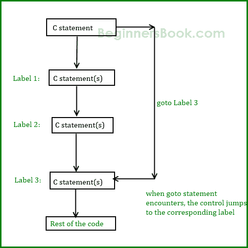

# C - `goto`语句

> 原文： [https://beginnersbook.com/2014/01/c-goto-statement/](https://beginnersbook.com/2014/01/c-goto-statement/)

很少使用 goto 语句，因为它会使程序混乱，可读性和复杂性降低。而且，当使用它时，程序的控制将不容易跟踪，因此它使测试和调试变得困难。

## C - `goto`语句

当在 C 程序中遇到 goto 语句时，控制流直接跳转到 goto
**C 语言中 goto 语句的语法中提到的标签**

```c
goto label_name;
..
..
label_name: C-statements
```

### `goto`流程图



### `goto`语句的示例

```c
#include <stdio.h>
int main()
{
   int sum=0;
   for(int i = 0; i<=10; i++){
	sum = sum+i;
	if(i==5){
	   goto addition;
	}
   }

   addition:
   printf("%d", sum);

   return 0;
}

```

输出：

```c
15
```

**说明：**在这个例子中，我们有一个标签`addition`，当 i 的值（内部循环）等于 5 时，我们使用 goto 跳转到这个标签。这就是总和显示直到 5 的数字之和的原因，即使循环设置为从 0 到 10 运行。