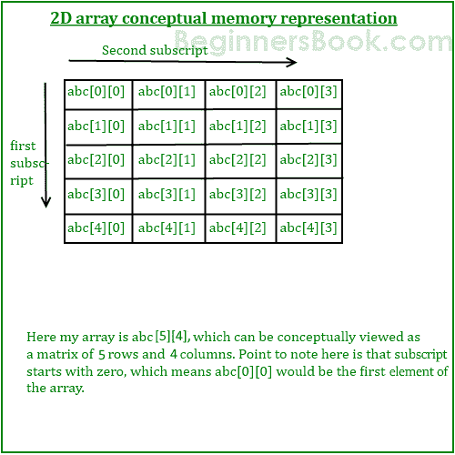
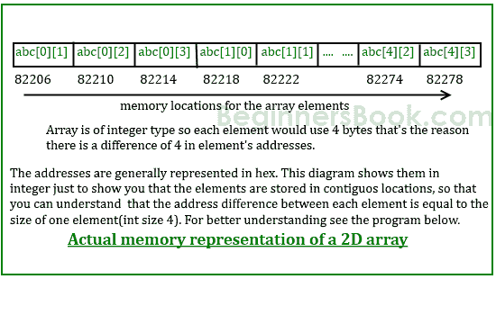

# C 编程中的二维（2D）数组

> 原文： [https://beginnersbook.com/2014/01/2d-arrays-in-c-example/](https://beginnersbook.com/2014/01/2d-arrays-in-c-example/)

数组数组称为 2D 数组。[C 编程](https://beginnersbook.com/2014/01/c-tutorial-for-beginners-with-examples/)中的二维（2D）数组也称为矩阵。矩阵可以表示为行和列的表。在我们讨论更多关于二维数组之前，让我们来看看下面的 C 程序。

## 简单的二维（2D）数组示例

现在不用担心如何初始化二维数组，我们稍后会讨论该部分。该程序演示了如何将用户输入的元素存储在二维数组中以及如何显示二维数组的元素。

```c
#include<stdio.h>
int main(){
   /* 2D array declaration*/
   int disp[2][3];
   /*Counter variables for the loop*/
   int i, j;
   for(i=0; i<2; i++) {
      for(j=0;j<3;j++) {
         printf("Enter value for disp[%d][%d]:", i, j);
         scanf("%d", &disp[i][j]);
      }
   }
   //Displaying array elements
   printf("Two Dimensional array elements:\n");
   for(i=0; i<2; i++) {
      for(j=0;j<3;j++) {
         printf("%d ", disp[i][j]);
         if(j==2){
            printf("\n");
         }
      }
   }
   return 0;
}
```

输出：

```c
Enter value for disp[0][0]:1
Enter value for disp[0][1]:2
Enter value for disp[0][2]:3
Enter value for disp[1][0]:4
Enter value for disp[1][1]:5
Enter value for disp[1][2]:6
Two Dimensional array elements:
1 2 3 
4 5 6 

```

## 2D 数组的初始化

在声明期间有两种方法初始化二维数组。

```c
int disp[2][4] = {
    {10, 11, 12, 13},
    {14, 15, 16, 17}
};
```

要么

```c
int disp[2][4] = { 10, 11, 12, 13, 14, 15, 16, 17};
```

虽然上述两个声明都是有效的，但我建议您使用第一个方法，因为它更具可读性，因为您可以在此方法中可视化 2d 数组的行和列。

#### 初始化 2D 数组时必须考虑的事项

我们已经知道，当我们在声明期间初始化一个普通的[数组](https://beginnersbook.com/2014/01/c-arrays-example/)（或者你可以说是一维数组）时，我们不需要指定它的大小。但是，对于 2D 数组而言，情况并非如此，即使在声明期间指定元素，也必须始终指定第二个维度。让我们在几个例子的帮助下理解这一点 -

```c
/* Valid declaration*/
int abc[2][2] = {1, 2, 3 ,4 }  
/* Valid declaration*/ 
int abc[][2] = {1, 2, 3 ,4 }  
/* Invalid declaration – you must specify second dimension*/
int abc[][] = {1, 2, 3 ,4 }   
/* Invalid because of the same reason  mentioned above*/
int abc[2][] = {1, 2, 3 ,4 }
```

## 如何将用户输入数据存储到 2D 数组中

我们可以使用这个公式计算二维数组可以有多少元素：

数组`arr[n1][n2]`可以有`n1 * n2`个元素。我们在下面的示例中具有的数组具有尺寸 5 和 4。这些尺寸称为下标。所以这个数组的**第一个下标**值为 5，**第二个下标**值为 4。

因此数组`abc[5][4]`可以有`5 * 4 = 20`个元素。

为了存储用户输入的元素，我们使用两个`for`循环，其中一个是嵌套循环。外循环从 0 到（第一个下标减一），内部`for`循环从 0 到（第二个下标减一）。这样，用户输入元素的顺序将是`abc[0][0]`，`abc[0][1]`，`abc[0][2]`......等等。

```c
#include<stdio.h>
int main(){
   /* 2D array declaration*/
   int abc[5][4];
   /*Counter variables for the loop*/
   int i, j;
   for(i=0; i<5; i++) {
      for(j=0;j<4;j++) {
         printf("Enter value for abc[%d][%d]:", i, j);
         scanf("%d", &abc[i][j]);
      }
   }
   return 0;
}
```

在上面的例子中，我有一个整数类型的 2D 数组`abc`。从概念上讲，你可以像这样想象上面的数组：



然而，这个数组在内存中的实际表示将是这样的：



## 指针和二维数组

我们知道一维数组名称作为指向数组的基本元素（第一个元素）的指针。然而，在 2D 数组的情况下，逻辑略有不同。您可以将 2D 数组视为多个一维数组的集合。

**所以** `abc[0]`将拥有第一行第一个元素的地址（如果我们考虑上面的图表编号 1）。
类似地`abc[1]`将具有第二行的第一个元素的地址。为了更好地理解它，让我们编写一个 C 程序 -

```c
#include <stdio.h>
int main()
{
   int abc[5][4] ={
            {0,1,2,3},
            {4,5,6,7},
            {8,9,10,11},
            {12,13,14,15},
            {16,17,18,19}
            };
    for (int i=0; i<=4; i++)
    {
        /* The correct way of displaying an address would be
         * printf("%p ",abc[i]); but for the demonstration
         * purpose I am displaying the address in int so that
         * you can relate the output with the diagram above that
         * shows how many bytes an int element uses and how they
         * are stored in contiguous memory locations.
         *
         */
    	printf("%d ",abc[i]);
    }
    return 0;
}

```

Output:

```c
1600101376 1600101392 1600101408 1600101424 1600101440
```

实际地址表示应为十六进制，我们使用`%p`而不是`%d`，如注释中所述。这只是为了表明元素存储在连续的内存位置。您可以将输出与上图相关联，以查看这些地址之间的差异实际上是该行元素消耗的字节数。

输出中显示的地址属于每行的第一个元素`abc[0][0]`，`abc[1][0]`，`abc[2][0]`，`abc[3][0]`和`abc[4][0]`。