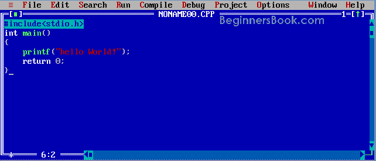
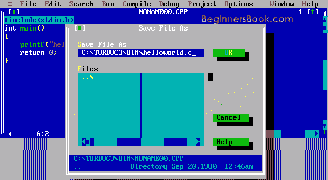
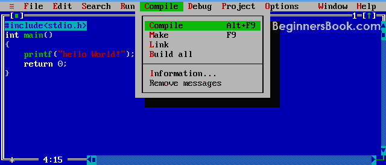

# 如何安装 Turbo C++：编译并运行 C 程序

> 原文： [https://beginnersbook.com/2014/01/install-turbo-c/](https://beginnersbook.com/2014/01/install-turbo-c/)

您需要了解的第一件事是计算机（机器）只能理解机器语言（0 和 1 流）。为了将您的 C 程序源代码转换为机器代码，您需要编译它。编译器是将源代码转换为机器代码的东西。简单来说，您可以说编译器将人类可读代码转换为机器可读格式。

## 安装 Turbo C++：分步指南

**下载链接**：[下载适用于 Windows 的 Turbo C++](https://download.cnet.com/TurboC-for-Windows/3000-2212_4-75786077.html)

**步骤 1**：找到`TC.exe`文件并将其打开。你会在位置`C:\TC\BIN\`找到它。

**步骤 2**：文件 -&gt; 新建（如上图所示）然后编写 C 程序

```c
#include<stdio.h>
int main()
{
       printf("hello World!");
       return 0;
}
```



**步骤 3**：使用`F2`（或者文件 -&gt; 保存）保存程序，记住扩展名应为`.c`。在下面的屏幕截图中，我将它命名为`helloworld.c`。



**步骤 4**：使用`Alt + F9`**或**编译 -&gt; 编译程序。编译（如下面的屏幕截图所示）。



**步骤 5**：按`Ctrl + F9`运行（或在菜单栏中选择运行 -&gt; 运行）C 程序。


**步骤 6** ：`Alt + F5`查看输出到屏幕上的程序输出。


## 使用 gcc 编译器编译和运行 C 程序

我们已经看到了使用 Turbo C++ 编译和执行 C 程序的步骤。我们也可以使用 gcc 编译器来做同样的事情。步骤如下：

**源代码** `Helloworld.c`（文件应始终以`.c`扩展名保存）

```c
# include<stdio.h>
int main()
{
         puts ("hello World");
         return 0;
}
```

**编译它**（它基本上是将`helloworld.c`文件转换为`helloworld`文件）

```c
>gcc  helloworld.c  –o  helloworld
>
```

如果您在 Windows 上编译，生成的文件将是`helloworld.exe`。

**运行已编译的程序**

一旦你给出了上面的命令，如果你在 Windows 上就会创建一个`.exe`文件，然后输入以下命令来运行源代码。

**适用于 Windows**

```c
>helloworld
```

**适用于 Mac 和 Linux 操作系统**

```c
>./helloworld
```

gcc 编译器采用人类可读格式（`helloworld.c`文件）并转换为 Windows，Linux 和 Mac OS X 的机器代码。