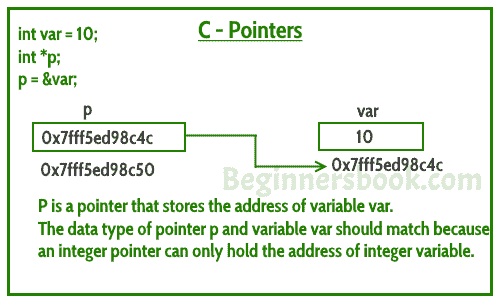

# C 编程中的指针示例

> 原文： [https://beginnersbook.com/2014/01/c-pointers/](https://beginnersbook.com/2014/01/c-pointers/)

**指针**是存储另一个变量的地址的变量。与保存某种类型值的其他变量不同，指针保存变量的地址。例如，整数变量保持（或者可以说是存储）整数值，但整数指针保存整数变量的地址。在本指南中，我们将在示例的帮助下讨论 [C 编程](https://beginnersbook.com/2014/01/c-tutorial-for-beginners-with-examples/)中的指针。

在我们讨论 C 中的**指针之前，让我们举一个简单的例子来理解变量地址的含义。**

#### 一个简单的例子，了解如何在没有指针的情况下访问变量的地址？

在这个程序中，我们有一个`int`类型的变量。`num`的值是 10，这个值必须存储在内存中的某个地方，对吧？为保存该变量值的每个变量分配一个内存空间，该内存空间有一个地址。例如，我们住在一所房子里，我们的房子有一个地址，帮助其他人找到我们的房子。同样，变量的值存储在内存地址中，这有助于 C 程序在需要时找到该值。

因此，假设分配给变量`num`的地址是`0x7fff5694dc58`，这意味着我们将分配给`num`的任何值都应该存储在以下位置：`0x7fff5694dc58`。见下图。

```c
#include <stdio.h>
int main()
{
   int num = 10;
   printf("Value of variable num is: %d", num);
   /* To print the address of a variable we use %p
    * format specifier and ampersand (&) sign just
    * before the variable name like &num.
    */
   printf("\nAddress of variable num is: %p", &num);
   return 0;
}
```

**输出：**

```c
Value of variable num is: 10
Address of variable num is: 0x7fff5694dc58
```


## C 中指针的一个简单例子

该程序显示如何声明和使用指针。我们可以使用指针做其他一些事情，我们在本指南后面讨论过它们。现在，我们只需要知道如何将指针链接到变量的地址。

> **需要注意的重点是**：指针的数据类型和变量必须匹配，`int`指针可以保存`int`变量的地址，类似地用`float`数据类型声明的指针可以保存`float`变量的地址。在下面的示例中，指针和变量都是`int`类型。

```c
#include <stdio.h>
int main()
{
   //Variable declaration
   int num = 10;

   //Pointer declaration
   int *p;

   //Assigning address of num to the pointer p
   p = #

   printf("Address of variable num is: %p", p);
   return 0;
}
```

输出：

```c
Address of variable num is: 0x7fff5694dc58
```

## C 指针 - 与指针一起使用的运算符

让我们讨论一下用于 C 中的指针的运算符。

### `&`地址运算符

我们在第一个例子中已经看到，我们可以使用`&`符号显示变量的地址。我用`&num`来访问变量`num`的地址。 **`&`运算符** 也称为**地址运算符**。

```c
printf("Address of var is: %p", &num);
```

**注意事项：**`%p`是一种格式说明符，用于以十六进制格式显示地址。
既然您知道如何获取变量的地址，但**如何将该地址存储在其他变量中？** 这就是指针进入画面的地方。如本指南开头所述，C 编程中的指针用于保存另一个变量的地址。

**指针就像另一个变量，主要区别在于它存储另一个变量的地址而不是值。**

## “地址值”（`*`）运算符

`*`运算符也称为**地址值运算符**。

**如何声明指针？**

```c
int *p1  /*Pointer to an integer variable*/
double *p2  /*Pointer to a variable of data type double*/
char *p3   /*Pointer to a character variable*/
float *p4   /*pointer to a float variable*/
```

以上是指针声明的几个例子。 **如果你需要一个指针来存储整数变量的地址，那么指针的数据类型应该是 `int`** 。同样的情况与其他数据类型有关。

通过使用`*`运算符，我们可以通过指针访问变量的值。
例如：

```c
double a = 10;
double *p;
p = &a;
```

`*p`会给我们变量`a`的值。以下语句将显示 10 作为输出。

```c
printf("%d", *p);
```

同样，如果我们像这样为`*`指针赋值：

```c
*p = 200;
```

它会改变变量`a`的值。上面的语句会将`a`的值从 10 更改为 200。

### 使用`&`和`*`的指针示例

```c
#include <stdio.h>
int main()
{
   /* Pointer of integer type, this can hold the
    * address of a integer type variable.
    */
   int *p;

   int var = 10;

   /* Assigning the address of variable var to the pointer
    * p. The p can hold the address of var because var is
    * an integer type variable.
    */
   p= &var;

   printf("Value of variable var is: %d", var);
   printf("\nValue of variable var is: %d", *p);
   printf("\nAddress of variable var is: %p", &var);
   printf("\nAddress of variable var is: %p", p);
   printf("\nAddress of pointer p is: %p", &p);
   return 0;
}

```

输出：

```c
Value of variable var is: 10
Value of variable var is: 10
Address of variable var is: 0x7fff5ed98c4c
Address of variable var is: 0x7fff5ed98c4c
Address of pointer p is: 0x7fff5ed98c50
```



让我们更多的例子来更好地理解它 -
让我们说我们有一个`char`变量`ch`和一个指向`ptr`的地址。

```c
char ch='a';
char *ptr;
```

**读取`ch`** 的值

```c
printf("Value of ch: %c", ch);
or
printf("Value of ch: %c", *ptr);

```

**改变`ch`** 的值

```c
ch = 'b';
or
*ptr = 'b';

```

上面的代码会将值`'a'`替换为`'b'`。

**您能猜出以下 C 程序的输出吗？**

```c
#include <stdio.h>
int main()
{
    int var =10;
    int *p;
    p= &var;

    printf ( "Address of var is: %p", &var);
    printf ( "\nAddress of var is: %p", p);

    printf ( "\nValue of var is: %d", var);
    printf ( "\nValue of var is: %d", *p);
    printf ( "\nValue of var is: %d", *( &var));

    /* Note I have used %p for p's value as it represents an address*/
    printf( "\nValue of pointer p is: %p", p);
    printf ( "\nAddress of pointer p is: %p", &p);

    return 0;
}
```

**输出：**

```c
Address of var is: 0x7fff5d027c58
Address of var is: 0x7fff5d027c58
Value of var is: 10
Value of var is: 10
Value of var is: 10
Value of pointer p is: 0x7fff5d027c58
Address of pointer p is: 0x7fff5d027c50
```

#### 关于指针的更多主题

1） [**指向指针的指针**](https://beginnersbook.com/2014/01/c-pointer-to-pointer/) - 一个指针可以指向另一个指针（这意味着它可以存储另一个指针的地址），这样的指针称为双重指针或者指针的指针。

2） [**将指针传递给函数**](https://beginnersbook.com/2014/01/c-passing-pointers-to-functions/) - 指针也可以作为参数传递给函数，使用此功能可以通过引用调用函数，并且可以将数组传递给呼叫时的功能。

3） [**函数指针**](https://beginnersbook.com/2014/01/c-function-pointers/) - 函数指针就像另一个指针，它用于存储函数的地址。函数指针也可用于调用 C 程序中的函数。