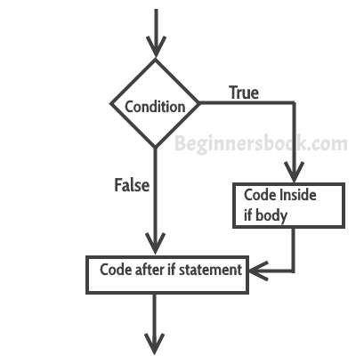

# C 编程中的`if`语句

> 原文： [https://beginnersbook.com/2014/01/c-if-statement/](https://beginnersbook.com/2014/01/c-if-statement/)

当我们只在给定条件为真时才需要执行一个语句块，那么我们使用 if 语句。在下一个教程中，我们将学习 [C if..else，嵌套 if..else 和 else..if](https://beginnersbook.com/2014/01/c-if-else-statement-example/) 。

## C - `if`语句

if 语句的语法：
“if”正文中的语句仅在给定条件返回 true 时才执行。如果条件返回 false，则跳过“if”内的语句。

```c
if (condition)
{
     //Block of C statements here
     //These statements will only execute if the condition is true
}

```

### `if`语句的流程图



### `if`语句的示例

```c
#include <stdio.h>
int main()
{
    int x = 20;
    int y = 22;
    if (x<y)
    {
        printf("Variable x is less than y");
    }
    return 0;
}
```

**输出：**

```c
Variable x is less than y
```

**说明：**“if”中指定的条件（x

### 多个`if`语句的示例

我们可以使用多个 if 语句来检查多个条件。

```c
#include <stdio.h>
int main()
{
    int x, y;
    printf("enter the value of x:");
    scanf("%d", &x);
    printf("enter the value of y:");
    scanf("%d", &y);
    if (x>y)
    {
	printf("x is greater than y\n");
    }
    if (x<y)
    {
	printf("x is less than y\n");
    }
    if (x==y)
    {
	printf("x is equal to y\n");
    }
    printf("End of Program");
    return 0;
}

```

在上面的示例中，输出取决于用户输入。

输出：

```c
enter the value of x:20
enter the value of y:20
x is equal to y
End of Program
```