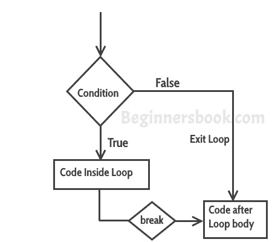

# 在 C++ 中使用`break`语句

> 原文： [https://beginnersbook.com/2017/08/cpp-break-statement/](https://beginnersbook.com/2017/08/cpp-break-statement/)

**`break`语句**用于以下两种情况：

a）使用`break`语句立即退出循环。每当在循环内遇到`break`语句时，控制流就会直接从循环中退出。它与`if`语句一起使用，只能在循环内部使用（参见下面的示例），以便它仅在特定条件下发生。

b）用于`switch-case`控制结构。通常，在`switch case`中的所有情况都跟一个`break`语句，以避免后续的情况（参见下面的例子）执行。无论何时在`switch-case`块中遇到，控制流都从`switch-case`体中出来。

#### `break`语句的语法

```cpp
break;
```

## `break`语句流程图



## 示例 - 在`while`循环中使用`break`语句

在下面的示例中，我们有一个从 10 到 200 运行的`while`循环，但由于我们有一个在循环计数器，变量值达到 12 时遇到`break`语句，循环终止并且控制流跳转到程序中循环体之后的下一个语句。

```cpp
#include <iostream>
using namespace std;
int main(){
   int num =10;
   while(num<=200) {
      cout<<"Value of num is: "<<num<<endl;
      if (num==12) {
         break;
      }
      num++;
   } 
   cout<<"Hey, I'm out of the loop";
   return 0;
}
```

**输出：**

```cpp
Value of num is: 10
Value of num is: 11
Value of num is: 12
Hey, I'm out of the loop
```

## 示例：`for`循环中的`break`语句

```cpp
#include <iostream>
using namespace std;
int main(){
   int var;
   for (var =200; var>=10; var --) {
      cout<<"var: "<<var<<endl;
      if (var==197) {
         break;
      }
   }
   cout<<"Hey, I'm out of the loop";
   return 0;
}
```

**输出：**

```cpp
var: 200
var: 199
var: 198
var: 197
Hey, I'm out of the loop
```

## 示例：`switch-case`中的`break`语句

```cpp
#include <iostream>
using namespace std;
int main(){
   int num=2;
   switch (num) {
      case 1: cout<<"Case 1 "<<endl;
      break;
      case 2: cout<<"Case 2 "<<endl;
      break;
      case 3: cout<<"Case 3 "<<endl;
      break;
      default: cout<<"Default "<<endl;
   }
   cout<<"Hey, I'm out of the switch case";
   return 0;
}
```

**输出：**

```cpp
Case 2 
Hey, I'm out of the switch case
```

在这个例子中，我们在每个`case`块之后都有`break`语句，这是因为如果我们没有它，那么后续的`case`块也会执行。没有`break`的同一程序的输出将是：

```cpp
Case 2
Case 3
Default
Hey, I'm out of the switch case
```