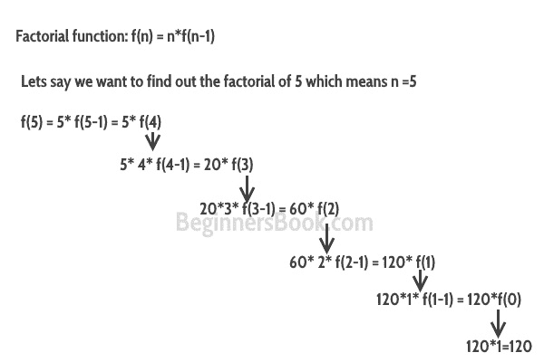

# C++ 递归示例

> 原文： [https://beginnersbook.com/2017/08/cpp-recursion/](https://beginnersbook.com/2017/08/cpp-recursion/)

函数调用自身的过程称为递归，相应的函数称为**递归函数**。理解递归的流行示例是阶乘函数。

**阶乘函数：** `f(n) = n * f(n-1)`，基本条件：如果`n <= 1`则`f(n)= 1`。不要担心我们将讨论什么是基本条件，以及为什么它很重要。

在下图中。我已经证明了在函数达到基本条件之前，阶乘函数如何调用自身。



让我们用 C++ 程序解决问题。

## C++ 递归示例：阶乘

```cpp
#include <iostream>
using namespace std;
//Factorial function
int f(int n){
   /* This is called the base condition, it is
    * very important to specify the base condition
    * in recursion, otherwise your program will throw
    * stack overflow error.
    */
   if (n <= 1)
        return 1;
   else 
       return n*f(n-1);
}
int main(){
   int num;
   cout<<"Enter a number: ";
   cin>>num;
   cout<<"Factorial of entered number: "<<f(num);
   return 0;
}
```

**输出：**

```cpp
Enter a number: 5
Factorial of entered number: 120
```

### 基本情况

在上面的程序中，您可以看到我在递归函数中提供了基本条件。条件是：

```cpp
if (n <= 1)
        return 1;
```

递归的目的是将问题分成较小的问题，直到达到基本条件。例如，在上述阶乘程序中，我通过调用较小的阶乘函数`f(n-1)`来求解阶乘函数 `f(n)`，这一直重复发生，直到`n`值达到基本条件（`f(1) = 1`）。如果未在递归函数中定义基本条件，则会出现堆栈溢出错误。

## 直接递归与间接递归

**直接递归：**当函数调用自身时，它被称为直接递归，我们上面看到的例子是直接递归示例。

**间接递归：**当函数调用另一个函数并且该函数调用这个函数时，这称为间接递归。例如：函数 A 调用函数 B，函数 B 调用函数 A。

### C++ 中的间接递归示例

```cpp
#include <iostream>
using namespace std;
int fa(int);
int fb(int);
int fa(int n){
   if(n<=1)
      return 1;
   else
      return n*fb(n-1);
}
int fb(int n){
   if(n<=1)
      return 1;
   else
      return n*fa(n-1);
}
int main(){
   int num=5;
   cout<<fa(num);
   return 0;
}
```

**输出：**

```cpp
120
```