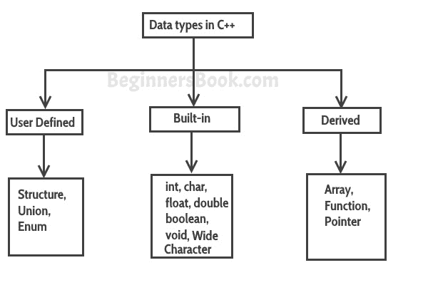

# C ++中的数据类型

> 原文： [https://beginnersbook.com/2017/08/cpp-data-types/](https://beginnersbook.com/2017/08/cpp-data-types/)

数据类型定义[变量](https://beginnersbook.com/2017/08/cpp-variables/)可以容纳的数据类型，例如整数变量可以保存整数数据，字符类型变量可以保存字符数据等。

C ++中的数据类型分为三组：**内置**，**用户定义**和**派生**。


## 内置数据类型

**char** ：适用于角色。大小 1 个字节。

```
char ch = 'A';
```

**int** ：对于整数。大小 2 个字节。

```
int num = 100;
```

**float** ：用于单精度浮点数。大小 4 个字节。

```
float num = 123.78987;
```

**double** ：用于双精度浮点数。大小为 8 个字节。

```
double num = 10098.98899;
```

**bool** ：对于布尔，无论是真还是假。

```
bool b = true;
```

**wchar_t** ：宽字符。应该避免这种情况，因为它的大小是实现定义的并且不可靠。

## 用户定义的数据类型

我们在 C ++中有三种类型的用户定义数据类型
1\. struct
2\. union
3\. enum

我在单独的教程中详细介绍了它们。现在只记得它们属于用户定义的数据类型。

## C ++中的派生数据类型

我们在 C ++中有三种派生定义的数据类型
1.数组
2.函数
3.指针

它们是 C ++的广泛主题，我在单独的教程中介绍了它们。按照给定顺序的教程，你会没事的。