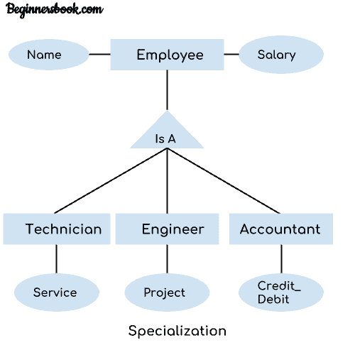

# DBMS 特化

> 原文： [https://beginnersbook.com/2018/11/dbms-specialization/](https://beginnersbook.com/2018/11/dbms-specialization/)

**特化**是将实体划分为子实体的过程。您可以将其视为[泛化](https://beginnersbook.com/2018/11/dbms-generalization/)的逆过程，在概括中，两个实体组合在一起形成一个新的更高级别的实体。特化是一个自上而下的过程。

特化背后的想法是找到具有很少区分属性的实体子集。例如 - 考虑一个实体员工，可以进一步分类为子实体技术员，工程师和工作人员。会计，因为这些子实体具有一些区分属性。

## 特化示例

在上图中，我们可以看到我们有一个更高级别的实体“员工”，我们将其划分为子实体“技术员”，“工程师”和“工作人员”。 “会计”。所有这些只是公司的一名员工，但他们的角色完全不同，他们几乎没有不同的属性。仅举例来说，我已经证明技术人员处理服务请求，工程师处理项目，会计处理信贷和借记明细。所有这三种员工类型都具有很少的共同属性，例如名称和名称。我们留下的薪水与父母实体“员工”相关联，如上图所示。