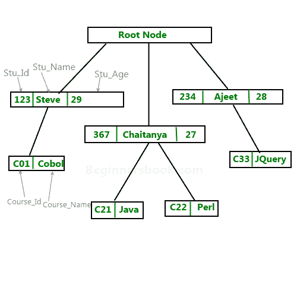

# DBMS 中的分层模型

> 原文： [https://beginnersbook.com/2015/04/hierarchical-model-in-dbms/](https://beginnersbook.com/2015/04/hierarchical-model-in-dbms/)

在**分层模型**中，数据被组织成树状结构，每个记录具有一个父记录和许多子记录。该模型的主要缺点是，节点之间只能有一对多的关系。

**注意：现在很少使用分层模型。**

**样本层次模型图**：

让我们说我们有一些学生和一些课程，一个课程只能分配给一个学生，但是学生可以选修任意数量的课程，这样这种关系就变成了一对多。

**表示为关系表的分层数据示例：**上述分层模型可以表示为关系表，如下所示：

`Student`表：

| `Stu_Id` | `Stu_Name` | `Stu_Age` |
| --- | --- | --- |
| 123 | Steve | 29 |
| 367 | Chaitanya | 27 |
| 234 | Ajeet | 28 |

`Course`表：

| `COURSE_ID` | `COURSE_NAME` | `Stu_Id` |
| --- | --- | --- |
| C01 | COBOL | 123 |
| C21 | Java | 367 |
| C22 | Perl | 367 |
| C33 | JQuery | 234 |