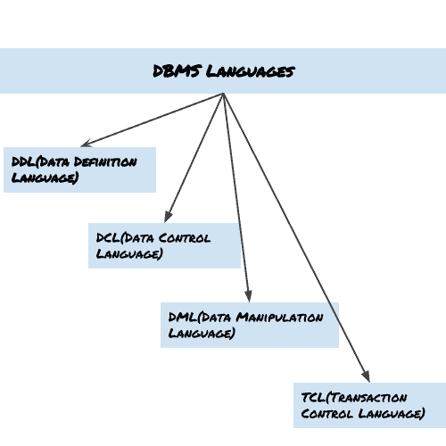

# DBMS 语言

> 原文： [https://beginnersbook.com/2015/04/dbms-languages/](https://beginnersbook.com/2015/04/dbms-languages/)

数据库语言用于读取，更新和存储数据库中的数据。有几种这样的语言可用于此目的；其中之一是 SQL（结构化查询语言）。

## DBMS 语言的类型：

### 数据定义语言（DDL）

DDL 用于指定数据库模式。它用于在数据库中创建表，模式，索引，约束等。让我们看看我们可以使用 DDL 在数据库上执行的操作：

*   创建数据库实例 - [`CREATE`](https://beginnersbook.com/2014/05/sql-create-database-statement/)
*   改变数据库的结构 - **`ALTER`**
*   删除数据库实例 - [`DROP`](https://beginnersbook.com/2014/05/sql-drop-database-statement/)
*   删除数据库实例中的表 - **`TRUNCATE`**
*   重命名数据库实例 - **`RENAME`**
*   从数据库中删除对象，例如表 - **`DROP`**
*   注释 - **注释**

所有这些命令都定义或更新数据库模式，这就是它们归入数据定义语言的原因。

### 数据处理语言（DML）

DML 用于访问和操作数据库中的数据。数据库的以下操作属于 DML：

*   从表中读取记录 - [`SELECT`](https://beginnersbook.com/2014/05/sql-select-query/)
*   将记录插入表 - **`INSERT`**
*   更新表中的数据 - [`UPDATE`](https://beginnersbook.com/2014/05/update-query-in-sql/)
*   删除表中的所有记录 - [`DELETE`](https://beginnersbook.com/2014/05/delete-query-in-sql/)

### 数据控制语言（DCL）

DCL 用于授予和撤销数据库上的用户访问权限 -

*   授予用户访问权限 - `GRANT`
*   撤消用户的访问权限 - `REVOKE`

**在实际数据定义语言中，数据处理语言和数据控制语言不是单独的语言，而是它们是单个数据库语言（如 SQL）的一部分。**

### 事务控制语言（TCL）

我们使用 DML 命令进行的数据库更改是使用 TCL 执行或回滚的。

*   提交 DML 命令在数据库中所做的更改 - `COMMIT`
*   要回滚对数据库所做的更改 - `ROLLBACK`