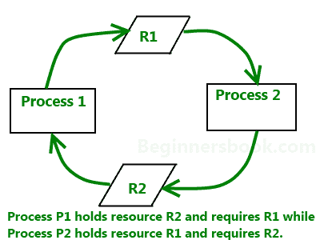

# DBMS 中的死锁

> 原文： [https://beginnersbook.com/2015/04/deadlock-in-dbms/](https://beginnersbook.com/2015/04/deadlock-in-dbms/)

**死锁**是一个条件，其中两个或多个任务正在等待彼此以便完成，但任务都不愿意放弃其他任务所需的资源。在这种情况下，任务都没有完成，并且永远处于等待状态。

## 科夫曼条件

科夫曼说明发生死锁的四个条件。如果满足以下所有条件，则可能发生死锁。

*   **互斥条件**：必须至少有一个资源一次不能被多个进程使用。
*   **保持和等待条件**：持有资源的进程可以请求系统中其他进程持有的其他资源。
*   **无抢占条件**：无法强制从进程中获取资源。只有进程才能释放它所持有的资源。
*   **循环等待条件**：一个进程正在等待第二个进程持有的资源而第二个进程正在等待第三个进程的情况......等等，最后一个进程正在等待第一个进程。从而制作一个循环链等待。

## 死锁处理

### 忽略死锁（鸵鸟算法）

那会让你笑吗？您可能想知道如何在死锁处理下忽略死锁。但是为了让你知道你在 PC 上使用的窗口，使用这种死锁处理方法，这是有时它会挂起的原因，你必须重新启动才能使它工作。不仅 Windows 而且 UNIX 也使用这种方法。

**问题是为什么？为什么不用处理死锁而忽略它以及为什么这被称为鸵鸟算法呢？**

好！让我先回答第二个问题，这就是所谓的鸵鸟算法，因为在这种方法中我们忽略了死锁并假装它永远不会发生，就像鸵鸟的行为“把头埋在沙子中假装没有问题”。

**让我们讨论为什么我们忽略它**：当认为死锁非常罕见并且死锁处理的成本更高时，在这种情况下忽略是比处理它更好的解决方案。例如：让我们以操作系统为例 - 如果时间需要处理死锁高于需要重新启动窗口的时间，那么考虑到死锁在 Windows 中非常罕见，重启将是首选。

### 死锁检测

资源调度程序是一种保持对进程分配和请求的资源的跟踪。因此，如果存在死锁，则资源调度程序已知它。这是检测到死锁的方式。

检测到死锁后，将通过以下方法进行更正：

*   **终止死锁中涉及的进程**：一个接一个地终止死锁或终止进程中涉及的所有进程，直到死锁被解决，这可能是解决方案，但这两种方法都不好。终止所有进程的成本很高，进程完成的部分工作会丢失。逐个终止需要花费大量时间，因为每次进程终止时，都需要检查死锁是否已解决。因此，最佳方法是在死锁条件期间终止它们时考虑进程年龄和优先级。
*   **资源抢占**：另一种方法可以是抢占资源并将其分配给其他进程，直到解决了死锁。

### 死锁预防

我们已经了解到，如果所有四个科夫曼条件都成立，则会发生死锁，因此阻止其中的一个或多个可以防止死锁。

*   **删除互斥**：所有资源必须是可共享的，这意味着一次可以有多个进程获取资源。这种方法几乎是不可能的。
*   **删除保持和等待条件**：如果进程在开始之前获取了所需的所有资源，则可以将其删除。另一种删除此方法的方法是在进程持有时不执行请求资源的规则。
*   **抢占资源**：从进程中抢占资源可能导致回滚，因此需要避免这种情况以保持系统的一致性和稳定性。
*   **避免循环等待条件**：如果资源在层次结构中维护，并且进程可以按优先级递增的顺序保存资源，则可以避免这种情况。这避免了循环等待。另一种方法是强制每个进程规则使用一个资源 - 进程可以在释放当前所拥有的资源后请求资源。这避免了循环等待。

## 死锁避免

如果以避免发生死锁的方式分配资源，则可以避免死锁。有两种算法可以避免死锁。

*   等待/死亡
*   死亡/等待

以下是每种算法的资源分配的表表示。这两种算法都考虑了进程时代，同时确定了避免死锁的最佳资源分配方式。

|  | 等待/死亡 | 死亡/等待 |
| --- | --- |
| 旧进程需要新进程持有的资源 | **旧进程**等待 | **新进程**死亡 |
| 新进程需要旧进程持有的资源 | **旧进程**死亡 | **新进程**等待 |

一个着名的死锁避免算法是 **银行家算法**。