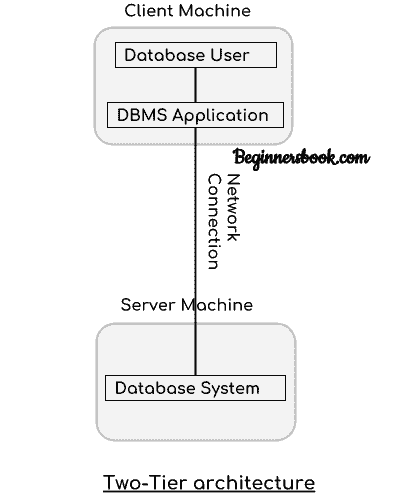
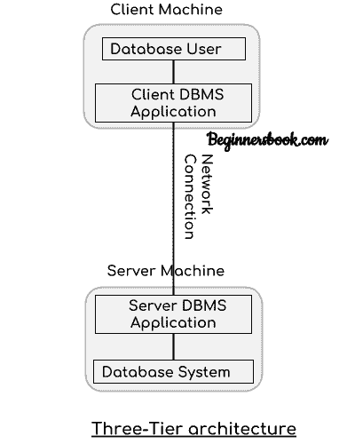

# DBMS 架构

> 原文： [https://beginnersbook.com/2018/11/dbms-architecture/](https://beginnersbook.com/2018/11/dbms-architecture/)

在之前的教程中，我们学习了 DBMS 的基础知识。在本指南中，我们将看到 **DBMS 架构**。数据库管理系统架构将帮助我们理解数据库系统的组件及其之间的关系。

DBMS 的架构取决于它运行的计算机系统。例如，在客户端 - 服务器 DBMS 架构中，服务器计算机上的数据库系统可以执行客户端计算机发出的多个请求。我们将借助图表来理解这种通信。

## DBMS 架构的类型

DBMS 架构有三种类型：

1. 单层架构
2. 双层架构
3. 三层架构

### 1\. 单层架构

在这种类型的架构中，数据库在客户端计算机上很容易获得，客户端发出的任何请求都不需要网络连接来对数据库执行操作。

例如，假设您要从数据库中获取员工的记录，并且数据库在您的计算机系统上可用，因此获取员工详细信息的请求将由您的计算机完成，并且您的数据将由你的电脑从数据库中获取。这种类型的系统通常称为本地数据库系统。

### 2\. 双层架构

在双层架构中，数据库系统存在于服务器机器上，DBMS 应用存在于客户机上，这两台机器通过可靠的网络相互连接，如上图所示。

每当客户端机器使用诸如 sql 之类的查询语言发出访问服务器上存在的数据库的请求时，服务器就会对数据库执行请求并将结果返回给客户端。 JDBC，ODBC 等应用连接接口用于服务器和客户端之间的交互。

### 3\. 三层架构

在三层架构中，客户端计算机和服务器计算机之间存在另一层。在该架构中，客户端应用不直接与服务器机器上存在的数据库系统通信，而是客户端应用与服务器应用通信，并且服务器应用在内部与服务器上存在的数据库系统通信。