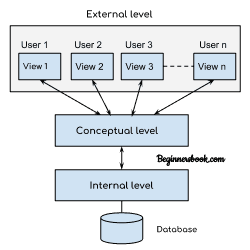

# DBMS - 三层架构

> 原文： [https://beginnersbook.com/2018/11/dbms-three-level-architecture/](https://beginnersbook.com/2018/11/dbms-three-level-architecture/)

在上一篇教程中，我们看到了 [DBMS 架构](https://beginnersbook.com/2018/11/dbms-architecture/) - 一层，两层和三层。在本指南中，我们将详细讨论三层 DBMS 架构。

## DBMS 三层架构图

该架构有三个层次：

1. 外部层
2. 概念层
3. 内部层

## 1\. 外部层

它也被称为**视图层**。此层次称为“视图”的原因是因为多个用户可以在此层次查看所需数据，这些数据是在概念和内部层次映射的帮助下从数据库内部获取的。

用户不需要知道数据库架构细节，例如数据结构，表定义等。用户只关心从数据库中获取后返回到视图层次的数据（存在于内部层次）。

外部层次是三层 DBMS 架构的“**顶层**”。

## 2\. 概念层

它也被称为**逻辑层**。数据库的整体设计，如数据之间的关系，数据模式等都在这个层次上进行了描述。

数据库约束和安全性也在此层次的架构中实现。此层次由 DBA（数据库管理员）维护。

## 3\. 内部层

此层次也称为物理层。此层次描述了数据实际存储在存储设备中的方式。此层次还负责为数据分配空间。这是架构的最低层次。