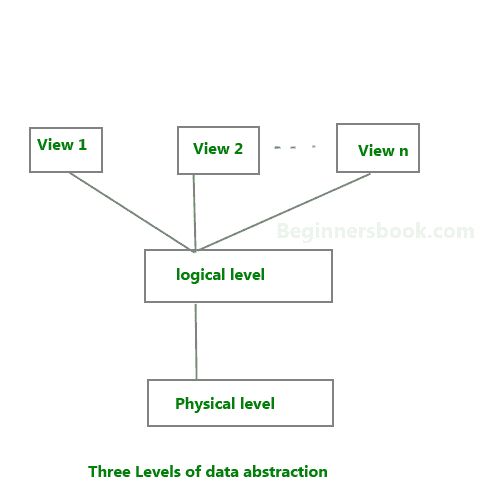

# DBMS 中的数据抽象

> 原文： [https://beginnersbook.com/2015/04/levels-of-abstraction-in-dbms/](https://beginnersbook.com/2015/04/levels-of-abstraction-in-dbms/)

数据库系统由复杂的数据结构组成。为了简化用户与数据库的交互，开发人员隐藏了用户的内部无关细节。这种从用户隐藏不相关细节的过程称为数据抽象。

**我们有三个抽象层次**：
**物理层**：这是数据抽象的最低层次。它描述了数据实际存储在数据库中的方式。您可以在此级别获取复杂的数据结构详细信息。

**逻辑级**：这是 3 级数据抽象架构的中间层。它描述了数据库中存储的数据。

**视图级**：最高级别的数据抽象。此级别描述用户与数据库系统的交互。

**示例**：假设我们将客户信息存储在客户表中。在**物理级**，这些记录可以描述为内存中的存储块（字节，千兆字节，太字节等）。这些细节通常对程序员来说是隐藏的。

在**逻辑级**，这些记录可以被描述为字段和属性以及它们的数据类型，它们之间的关系可以在逻辑上实现。程序员通常在这个级别工作，因为他们知道有关数据库系统的这些事情。

在**视图级**，用户只需在 GUI 的帮助下与系统交互并在屏幕上输入详细信息，他们不知道数据的存储方式和存储的数据;这些细节对他们来说是隐藏的。