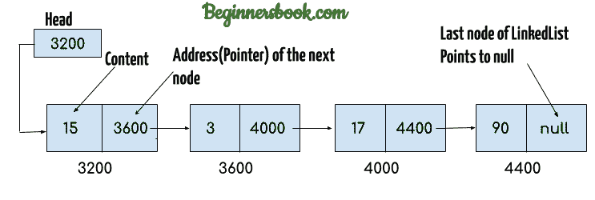
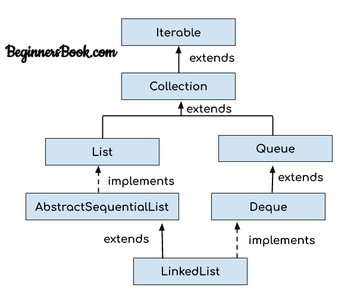
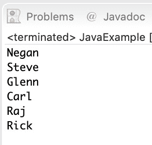

# Java 中的`LinkedList`

> 原文： [https://beginnersbook.com/2013/12/linkedlist-in-java-with-example/](https://beginnersbook.com/2013/12/linkedlist-in-java-with-example/)

与 Java 中的数组类似， **LinkedList 是线性数据结构**。但是，LinkedList 元素不存储在像数组这样的连续位置中，它们使用指针相互链接。 LinkedList 的每个元素都具有指向 LinkedList 的下一个元素的引用（地址/指针）。

### 目录

1\. [LinkedList 表示](#linkedlist)
2\. [为什么我们需要一个链表？](#why)
3\. [Java 中 LinkedList 类的层次结构](#hierarchy)
4\. [Java 链表添加元素的例子](#add)
5\. [Java 链表示例删除元素](#remove)
6\. [Java 中的 LinkedList 示例](#example)
7\. [LinkedList 类的方法](#methods)
8\. [关于 LinkedList 的教程](#tutorials) ] - LinkedList 类的所有方法都在单独的教程中详细介绍

## `LinkedList`表示

LinkedList 中的每个元素称为**节点**。 LinkedList 的每个节点包含两个项目：1）元素的内容 2）指向链表中的下一节点的指针/地址/引用。

**这就是 LinkedList 的样子：**


**注意：**
1\. **LinkedList 的头**仅包含 List 的 **First 元素**的地址。
2\. LinkedList 的 Last 元素在节点的指针部分包含 **null** ，因为它是 List 的结尾，因此它不指向任何内容，如上图所示。
3.上图所示的图表示**单链表**。 LinkedList 的另一种复杂类型变体称为**双向链表**，双向链表的节点包含三部分：1）指向链表的前一节点的指针 2）元素的内容 3）指向链表的下一个节点的指针。

## 为什么我们需要链表？

你必须知道数组也是一个线性数据结构，但**数组有一些限制，如：**
1）**数组的大小是固定的**这是我们决定的创建一个数组，因此很难预先预测元素的数量，如果声明的大小不足，那么我们就不能增加数组的大小，如果我们声明一个大型数组并且不需要存储那么多的元素那么它是浪费记忆。

2）数组元素**需要连续的存储单元**来存储它们的值。

3）**在数组中插入一个元素是性能上昂贵的**，因为我们必须移动几个元素来为新元素腾出空间。例如：
假设我们有一个具有以下元素的数组：10,12,15,20,4,5,100，现在如果我们想要在具有值 12 的元素之后插入新元素 99 那么我们必须将 12 之后的所有元素移到右边，为新元素腾出空间。

类似地，**从数组中删除元素**也是性能上昂贵的操作，因为删除元素之后的所有元素都必须向左移位。

**通过提供以下功能在链表中处理这些限制：**
1.链表允许**动态内存分配**，这意味着内存分配在运行时由编译器完成在链表声明中我们不需要提及列表的大小。

2.链表元素**不需要连续的存储单元**，因为元素使用包含列表的下一个节点的地址的节点的引用部分相互链接。

3.在链表中插入和删除操作的性能并不昂贵，因为从链表中添加和删除元素不需要元素移位，只需要更改前一个节点和下一个节点的指针。

## Java 中的`LinkedList`类的层次结构



## Java `LinkedList`添加元素的示例

在下面的例子中，我们使用`add()`，`addFirst()`和`addLast()`方法在 LinkedList 中的所需位置添加元素，LinkedList 类中有几个这样有用的方法，我在本文末尾提到过文章。

```
package com.beginnersbook;
import java.util.*;
public class JavaExample{
   public static void main(String args[]){

     LinkedList<String> list=new LinkedList<String>();

     //Adding elements to the Linked list
     list.add("Steve");
     list.add("Carl");
     list.add("Raj");

     //Adding an element to the first position
     list.addFirst("Negan");

     //Adding an element to the last position
     list.addLast("Rick");

     //Adding an element to the 3rd position
     list.add(2, "Glenn");

     //Iterating LinkedList
     Iterator<String> iterator=list.iterator();
     while(iterator.hasNext()){
       System.out.println(iterator.next());
     }
   } 
} 

```

**输出：**


## 从`LinkedList`中删除元素的 Java 示例

在下面的示例中，我们将检查 LinkedList 中用于从 LinkedList 中的某些位置删除元素的几个流行的**删除方法**。这些方法的详细说明以及示例将在单独的教程中介绍，本文末尾提供了链接。

```
package com.beginnersbook;
import java.util.*;
public class JavaExample{
   public static void main(String args[]){

      LinkedList<String> list=new LinkedList<String>();

      //Adding elements to the Linked list
      list.add("Steve");
      list.add("Carl");
      list.add("Raj");
      list.add("Negan");
      list.add("Rick");

      //Removing First element
      //Same as list.remove(0);
      list.removeFirst();

      //Removing Last element
      list.removeLast();

      //Iterating LinkedList
      Iterator<String> iterator=list.iterator();
      while(iterator.hasNext()){
         System.out.print(iterator.next()+" ");
      }

      //removing 2nd element, index starts with 0
      list.remove(1);

      System.out.print("\nAfter removing second element: ");
      //Iterating LinkedList again
      Iterator<String> iterator2=list.iterator();
      while(iterator2.hasNext()){
         System.out.print(iterator2.next()+" ");
      }
   }
}

```

**输出：**


## Java 中的`LinkedList`示例

```
import java.util.*;
public class LinkedListExample {
     public static void main(String args[]) {

       /* Linked List Declaration */
       LinkedList<String> linkedlist = new LinkedList<String>();

       /*add(String Element) is used for adding 
        * the elements to the linked list*/
       linkedlist.add("Item1");
       linkedlist.add("Item5");
       linkedlist.add("Item3");
       linkedlist.add("Item6");
       linkedlist.add("Item2");

       /*Display Linked List Content*/
       System.out.println("Linked List Content: " +linkedlist);

       /*Add First and Last Element*/
       linkedlist.addFirst("First Item");
       linkedlist.addLast("Last Item");
       System.out.println("LinkedList Content after addition: " +linkedlist);

       /*This is how to get and set Values*/
       Object firstvar = linkedlist.get(0);
       System.out.println("First element: " +firstvar);
       linkedlist.set(0, "Changed first item");
       Object firstvar2 = linkedlist.get(0);
       System.out.println("First element after update by set method: " +firstvar2);

       /*Remove first and last element*/
       linkedlist.removeFirst();
       linkedlist.removeLast();
       System.out.println("LinkedList after deletion of first and last element: " +linkedlist);

       /* Add to a Position and remove from a position*/
       linkedlist.add(0, "Newly added item");
       linkedlist.remove(2);
       System.out.println("Final Content: " +linkedlist); 
     }
}
```

输出：

```
Linked List Content: [Item1, Item5, Item3, Item6, Item2]
LinkedList Content after addition: [First Item, Item1, Item5, Item3, Item6, Item2, Last Item]
First element: First Item
First element after update by set method: Changed first item
LinkedList after deletion of first and last element: [Item1, Item5, Item3, Item6, Item2]
Final Content: [Newly added item, Item1, Item3, Item6, Item2]
```

## `LinkedList`类的方法：

> 这里我已经提到了 LinkedList 方法的简要说明，我已经在单独的教程中介绍了这些方法中的每一个，本文末尾提供了链接。

对于以下方法中的所有示例，请将` llistobj`视为`LinkedList&lt;String&gt;`的参考。

`LinkedList&lt;String&gt; llistobj  = new LinkedList&lt;String&gt;();`

1） **boolean add（Object item）**：它在列表的末尾添加项目。

```
llistobj.add("Hello");
```

它会在链表的末尾添加字符串“Hello”。

2） **void add（int index，Object item）**：它在列表的给定索引处添加一个项目。

```
llistobj.add(2, "bye");
```

这将在第 3 个位置添加字符串“bye”（2 索引是第 3 个位置，因为索引从 0 开始）。

3） **boolean addAll（Collection c）**：它将指定集合 c 的所有元素添加到列表中。如果指定的集合为 null，则抛出 NullPointerException。考虑下面的例子 -

```
LinkedList<String> llistobj = new LinkedList<String>();
ArrayList<String> arraylist= new ArrayList<String>();
arraylist.add("String1");
arraylist.add("String2");
llistobj.addAll(arraylist);
```

这段代码会将 ArrayList 的所有元素添加到 LinkedList 中。

4） **boolean addAll（int index，Collection c）**：它将集合 c 的所有元素从列表中的给定索引开始添加到列表中。如果集合 c 为 null，则抛出 NullPointerException;如果指定的索引超出范围，则抛出 IndexOutOfBoundsException。

```
llistobj.add(5, arraylist);
```

它会将 ArrayList 的所有元素从位置 6（索引 5）开始添加到 LinkedList。

5） **void addFirst（Object item）**：它在列表的第一个位置添加项（或元素）。

```
llistobj.addFirst("text");
```

它会在列表的开头添加字符串“text”。

6） **void addLast（Object item）**：它在列表的末尾插入指定的项目。

```
llistobj.addLast("Chaitanya");
```

该语句将在链表的末尾添加一个字符串“Chaitanya”。

7） **void clear（）**：删除列表中的所有元素。

```
llistobj.clear();
```

8）**对象 clone（）**：返回列表的副本。

对于例如我的 linkedList 有四个项目：text1，text2，text3 和 text4。

```
Object str= llistobj.clone();
 System.out.println(str);
```

输出：上面代码的输出是：

[text1，text2，text3，text4]

9） **boolean contains（Object item）**：它检查给定项是否存在于列表中。如果该项目存在，则返回 true，否则返回 false。

```
boolean var = llistobj.contains("TestString");
```

它将检查列表中是否存在字符串“TestString”。

10） **Object get（int index）**：从列表中返回指定索引的项。

```
Object var = llistobj.get(2);
```

它将从列表中获取第 3 个项目。

11） **Object getFirst（）**：从列表中取出第一个项目。

```
Object var = llistobj.getFirst();
```

12） **Object getLast（）**：从列表中取出最后一项。

```
Object var= llistobj.getLast();
```

13） **int indexOf（Object item）**：返回指定项的索引。

```
llistobj.indexOf("bye");
```

14） **int lastIndexOf（Object item）**：返回指定元素最后一次出现的索引。

```
int pos = llistobj.lastIndexOf("hello);
```

整数变量 pos 将具有最后一次出现的字符串“hello”的索引。

15）**对象轮询（）**：它返回并删除列表的第一项。

```
Object o = llistobj.poll();
```

16）**对象 pollFirst（）**：与 poll（）方法相同。删除列表中的第一项。

```
Object o = llistobj.pollFirst();
```

17） **Object pollLast（）**：返回并删除列表的最后一个元素。

```
Object o = llistobj.pollLast();
```

18） **Object remove（）**：删除列表的第一个元素。

```
llistobj.remove();
```

19） **Object remove（int index）**：它从列表中删除指定索引处的项目。

```
llistobj.remove(4);
```

它将从列表中删除第 5 个元素。

20） **Object remove（Object obj）**：从列表中删除指定的对象。

```
llistobj.remove("Test Item");
```

21）**对象 removeFirst（）**：它从列表中删除第一个项目。

```
llistobj.removeFirst();
```

22） **Object removeLast（）**：删除列表的最后一项。

```
llistobj.removeLast();
```

23） **Object removeFirstOccurrence（Object item）**：删除指定项的第一次出现。

```
llistobj.removeFirstOccurrence("text");
```

它将从列表中删除第一次出现的字符串“text”。

24） **Object removeLastOccurrence（Object item）**：删除给定元素的最后一次出现。

```
llistobj.removeLastOccurrence("String1);
```

它将删除最后一次出现的字符串“String1”。

25）**对象集（int index，Object item）**：用赋值更新指定索引的项。

```
llistobj.set(2, "Test");
```

它将使用字符串“Test”更新第 3 个元素。

26） **int size（）**：返回列表元素的数量。

```
llistobj.size();
```

## `LinkedList`教程

以下是我在 LinkedList 上分享的教程。

#### `LinkedList`基础知识

*   [如何迭代 LinkedList](https://beginnersbook.com/2013/12/how-to-loop-linkedlist-in-java/)

#### 添加/删除

*   [向 LinkedList 添加元素](https://beginnersbook.com/2014/08/adding-an-element-to-linkedlist-using-adde-e-method-java/)
*   [在 LinkedList](https://beginnersbook.com/2014/07/java-add-element-at-specific-index-in-linkedlist-example/) 中的特定索引处添加元素
*   [在 LinkedList](https://beginnersbook.com/2014/07/java-add-elements-at-beginning-and-end-of-linkedlist-example/) 的开头和结尾添加元素
*   [在 LinkedList](https://beginnersbook.com/2014/08/adding-element-to-front-of-linkedlist-in-java/) 的前面添加一个元素
*   [从 LinkedList](https://beginnersbook.com/2014/07/java-remove-first-and-last-element-from-linkedlist-example/) 中删除第一个和最后一个元素
*   [从特定索引](https://beginnersbook.com/2014/07/java-remove-element-from-a-specific-index-in-linkedlist-example/)中删除元素
*   [从 LinkedList](https://beginnersbook.com/2014/07/java-remove-specific-elements-from-linkedlist-example/) 中删除指定的元素
*   [从 LinkedList](https://beginnersbook.com/2014/07/java-remove-all-elements-from-linkedlist-example/) 中删除所有元素
*   [将 List 的所有元素附加到 LinkedList](https://beginnersbook.com/2014/08/append-all-the-elements-of-a-list-to-linkedlist-java/)

#### 获取/搜索

*   [从 LinkedList](https://beginnersbook.com/2014/07/java-get-first-and-last-elements-from-linkedlist-example/) 获取第一个和最后一个元素
*   [从 LinkedList](https://beginnersbook.com/2014/07/java-get-element-from-specific-index-of-linkedlist-example/) 的特定索引中获取元素
*   [LinkedList](https://beginnersbook.com/2014/07/java-search-elements-in-linkedlist-example/) 中的搜索元素
*   [获取 LinkedList 的子列表](https://beginnersbook.com/2014/07/java-get-sub-list-from-linkedlist-example/)

#### `Iterator`/`ListIterator`

*   [LinkedList Iterator 示例](https://beginnersbook.com/2014/07/java-linkedlist-iterator-example/)
*   [LinkedList ListIterator 示例](https://beginnersbook.com/2014/07/java-linkedlist-listiterator-example/)
*   [以反向顺序迭代链表](https://beginnersbook.com/2014/08/iterate-a-linkedlist-in-reverse-sequential-order-java/)

#### 其他教程

*   [用 LinkedList](https://beginnersbook.com/2014/07/java-replace-element-in-a-linkedlist-example/) 中的新值替换元素
*   [检查 LinkedList](https://beginnersbook.com/2014/07/java-check-if-a-particular-element-exists-in-linkedlist-example/) 中是否存在特定元素
*   [将 LinkedList 克隆到另一个 LinkedList](https://beginnersbook.com/2014/08/clone-a-generic-linkedlist-in-java/)
*   [获取 LinkedList](https://beginnersbook.com/2014/08/java-get-the-index-of-last-occurrence-of-an-element-in-linkedlist/) 中元素的最后一次出现的索引
*   [LinkedList push（）和 pop（）方法](https://beginnersbook.com/2014/08/linkedlist-push-and-pop-methods-java/)
*   [LinkedList poll（），pollFirst（）和 pollLast（）方法](https://beginnersbook.com/2014/08/java-linkedlist-poll-pollfirst-and-polllast-methods/)
*   [LinkedList peek（），peekFirst（）和 peekLast（）方法](https://beginnersbook.com/2014/08/java-linkedlist-peek-peekfirst-and-peeklast-methods/)

#### 转换

*   [将 LinkedList 转换为 ArrayList](https://beginnersbook.com/2014/07/java-convert-a-linkedlist-to-arraylist/)
*   [将 LinkedList 转换为数组](https://beginnersbook.com/2014/07/how-to-convert-linkedlist-to-array-using-toarray-in-java/)

#### 差异

*   [LinkedList vs ArrayList](https://beginnersbook.com/2013/12/difference-between-arraylist-and-linkedlist-in-java/)

#### 参考

*   [LinkedList 文档](https://docs.oracle.com/javase/7/docs/api/java/util/LinkedList.html)