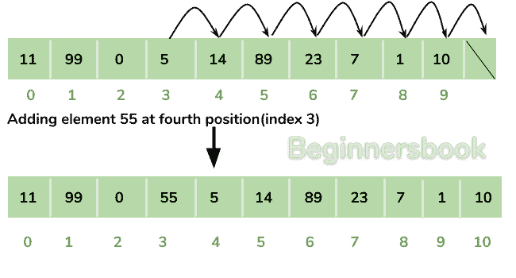
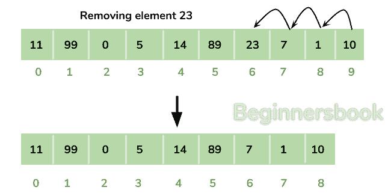

# 带示例程序的 java 中的 ArrayList - 集合框架

> 原文： [https://beginnersbook.com/2013/12/java-arraylist/](https://beginnersbook.com/2013/12/java-arraylist/)

**Arraylist** 类实现 List 接口，它基于 Array 数据结构。由于其提供的功能和灵活性，它被广泛使用。大多数开发人员**选择 Arraylist over Array** ，因为它是传统 java 数组的一个很好的替代品。 ArrayList 是`List`接口的可调整大小的数组实现。它实现了所有可选的列表操作，并允许所有元素，包括`null`。


## 为什么 ArrayList 比 Array 好？

数组的限制是它有一个固定的长度，所以如果它已满，你不能再添加任何元素，同样如果有多个元素被删除，内存消耗将与它不收缩相同。

另一个 ArrayList 可以在添加和删除元素后动态增长和缩小（参见下图）。除了这些好处之外，ArrayList 类还允许我们使用它的预定义方法，这使我们的任务变得简单。让我们看一下图表来理解从 ArrayList 中添加和删除元素，然后我们将看到这些程序。

**在指定位置的 ArrayList 中添加元素：**


**从 ArrayList 中删除元素：**


> 本指南末尾有一些关于 ArrayList 的教程列表，请参考它以完全理解和学习 ArrayList 概念。

## 如何创建 ArrayList？

我们可以通过编写一个这样的简单语句来创建一个 ArrayList：

此语句创建一个名为`alist`且类型为“String”的 ArrayList。该类型确定列表将具有哪种类型的元素。由于此列表是“String”类型，因此要添加到此列表的元素将为“String”类型。

```
ArrayList<String> alist=new ArrayList<String>();
```

类似地，我们可以创建接受 int 元素的 ArrayList。

```
ArrayList<Integer> list=new ArrayList<Integer>();
```

## 如何将元素添加到 ArrayList？

我们使用 add（）方法向 ArrayList 添加元素，这种方法有几种变体，我们可以根据需要使用它们。例如：如果我们想在 List 的末尾添加元素，那么就这样做：

```
alist.add("Steve"); //This will add "Steve" at the end of List
```

要在 ArrayList 中的指定位置添加元素，我们可以在 add 方法中指定索引，如下所示：

```
alist.add(3, "Steve"); //This will add "Steve" at the fourth position
```

让我们写完整的代码：

```
import java.util.*;  
class JavaExample{  
   public static void main(String args[]){  
      ArrayList<String> alist=new ArrayList<String>();  
      alist.add("Steve");
      alist.add("Tim");
      alist.add("Lucy");
      alist.add("Pat");
      alist.add("Angela");
      alist.add("Tom");

      //displaying elements
      System.out.println(alist);

      //Adding "Steve" at the fourth position
      alist.add(3, "Steve");

      //displaying elements
      System.out.println(alist);
   }  
}
```

**输出：**

```
[Steve, Tim, Lucy, Pat, Angela, Tom]
[Steve, Tim, Lucy, Steve, Pat, Angela, Tom]
```

**注意：**由于索引从 0 开始，索引 3 将代表第四个位置而不是 3。

## 如何从 ArrayList 中删除元素？

我们使用 remove（）方法从 ArrayList 中删除元素，与 add（）方法相同，此方法也有一些变化。

例如：

```
import java.util.*;
class JavaExample{
   public static void main(String args[]){
      ArrayList<String> alist=new ArrayList<String>(); 
      alist.add("Steve");
      alist.add("Tim");
      alist.add("Lucy");
      alist.add("Pat");
      alist.add("Angela");
      alist.add("Tom");

      //displaying elements
      System.out.println(alist);

      //Removing "Steve" and "Angela"
      alist.remove("Steve");
      alist.remove("Angela");

      //displaying elements
      System.out.println(alist);

      //Removing 3rd element
      alist.remove(2);

      //displaying elements
      System.out.println(alist);
   }
}
```

**Output:**

```
[Steve, Tim, Lucy, Pat, Angela, Tom]
[Tim, Lucy, Pat, Tom]
[Tim, Lucy, Tom]
```

## 迭代 ArrayList

在上面的例子中，我们只是通过引用 ArrayList 实例来显示 ArrayList 元素，这绝对不是显示元素的正确方法。显示元素的正确方法是使用像这样的高级 for 循环。

```
import java.util.*;  
class JavaExample{  
  public static void main(String args[]){  
     ArrayList<String> alist=new ArrayList<String>();  
     alist.add("Gregor Clegane");  
     alist.add("Khal Drogo");  
     alist.add("Cersei Lannister");  
     alist.add("Sandor Clegane"); 
     alist.add("Tyrion Lannister");

     //iterating ArrayList
     for(String str:alist)  
        System.out.println(str);  
     }  
}
```

**Output:**

```
Gregor Clegane
Khal Drogo
Cersei Lannister
Sandor Clegane
Tyrion Lannister

```

## Java 中的 ArrayList 示例

此示例演示如何从 ArrayList 创建，初始化，添加和删除元素。在这个例子中，我们有一个类型为“String”的 ArrayList。我们使用 add（String E）方法在 ArrayList 中添加了 5 个 String 元素，此方法在 ArrayList 的末尾添加了元素。

然后我们使用方法 add（int index，String E）在 ArrayList 中添加另外两个元素，此方法在指定的索引处添加指定的元素，索引 0 表示第一个位置，1 表示第二个位置。

然后我们从 ArrayList 中删除元素“Chaitanya”和“Harry”，然后我们使用方法 remove（int index）删除 ArrayList 的第二个元素。由于我们已将索引指定为 1（remove（1）），因此它将删除第二个元素。

```
import java.util.*;

public class JavaExample {
   public static void main(String args[]) {
      /* Creating ArrayList of type "String" which means
       * we can only add "String" elements
       */
      ArrayList<String> obj = new ArrayList<String>();

      /*This is how we add elements to an ArrayList*/
      obj.add("Ajeet");
      obj.add("Harry");
      obj.add("Chaitanya");
      obj.add("Steve");
      obj.add("Anuj");

      // Displaying elements
      System.out.println("Original ArrayList:");
      for(String str:obj)
         System.out.println(str);

      /* Add element at the given index
       * obj.add(0, "Rahul") - Adding element "Rahul" at first position
       * obj.add(1, "Justin") - Adding element "Justin" at second position
       */
      obj.add(0, "Rahul");
      obj.add(1, "Justin");

      // Displaying elements
      System.out.println("ArrayList after add operation:");
      for(String str:obj)
         System.out.println(str);

      //Remove elements from ArrayList like this
      obj.remove("Chaitanya"); //Removes "Chaitanya" from ArrayList
      obj.remove("Harry"); //Removes "Harry" from ArrayList

      // Displaying elements
      System.out.println("ArrayList after remove operation:");
      for(String str:obj)
         System.out.println(str);

      //Remove element from the specified index
      obj.remove(1); //Removes Second element from the List

      // Displaying elements
      System.out.println("Final ArrayList:");
      for(String str:obj)
         System.out.println(str);
   }
}

Output:
```

```
Original ArrayList:
Ajeet
Harry
Chaitanya
Steve
Anuj
ArrayList after add operation:
Rahul
Justin
Ajeet
Harry
Chaitanya
Steve
Anuj
ArrayList after remove operation:
Rahul
Justin
Ajeet
Steve
Anuj
Final ArrayList:
Rahul
Ajeet
Steve
Anuj

```

## ArrayList 类的方法

在上面的例子中，我们使用了 add（）和 remove（）等方法。但是有许多方法可以直接使用 ArrayList 类的对象。我们来讨论一下 ArrayList 类的几个重要方法。

1） **add（Object o）**：此方法向 arraylist 添加一个对象 o。

```
obj.add("hello");
```

这个语句会在最后一个位置的 arraylist 中添加一个字符串 hello。

2） **add（int index，Object o）**：它将对象 o 添加到给定索引处的数组列表中。

```
obj.add(2, "bye");
```

它将字符串再见添加到数组列表的第二个索引（数组列表以索引 0 开头的第三个位置）。

3） **remove（Object o）**：从 ArrayList 中删除对象 o。

```
obj.remove("Chaitanya");
```

该语句将从 ArrayList 中删除字符串“Chaitanya”。

4） **remove（int index）**：从给定索引中删除元素。

```
obj.remove(3);
```

它将删除索引 3 的元素（列表的第 4 个元素 - 列表以 o 开头）。

5） **set（int index，Object o）**：用于更新元素。它用对象 o 替换指定索引处的元素。

```
obj.set(2, "Tom");
```

它将使用值 Tom 替换第 3 个元素（index = 2 是第 3 个元素）。

6） **int indexOf（Object o）**：给出对象的索引 o。如果在列表中找不到该元素，则此方法返回值-1。

```
int pos = obj.indexOf("Tom");
```

这将给出列表中字符串 Tom 的索引​​（位置）。

7） **Object get（int index）**：返回列表对象，该对象出现在指定的索引处。

```
String str= obj.get(2);
```

函数 get 将返回存储在第 3 个位置（索引 2）的字符串，并将分配给字符串“str”。我们已将返回的值存储在字符串变量中，因为在我们的示例中，我们已经定义了 ArrayList 是 String 类型。如果您有整数数组列表，则返回的值应存储在整数变量中。

8） **int size（）**：它给出了 ArrayList 的大小 - 列表元素的数量。

```
int numberofitems = obj.size();
```

9） **boolean contains（Object o）**：它检查给定对象 o 是否存在于数组列表中，如果它在那里则返回 true，否则返回 false。

```
obj.contains("Steve");
```

如果字符串“Steve”出现在列表中，它将返回 true，否则我们将得到错误。

10） **clear（）：**它用于一次性删除数组列表的所有元素。下面的代码将删除其对象为 obj 的 ArrayList 的所有元素。

```
obj.clear();
```

## Java ArrayList 教程

以下是 beginnersbook.com 上发布的 **ArrayList** 教程列表。

#### ArrayList 基础知识

*   [初始化 ArrayList](https://beginnersbook.com/2013/12/how-to-initialize-an-arraylist/)
*   [Loop ArrayList](https://beginnersbook.com/2013/12/how-to-loop-arraylist-in-java/)
*   [查找 ArrayList 的长度](https://beginnersbook.com/2013/12/how-to-find-length-of-arraylist-in-java/)

#### 排序

*   [Sort ArrayList](https://beginnersbook.com/2013/12/how-to-sort-arraylist-in-java/)
*   [按降序排序 ArrayList](https://beginnersbook.com/2013/12/sort-arraylist-in-descending-order-in-java/)
*   [使用 Comparable 和 Comparator 对对象排序 ArrayList](https://beginnersbook.com/2013/12/java-arraylist-of-object-sort-example-comparable-and-comparator/)

#### 添加/删除

*   [将元素添加到 ArrayList](https://beginnersbook.com/2013/12/java-arraylist-add-method-example/)
*   [在 ArrayList](https://beginnersbook.com/2013/12/java-arraylist-addint-index-e-element-example/) 的特定索引处添加元素
*   [将 Collection 元素追加到 ArrayList](https://beginnersbook.com/2013/12/java-arraylist-addallcollection-c-method-example/)
*   [将所有列表元素复制到 ArrayList](https://beginnersbook.com/2013/12/how-to-copy-and-add-all-list-elements-to-arraylist-in-java/)
*   [将所有集合元素插入 ArrayList](https://beginnersbook.com/2013/12/java-arraylist-addall-int-index-collection-c-method-example/) 中的指定位置
*   [从 ArrayList](https://beginnersbook.com/2013/12/java-arraylist-remove-method-example/) 中的指定索引中删除元素
*   [从 ArrayList](https://beginnersbook.com/2013/12/java-arraylist-removeobject-method-example/) 中删除指定的元素

#### 获取/搜索

*   [获取 ArrayList 的子列表](https://beginnersbook.com/2013/12/how-to-get-sublist-of-an-arraylist-with-example/)
*   [获取 ArrayList](https://beginnersbook.com/2013/12/java-arraylist-lastindexofobject-0bj-method-example/) 中元素的最后一次出现的索引
*   [从 ArrayList](https://beginnersbook.com/2013/12/java-arraylist-get-method-example/) 获取元素
*   [获取 ArrayList](https://beginnersbook.com/2013/12/java-arraylist-indexof-method-example/) 中元素第一次出现的索引
*   [检查 ArrayList 中是否存在元素](https://beginnersbook.com/2013/12/java-arraylist-contains-method-example/)

#### 关于 ArrayList 的其他教程

*   [比较两个 ArrayList](https://beginnersbook.com/2013/12/how-to-compare-two-arraylist-in-java/)
*   [同步 ArrayList](https://beginnersbook.com/2013/12/how-to-synchronize-arraylist-in-java-with-example/)
*   [在 ArrayList](https://beginnersbook.com/2013/12/how-to-swap-two-elements-in-an-arraylist/) 中交换两个元素
*   [覆盖 toString（）方法 - ArrayList](https://beginnersbook.com/2013/12/how-to-override-tostring-method-for-arraylist-in-java/)
*   [序列化 ArrayList](https://beginnersbook.com/2013/12/how-to-serialize-arraylist-in-java/)
*   [加入两个 ArrayList](https://beginnersbook.com/2013/12/how-to-joincombine-two-arraylists-in-java/)
*   [克隆 ArrayList 到另一个 ArrayList](https://beginnersbook.com/2013/12/how-to-clone-an-arraylist-to-another-arraylist/)
*   [使 ArrayList 为空](https://beginnersbook.com/2013/12/how-to-empty-an-arraylist-in-java/)
*   [检查 ArrayList 是否为空](https://beginnersbook.com/2013/12/java-arraylist-isempty-method-example/)
*   [修剪 ArrayList 的大小](https://beginnersbook.com/2013/12/java-arraylist-trimtosize-method-example/)
*   [替换 ArrayList](https://beginnersbook.com/2013/12/java-arraylist-set-method-example/) 中现有元素的值
*   [增加 ArrayList](https://beginnersbook.com/2013/12/java-arraylist-ensurecapacity-method-example/) 的容量（大小）

#### 转换：

*   [将 LinkedList 转换为 ArrayList](https://beginnersbook.com/2014/07/java-convert-a-linkedlist-to-arraylist/)
*   [将 Vector 转换为 ArrayList](https://beginnersbook.com/2014/07/java-convert-vector-to-arraylist-example/)
*   [将 ArrayList 转换为字符串数组](https://beginnersbook.com/2013/12/how-to-convert-arraylist-to-string-array-in-java/)
*   [将数组转换为 ArrayList](https://beginnersbook.com/2013/12/how-to-convert-array-to-arraylist-in-java/)
*   [将 HashSet 转换为 ArrayList](https://beginnersbook.com/2014/08/convert-hashset-to-a-list-arraylist/)

#### 区别：

*   [ArrayList vs Vector](https://beginnersbook.com/2013/12/difference-between-arraylist-and-vector-in-java/)
*   [ArrayList vs HashMap](https://beginnersbook.com/2013/12/difference-between-arraylist-and-hashmap-in-java/)
*   [ArrayList vs LinkedList](https://beginnersbook.com/2013/12/difference-between-arraylist-and-linkedlist-in-java/)

#### 参考

*   [ArrayList 文档](https://docs.oracle.com/javase/7/docs/api/java/util/ArrayList.html)