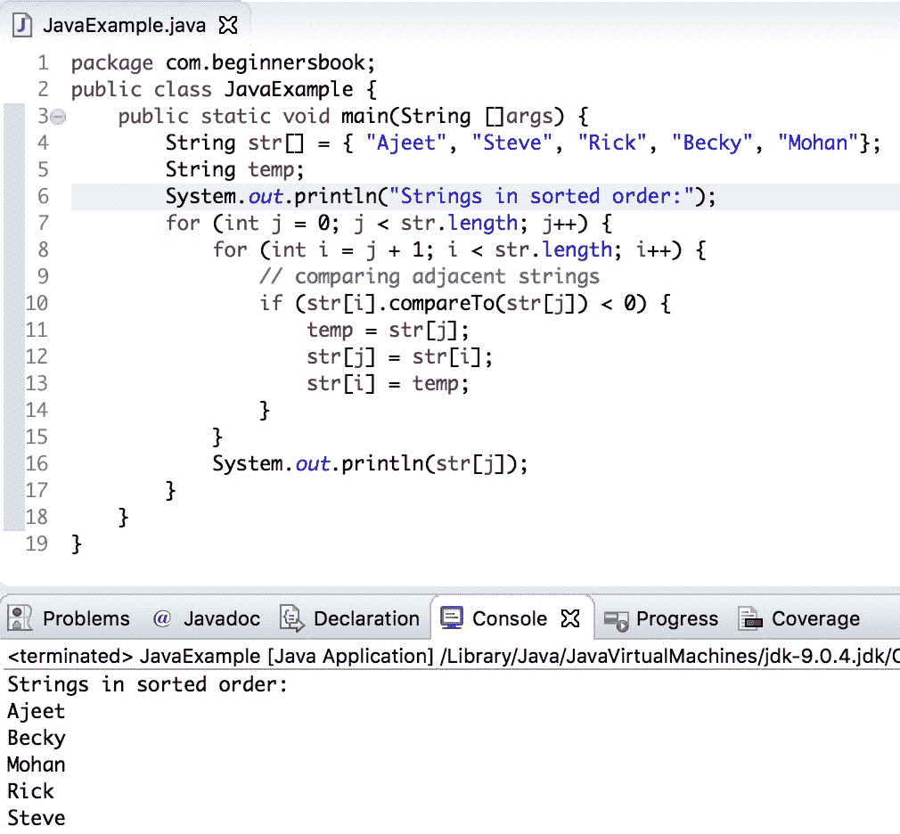

# Java 程序：对字符串执行冒泡排序

> 原文： [https://beginnersbook.com/2019/04/java-program-to-perform-b​​ubble-sort-on-strings/](https://beginnersbook.com/2019/04/java-program-to-perform-bubble-sort-on-strings/)

要对字符串执行冒泡排序，我们需要比较相邻的字符串，如果它们不在顺序中，那么我们需要交换这些字符串，这个过程需要完成，直到我们到达最后。这样，所有字符串都将按升序排序，这种排序过程称为冒泡排序。

## 字符串上的冒泡排序示例

在下面的示例中，我们将字符串存储在`String`数组中，并且我们使用嵌套`for`循环来比较数组中的相邻字符串，如果它们不是按顺序我们[使用临时字符串变量`temp`交换它们](https://beginnersbook.com/2017/09/java-program-to-swap-two-numbers-using-bitwise-xor-operator/)。

这里我们使用[`compareTo()`方法](https://beginnersbook.com/2013/12/java-string-compareto-method-example/)来比较相邻的字符串。

```java
public class JavaExample {
   public static void main(String []args) {
	String str[] = { "Ajeet", "Steve", "Rick", "Becky", "Mohan"};
	String temp;
	System.out.println("Strings in sorted order:");
	for (int j = 0; j < str.length; j++) {
   	   for (int i = j + 1; i < str.length; i++) {
		// comparing adjacent strings
		if (str[i].compareTo(str[j]) < 0) {
			temp = str[j];
			str[j] = str[i];
			str[i] = temp;
		}
	   }
	   System.out.println(str[j]);
	}
   }
}
```

**输出：**



#### 相关的 Java 示例

1.  [Java 程序：排序数组](https://beginnersbook.com/2018/10/java-program-to-sort-an-array-in-ascending-order/)
2.  [Java 程序：按字母顺序排序字符串](https://beginnersbook.com/2018/10/java-program-to-sort-strings-in-an-alphabetical-order/)
3.  [Java 程序：反转字符串中的单词](https://beginnersbook.com/2017/09/java-program-to-reverse-words-in-a-string/)
4.  [Java 程序：查找字符串中的重复字符](https://beginnersbook.com/2014/07/java-program-to-find-duplicate-characters-in-a-string/)