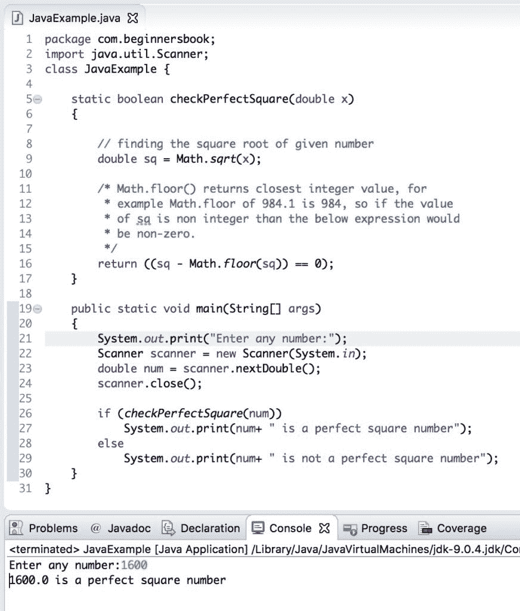

# Java 程序：检查给定数字是否为完美平方

> 原文： [https://beginnersbook.com/2019/02/java-program-to-check-if-given-number-is-perfect-square/](https://beginnersbook.com/2019/02/java-program-to-check-if-given-number-is-perfect-square/)

在本教程中，我们将编写一个 java 程序到**，检查给定的数字是否为完美平方**。

## Java 示例检查数字是否是完美的正方形

在这个程序中，我们创建了一个[用户定义的方法](https://beginnersbook.com/2013/04/oops-concepts/) `checkPerfectSquare()`，它接受一个数字作为参数，如果数字是完美的正方形则返回`true`，否则返回`false`。

在用户定义的方法中，我们使用`Math`类的两种方法，`sqrt()`方法和`floor()`方法。`Math.sqrt()`方法找到给定数字的平方根，`floor()`方法找到`sqrt()`方法返回的平方根值的最接近整数。后来我们计算了这两者之间的差异，以检查差异是零还是非零。对于完美的平方数，这个差值应该为零，因为完美平方数的平方根本身就是整数。

```java
package com.beginnersbook;
import java.util.Scanner;
class JavaExample { 

    static boolean checkPerfectSquare(double x)  
    { 

	// finding the square root of given number 
	double sq = Math.sqrt(x); 

	/* Math.floor() returns closest integer value, for
	 * example Math.floor of 984.1 is 984, so if the value
	 * of sq is non integer than the below expression would
	 * be non-zero.
	 */
	return ((sq - Math.floor(sq)) == 0); 
    } 

    public static void main(String[] args)  
    { 
	System.out.print("Enter any number:");
	Scanner scanner = new Scanner(System.in);
	double num = scanner.nextDouble(); 
	scanner.close();

	if (checkPerfectSquare(num)) 
		System.out.print(num+ " is a perfect square number"); 
	else
		System.out.print(num+ " is not a perfect square number"); 
    } 
}
```

**输出：**



#### 相关的 Java 示例

1\. [Java 程序：将整数分解为数字](https://beginnersbook.com/2019/02/java-program-to-break-integer-into-digits/)
2\. [Java 程序：检查阿姆斯特朗数](https://beginnersbook.com/2017/09/java-program-to-check-armstrong-number/)
3\. [Java 程序：检查素数](https://beginnersbook.com/2014/01/java-program-to-check-prime-number/)
4\. [Java 程序：检查闰年](https://beginnersbook.com/2017/09/java-program-to-check-leap-year/)