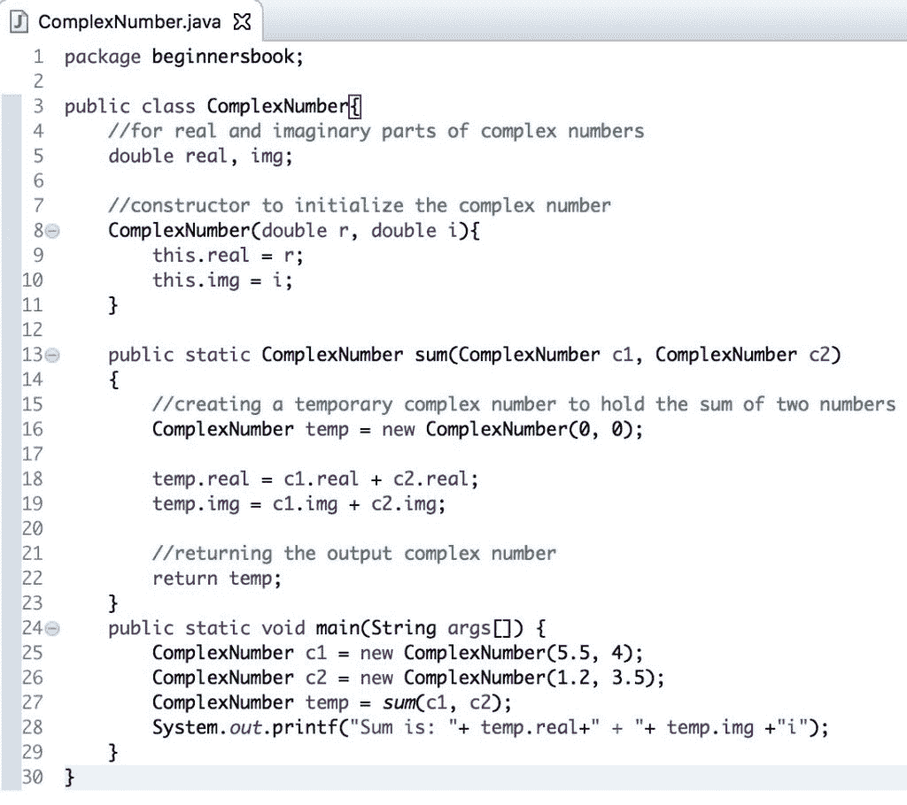

# Java 程序添加两个复数

> 原文： [https://beginnersbook.com/2018/09/java-program-to-add-two-complex-numbers/](https://beginnersbook.com/2018/09/java-program-to-add-two-complex-numbers/)

**复数**有两部分 - 实部​​和虚部。在[教程](https://beginnersbook.com/java-tutorial-for-beginners-with-examples/)中，我们将 [Java 程序](https://beginnersbook.com/2017/09/java-examples/)编写为**添加两个复数**。添加复数时，我们将实部和虚部加在一起，如下图所示。


## 示例 - 在 Java 中添加两个复数

在这个程序中，我们有一个类`ComplexNumber`。在这个类中，我们有两个实例变量`real`和`img`来保存复数的实部和虚部。

我们已经声明了一个方法 sum（）到[通过将它们的实部和虚部加在一起来添加两个数字](https://beginnersbook.com/2017/09/java-program-to-add-two-numbers/)。

此类的构造函数用于初始化复数。对于例如当我们像这个`ComplexNumber temp = new ComplexNumber(0, 0);`创建这个类的实例时，它实际上会创建一个复数`0 + 0i`。

```java
public class ComplexNumber{
   //for real and imaginary parts of complex numbers
   double real, img;

   //constructor to initialize the complex number
   ComplexNumber(double r, double i){
	this.real = r;
	this.img = i;
   }

   public static ComplexNumber sum(ComplexNumber c1, ComplexNumber c2)
   {
	//creating a temporary complex number to hold the sum of two numbers
        ComplexNumber temp = new ComplexNumber(0, 0);

        temp.real = c1.real + c2.real;
        temp.img = c1.img + c2.img;

        //returning the output complex number
        return temp;
    }
    public static void main(String args[]) {
	ComplexNumber c1 = new ComplexNumber(5.5, 4);
	ComplexNumber c2 = new ComplexNumber(1.2, 3.5);
        ComplexNumber temp = sum(c1, c2);
        System.out.printf("Sum is: "+ temp.real+" + "+ temp.img +"i");
    }
}
```

**输出：**

```java
Sum is: 6.7 + 7.5i
```

屏幕截图：Eclipse IDE 中的相同 Java 程序 -


Eclipse IDE 中的输出：

以下是一些相关的 java 示例：

1.  1.  [Java 程序找到最大的三个数字](https://beginnersbook.com/2017/09/java-program-to-find-largest-of-three-numbers/)
    2.  [使用 Switch Case 制作计算器的 Java 程序](https://beginnersbook.com/2017/09/java-program-to-make-a-calculator-using-switch-case/)
    3.  [Java 程序交换两个数字](https://beginnersbook.com/2017/09/java-program-to-swap-two-numbers-using-bitwise-xor-operator/)
    4.  [C ++程序添加两个复数](https://beginnersbook.com/2017/12/c-program-to-add-complex-numbers/)