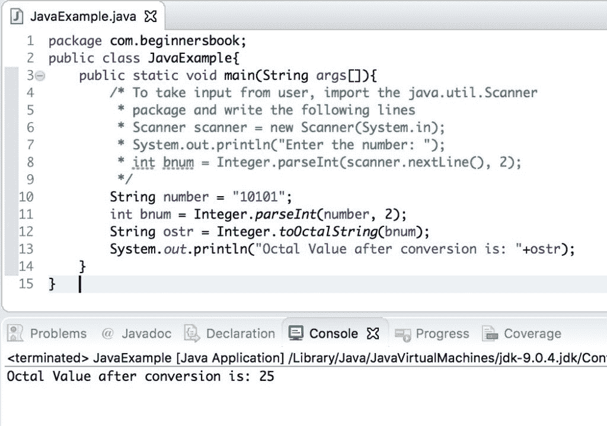

# Java 程序：二进制到八进制的转换

> 原文： [https://beginnersbook.com/2019/04/java-binary-to-octal-conversion/](https://beginnersbook.com/2019/04/java-binary-to-octal-conversion/)

在本教程中，我们将看到如何借助示例将二进制数转换为八进制数。

## 二进制到八进制转换示例

要将二进制数转换为八进制数，我们可以使用`Integer.toOctalString()`方法，该方法将二进制数作为参数并返回一个字符串，该字符串是传递的二进制数的八进制等效值。

这里我们给出了一个`String`形式的二进制数，我们首先使用`Integer.parseInt()`方法将字符串转换为基数 2（二进制数），我们将结果存储在整数`bnum`中。然后我们将这个二进制数`bnum`传递给`Integer.toOctalString()`方法以获取八进制数。

```java
public class JavaExample{  
   public static void main(String args[]){  
	/* To take input from user, import the java.util.Scanner
	 * package and write the following lines
	 * Scanner scanner = new Scanner(System.in);
 	 * System.out.println("Enter the number: ");
	 * int bnum = Integer.parseInt(scanner.nextLine(), 2);
         */
	String number = "10101";
	int bnum = Integer.parseInt(number, 2);
	String ostr = Integer.toOctalString(bnum);
	System.out.println("Octal Value after conversion is: "+ostr);
   }
}
```

**输出：**



如评论中所示，如果我们想从用户那里获取二进制数而不是硬编码值，那么我们可以导入`java.util.Scanner`包并使用以下代码行：

```java
Scanner scanner = new Scanner(System.in);
System.out.println("Enter the number: ");
int bnum = Integer.parseInt(scanner.nextLine(), 2);
```
