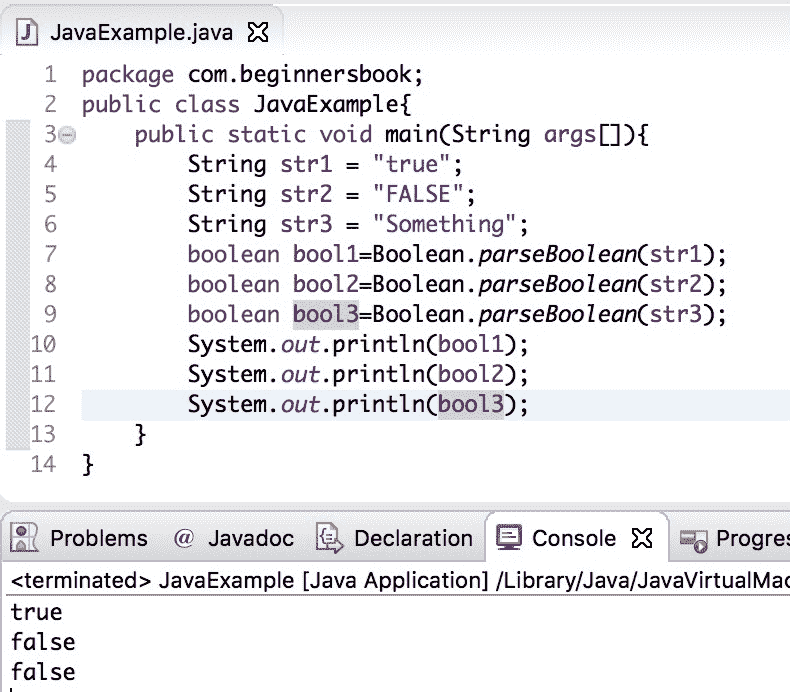
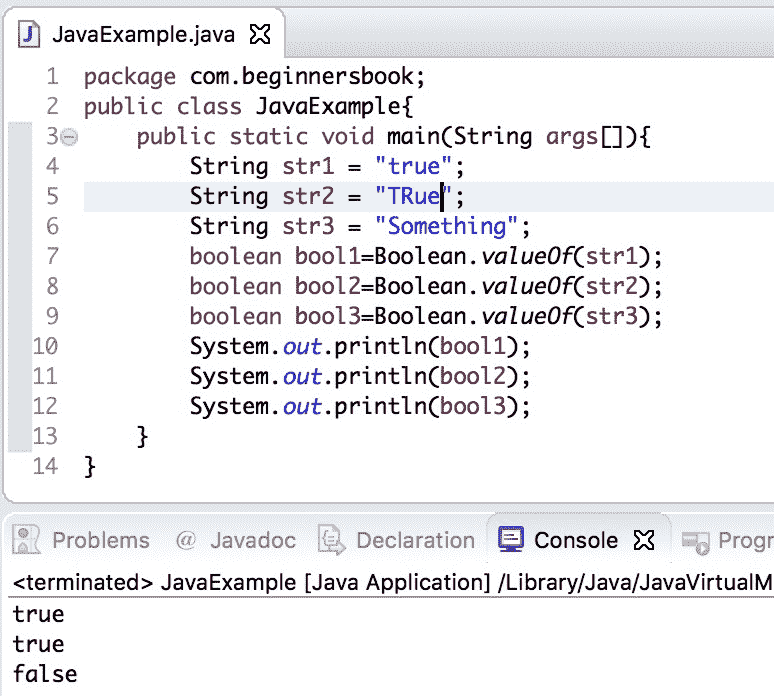

# Java 程序：`String`到`boolean`的转换

> 原文： [https://beginnersbook.com/2019/04/java-string-to-boolean-conversion/](https://beginnersbook.com/2019/04/java-string-to-boolean-conversion/)

在本指南中，我们将在示例的帮助下，看到如何**将`String`转换为布尔值**。

将`String`转换为布尔值时，如果字符串包含值`"true"`（大小写无关紧要），则转换后的布尔值为`true`，如果该字符串包含任何其他值，那么转换后的布尔值将为`"false"`。

## 使用`Boolean.parseBoolean()`方法将`String`转换为布尔

这里我们有三个字符串`str1`，`str2`和`str3`，我们使用`Boolean.parseBoolean()`方法将它们转换为布尔值，此方法接受`String`作为参数并返回布尔值`true`或`false`。如果字符串的值为`"true"`（在任何情况下为大写，小写或混合），则此方法返回`true`，否则返回`false`。

```java
public class JavaExample{  
   public static void main(String args[]){  
	String str1 = "true";  
	String str2 = "FALSE";  
	String str3 = "Something";  
	boolean bool1=Boolean.parseBoolean(str1);  
	boolean bool2=Boolean.parseBoolean(str2);  
	boolean bool3=Boolean.parseBoolean(str3);  
	System.out.println(bool1);  
	System.out.println(bool2);  
	System.out.println(bool3);  
   }
}
```

**输出：**



## 使用`Boolean.valueOf()`的 Java `String`到`boolean`转换

在这里，我们将看到另一种方法，我们可以使用它来进行字符串到布尔转换。与`Boolean.parseBoolean()`方法类似，`Boolean.valueOf()`方法接受字符串作为参数，并返回布尔值`true`或`false`。

```java
public class JavaExample{  
   public static void main(String args[]){  
	String str1 = "true";  
	String str2 = "TRue";  
	String str3 = "Something";  
	boolean bool1=Boolean.valueOf(str1);  
	boolean bool2=Boolean.valueOf(str2);  
	boolean bool3=Boolean.valueOf(str3);  
	System.out.println(bool1);  
	System.out.println(bool2);  
	System.out.println(bool3);  
   }
}
```

**输出：**


