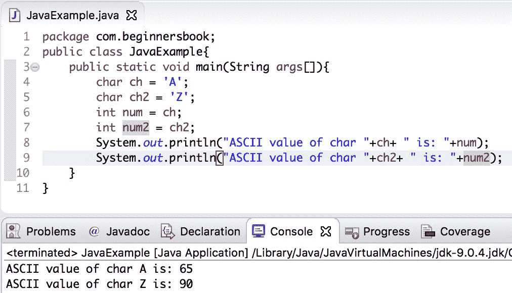
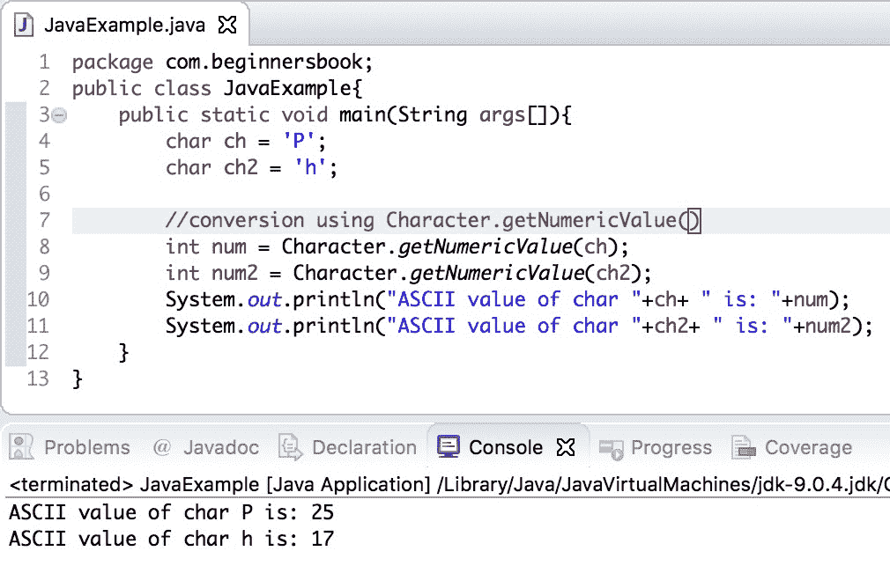
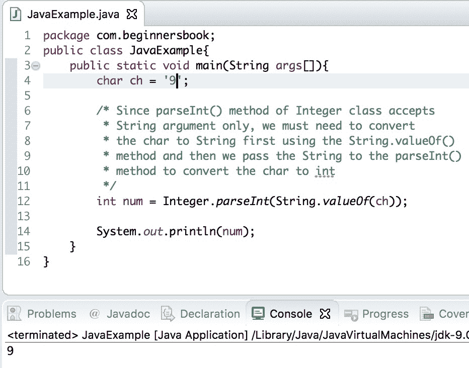

# Java 程序：`char`到`int`的转换

> 原文： [https://beginnersbook.com/2019/04/java-char-to-int-conversion/](https://beginnersbook.com/2019/04/java-char-to-int-conversion/)

在本教程中，我们将看到如何借助示例将`char`转换为`int`。将字符转换为整数等同于查找给定字符的 ASCII 值（这是一个整数）。

## Java `char`到`int` - 隐式类型转换

由于`char`是与`int`相比较小的数据类型，因此我们不需要在此处进行显式类型转换。将`char`值简单赋值给`int`变量就可以了，编译器会自动将`char`转换为`int`，这个过程称为隐式类型转换或类型提升。

在下面的示例中，我们将`char`值分配给整数变量，而不进行任何类型转换。编译器在这里自动进行转换，这仅适用于我们将较小的数据类型分配给较大的数据类型，否则我们必须进行显式类型转换。

```java
public class JavaExample{  
   public static void main(String args[]){  
	char ch = 'A';
	char ch2 = 'Z';
	int num = ch;
	int num2 = ch2;
	System.out.println("ASCII value of char "+ch+ " is: "+num);
	System.out.println("ASCII value of char "+ch2+ " is: "+num2);
   }
}
```

**输出：**



## 使用`Character.getNumericValue()`进行 Java `char`转换为`int`

我们还可以使用`Character.getNumericValue(char ch)`方法将`char`转换为`int`。此方法接受`char`作为参数，并在转换后返回等效的`int`（ASCII）值。

这里我们有两个`char`变量`ch`和`ch2`，我们使用`Character.getNumericValue()`方法将它们转换为整数`num`和`num2`。

```java
public class JavaExample{  
   public static void main(String args[]){  
	char ch = 'P';
	char ch2 = 'h';

	//conversion using Character.getNumericValue()
	int num = Character.getNumericValue(ch);
	int num2 = Character.getNumericValue(ch2);
	System.out.println("ASCII value of char "+ch+ " is: "+num);
	System.out.println("ASCII value of char "+ch2+ " is: "+num2);
   }
}
```

**输出：**



## 使用`Integer.parseInt()`方法将 Java `char`转换为`int`

这里我们使用`Integer.parseInt(String)`方法将给定的`char`转换为`int`。由于此方法接受字符串参数，因此我们[使用`String.valueOf()`方法将`char`转换为`String`](https://beginnersbook.com/2019/04/java-char-to-string-conversion/)，然后将转换后的值传递给方法。

```java
public class JavaExample{  
   public static void main(String args[]){  
	char ch = '9';

	/* Since parseInt() method of Integer class accepts
   	 * String argument only, we must need to convert
	 * the char to String first using the String.valueOf()
	 * method and then we pass the String to the parseInt()
	 * method to convert the char to int
	 */
	int num = Integer.parseInt(String.valueOf(ch));

	System.out.println(num);
   }
}
```

**输出：**


