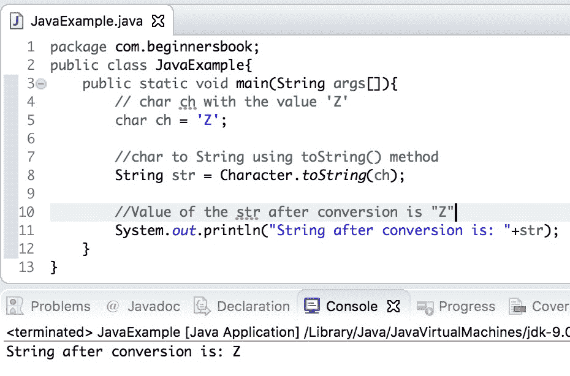

# Java 程序：`char`到`String`的转换

> 原文： [https://beginnersbook.com/2019/04/java-char-to-string-conversion/](https://beginnersbook.com/2019/04/java-char-to-string-conversion/)

在本教程中，我们将在示例的帮助下看到如何将`char`转换为字符串。

有两种方法可以对字符串进行字符串转换 -

1.  使用`String.valueOf(char ch)`方法
2.  使用`Character.toString(char ch)`方法

## 使用`String.valueOf(char ch)`的`char`到`String`转换

我们可以使用`String`类的`valueOf(char ch)`方法将传递的`char ch`转换为`String`。此方法接受`char`作为参数，并返回与参数等效的字符串。

在下面的示例中，我们有一个 char ch`，其值为`'P'`，我们使用`String.valueOf()`方法将其转换为`String str`。转换后字符串的值为`"P"`。

```java
public class JavaExample{  
    public static void main(String args[]){  
	//given char
	char ch = 'P';

	//char to string conversion
	String str = String.valueOf(ch);  

	//displaying the string
	System.out.println("String after conversion is: "+str);    
   }
}
```

**输出：**


## 使用`Character.toString(char ch)`将`char`转换为`String`

我们还可以使用`Character`类的`toString(char ch)`方法将传递的`char ch`转换为`String`。与`String.valueOf(char ch)`方法类似，此方法也接受`char`作为参数并返回等效的`String`。

在下面的示例中，我们使用`Character.toString(char ch)`方法将`char`转换为`String`。

```java
public class JavaExample{  
   public static void main(String args[]){  
	// char ch with the value 'Z'
	char ch = 'Z';

	//char to String using toString() method
	String str = Character.toString(ch);  

	//Value of the str after conversion is "Z"
	System.out.println("String after conversion is: "+str);    
   }
}
```

**输出：**


