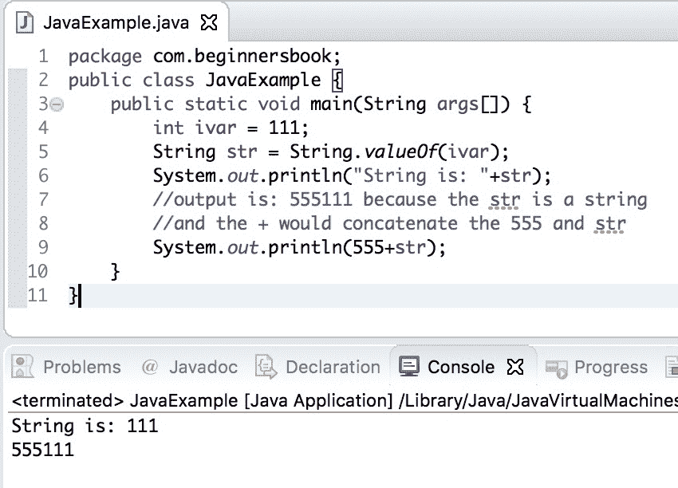

# Java 程序：`int`到`String`的转换

> 原文： [https://beginnersbook.com/2015/05/java-int-to-string/](https://beginnersbook.com/2015/05/java-int-to-string/)

在本指南中，我们将学习如何在 Java 中将`int`转换为字符串。我们可以**使用`String.valueOf()`或`Integer.toString()`方法将`int`转换为`String`**。我们也可以使用`String.format()`方法进行转换。

## 1.使用`String.valueOf()`将`int`转换为`String`

`String.valueOf(int i)`方法将整数值作为参数，并返回表示`int`参数的字符串。

**方法签名**：

```java
public static String valueOf（int i）
```

**参数**：

`i` - 需要转换为字符串的整数

**返回**：

表示整数参数的字符串

### 使用`String.valueOf()`将`int`转换为`String`

```java
public class JavaExample {
   public static void main(String args[]) {
	int ivar = 111;
	String str = String.valueOf(ivar);
	System.out.println("String is: "+str); 
	//output is: 555111 because the str is a string 
	//and the + would concatenate the 555 and str
	System.out.println(555+str);
   }
}

```

**输出：**



## 2.使用`Integer.toString()`将`int`转换为`String`

`Integer.toString(int i)`方法与`String.valueOf(int i)`方法的作用相同。它属于`Integer`类，并将指定的整数值转换为`String`。例如如果传递的值是 101，那么返回的字符串值将是`"101"`。

**方法签名**：

```java
public static String toString（int i）
```

**参数**：

`i` - 需要转换的整数

**返回**：

表示整数`i`的字符串。

**示例：**

```java
int ivar2 = 200;
String str2 = Integer.toString(ivar2);
```

### 使用`Integer.toString()`的`int`到`String`转换

```java
public class Example {
   public static void main(String args[]) {
        int ivar = 111;
	String str = Integer.toString(ivar);
	System.out.println("String is: "+str);
	//output is: 555111 because the str is a string 
	//and the + would concatenate the 555 and str
	System.out.println(555+str);

	//output is: 666 because ivar is int value and the
        //+ would perform the addition of 555 and ivar
	System.out.println(555+ivar);
   }
}
```

输出：

```java
String is: 111
555111
666
```

## 示例：将`int`转换为`String`

该程序演示了如何使用上述方法（`String.valueOf()`和`Integer.toString()`）。这里我们有两个整数变量，我们使用`String.valueOf(int i)`方法转换其中一个，使用`Integer.toString(int i)`方法转换其中一个。

```java
public class IntToString {
    public static void main(String[] args) {

        /* Method 1: using valueOf() method
         * of String class.
         */
        int ivar = 111;
        String str = String.valueOf(ivar);
        System.out.println("String is: "+str);

        /* Method 2: using toString() method 
         * of Integer class
         */
        int ivar2 = 200;
        String str2 = Integer.toString(ivar2);
        System.out.println("String2 is: "+str2);
    }
}
```

**输出：**

```java
String is: 111
String2 is: 200
```

## 3.用于转换的`String.format()`方法

```java
public class JavaExample{  
   public static void main(String args[]){  
	int num = 99;  
	String str = String.format("%d",num);  
	System.out.println("hello"+str);  
   }
}
```

**输出：**

```java
hello99
```

