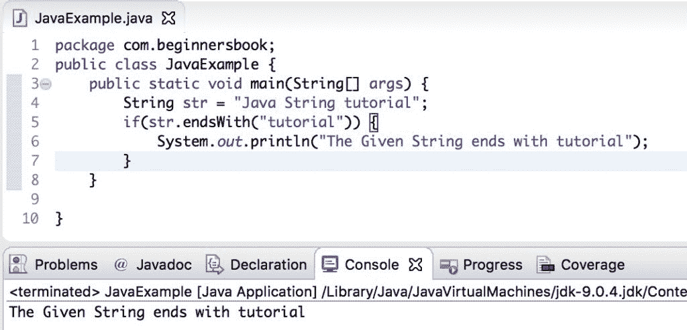

# Java String endsWith（）方法与示例

> 原文： [https://beginnersbook.com/2013/12/java-string-endswith-method-example/](https://beginnersbook.com/2013/12/java-string-endswith-method-example/)

Java String `endsWith(String suffix)`方法检查`String`是否以指定的后缀结尾。此方法返回布尔值 true 或 false。如果在字符串的末尾找到指定的后缀，则返回 true，否则返回 false。

**endsWith（）方法签名：**
`public boolean endsWith(String suffix)`

## Java String endsWith（）方法示例

在下面的例子中，我们有两个字符串`str1`和`str2`，我们正在检查字符串是否以指定的后缀结尾。

```
public class EndsWithExample{
   public static void main(String args[]){
       String str1 = new String("This is a test String");
       String str2 = new String("Test ABC");
       boolean var1 = str1.endsWith("String");
       boolean var2 = str1.endsWith("ABC");
       boolean var3 = str2.endsWith("String");
       boolean var4 = str2.endsWith("ABC");
       System.out.println("str1 ends with String: "+ var1);
       System.out.println("str1 ends with ABC: "+ var2);
       System.out.println("str2 ends with String: "+ var3);
       System.out.println("str2 ends with ABC: "+ var4);
   }
}
```

**输出：**

```
str1 ends with String: true
str1 ends with ABC: false
str2 ends with String: false
str2 ends with ABC: true
```

## String endsWith（）方法，带 if 语句

由于方法 endsWith（）返回一个布尔值，因此它可以在 [If 语句](https://beginnersbook.com/2017/08/if-else-statement-in-java/)中用作条件，如下例所示。这里我们给出了一个 String“Java String tutorial”，我们正在检查 if 语句是否以后缀“tutorial”结尾。

```
public class JavaExample {  
   public static void main(String[] args) {  
	String str = "Java String tutorial";
	if(str.endsWith("tutorial")) {
		System.out.println("The Given String ends with tutorial");
	}
   }  
}
```

**输出：**
