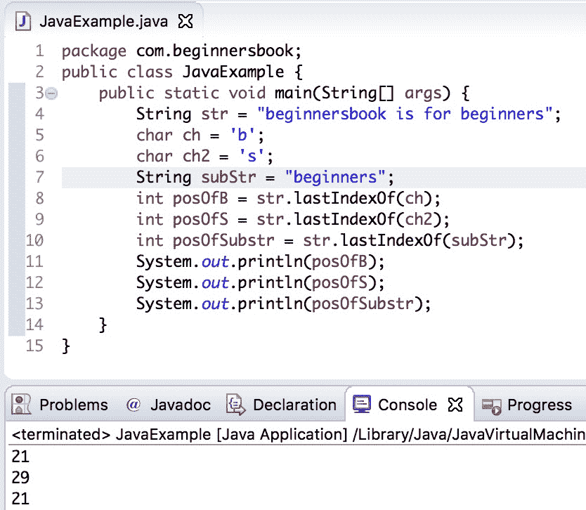

# Java String lastIndexOf（）方法示例

> 原文： [https://beginnersbook.com/2013/12/java-string-lastindexof-method-example/](https://beginnersbook.com/2013/12/java-string-lastindexof-method-example/)

在上一个教程中，我们讨论了 [`indexOf()`](https://beginnersbook.com/2013/12/java-string-indexof-method-example/) 方法，该方法用于找出给定 String 中指定 char 或子字符串的出现。在本教程中，我们将讨论`lastIndexOf()`方法，该方法用于找出给定 String 中字符的最后一次出现的索引或[子串](https://beginnersbook.com/2013/12/java-string-substring-method-example/)。

## Java String lastIndexOf（）方法签名

要找出指定字符或字符串的最后一次出现，此方法从字符串末尾开始搜索并从那里向后返回。如果在方法调用期间指定了`fromIndex`，则向后搜索从指定的索引`fromIndex`开始

`int lastIndexOf(int ch)`：返回给定 String 中最后一次出现的字符 ch。

`int lastIndexOf(int ch, int fromIndex)`：返回最后一次出现的 ch，它从指定的索引“fromIndex”开始向后看。

`int lastIndexOf(String str)`：返回 String 中最后一次出现的 substring str。

`int lastIndexOf(String str, int fromIndex)`：返回最后一次出现的 str，开始从指定的索引“fromIndex”向后搜索。

## Java String lastIndexOf（）示例

在下面的例子中，我们在 String `str`中搜索几个给定的字符和一个给定的子字符串。我们正在寻找它们在 String str 中的最后一次出现，这就是我们使用 lastIndexOf（）方法的原因。如果要查找字符串中第一次出现的 char 或子字符串，请改用 [indexOf（）方法](https://beginnersbook.com/2013/12/java-string-indexof-method-example/)。

```
public class JavaExample {  
   public static void main(String[] args) {  
	String str = "beginnersbook is for beginners";
	char ch = 'b';
	char ch2 = 's';
	String subStr = "beginners";
	int posOfB = str.lastIndexOf(ch);
	int posOfS = str.lastIndexOf(ch2);
	int posOfSubstr = str.lastIndexOf(subStr);
	System.out.println(posOfB);
	System.out.println(posOfS);
	System.out.println(posOfSubstr);
   }  
}
```

**输出：**


## String lastIndexOf（）方法的另一个例子

这里我们将演示在各种情况下使用 lastIndexOf（）方法。我们正在尝试使用 lastIndexOf（）方法的不同变体，我们提供`fromIndex`，然后该方法从指定的`fromIndex`向后搜索。

```
public class LastIndexOfExample{
   public static void main(String args[]) {
       String str1 = new String("This is a BeginnersBook tutorial");
       String str2 = new String("Beginners");
       String str3 = new String("Book");
       String str4 = new String("Books");
       System.out.println("Last 'B' in str1: "+str1.lastIndexOf('B'));
       System.out.println("Last 'B' in str1 whose index<=15:"+str1.lastIndexOf('B', 15));
       System.out.println("Last 'B' in str1 whose index<=30:"+str1.lastIndexOf('B', 30));
       System.out.println("Last occurrence of str2 in str1:"+str1.lastIndexOf(str2));
       System.out.println("Last occurrence of str2 in str1 before 15:"+str1.lastIndexOf(str2, 15));
       System.out.println("Last occurrence of str3 in str1:"+str1.lastIndexOf(str3));
       System.out.println("Last occurrence of str4 in str1"+str1.lastIndexOf(str4));
       System.out.println("Last occurrence of 'is' in str1:"+str1.lastIndexOf("is"));
       System.out.println("Last occurrence of 'is' in str1 before 4:"+str1.lastIndexOf("is", 4));
   }
}
```

**输出：**

```
Last 'B' in str1: 19
Last 'B' in str1 whose index<=15:10
Last 'B' in str1 whose index<=30:19
Last occurrence of str2 in str1:10
Last occurrence of str2 in str1 before 15:10
Last occurrence of str3 in str1:19
Last occurrence of str4 in str1-1
Last occurrence of 'is' in str1:5
Last occurrence of 'is' in str1 before 4:2
```