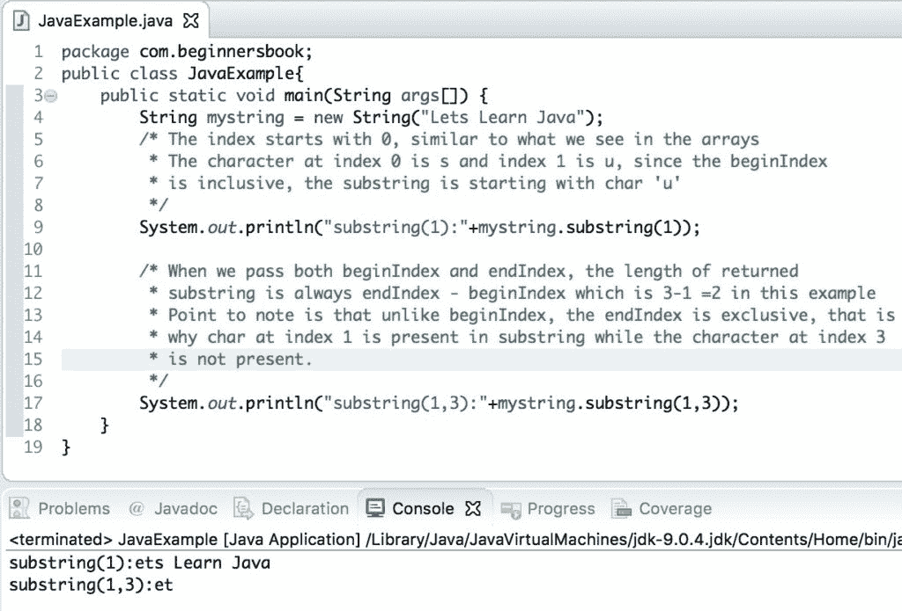

# Java - `String substring()`方法

> 原文： [https://beginnersbook.com/2013/12/java-string-substring-method-example/](https://beginnersbook.com/2013/12/java-string-substring-method-example/)

方法`substring()`返回一个新字符串，它是给定字符串的子字符串。 Java [`String`](https://beginnersbook.com/2013/12/java-strings/)`substring()`方法用于根据传递的索引获取给定字符串的子字符串。这种方法有两种变体。在本指南中，我们将看到如何在示例的帮助下使用此方法。

## `String substring()`方法变体

我们可以通过两种方式使用`substring()`方法 -

**1.当我们只通过起始指数时：**

```java
String substring(int beginIndex)
```

返回从指定索引开始的子字符串，即`beginIndex`，并扩展到字符串末尾的字符。例如 - `"Chaitanya".substring(2)`将返回`"aitanya"`。`beginIndex`是包含的，这就是索引 2 中出现的字符包含在子字符串中的原因。如果`beginIndex`小于零或大于`String`的长度（`beginIndex < 0 || > String.length()`）抛出`IndexOutOfBoundsException`。

**2.当我们传递两个索引时，起始索引和结束索引：**

```java
String substring(int beginIndex, int endIndex)
```

返回一个新字符串，该字符串是此字符串的子字符串。子字符串从指定的`beginIndex`开始，并扩展到索引`endIndex - 1`处的字符。**因此子字符串的长度是`endIndex-beginIndex`。** 换句话说，你可以说`beginIndex`是包容性的，而`endIndex`在获取子字符串时是独占的。

例如 - `"Chaitanya".substring(2,5)`将返回`"ait"`。如果`beginIndex`小于零或`beginIndex > endIndex`或`endIndex`大于`String`的长度，它抛出`IndexOutOfBoundsException`。

## Java `String substring()`示例

现在我们了解了`substring()`方法的基础知识，让我们来看一个[示例](https://beginnersbook.com/2017/09/java-examples/)来理解这个方法的用法。

这里我们有一个字符串`str`，我们使用`substring()`方法找出该字符串的子串。

```java
public class SubStringExample{
   public static void main(String args[]) {
       String str= new String("quick brown fox jumps over the lazy dog");
       System.out.println("Substring starting from index 15:");
       System.out.println(str.substring(15));
       System.out.println("Substring starting from index 15 and ending at 20:");
       System.out.println(str.substring(15, 20));
   }
}
```

**输出：**

```java
Substring starting from index 15:
 jumps over the lazy dog
Substring starting from index 15 and ending at 20:
 jump
```

**注意：**很多人都很困惑，第二个方法调用中返回的子字符串应该是`" jump"`而不是`" jumps"`，这是因为返回的子字符串长度应该是`endIndex-beginIndex`，在我们的例子中，`beginIndex`是 15，`endIndex`是 20，因此，返回的子串的长度应该是`20-15 = 5`。正确的答案是`" jump"`，因为在它之前有一个空格，所以子串`" jump"`的长度是 5（包括空格）。
为了进一步避免混淆，我正在分享这个方法的另一个例子，这个例子很容易理解。

## `String substring()`方法的另一个例子

```java
public class JavaExample{
   public static void main(String args[]) {
	String mystring = new String("Lets Learn Java");
	/* The index starts with 0, similar to what we see in the arrays
	 * The character at index 0 is s and index 1 is u, since the beginIndex
	 * is inclusive, the substring is starting with char 'u'
	 */
	System.out.println("substring(1):"+mystring.substring(1));

	/* When we pass both beginIndex and endIndex, the length of returned
	 * substring is always endIndex - beginIndex which is 3-1 =2 in this example
	 * Point to note is that unlike beginIndex, the endIndex is exclusive, that is 
	 * why char at index 1 is present in substring while the character at index 3 
	 * is not present.
	 */
	System.out.println("substring(1,3):"+mystring.substring(1,3));
   }
}
```

**输出：**



**参考：**[Javadoc `substring()`](https://docs.oracle.com/javase/7/docs/api/java/lang/String.html#substring(int,%20int))