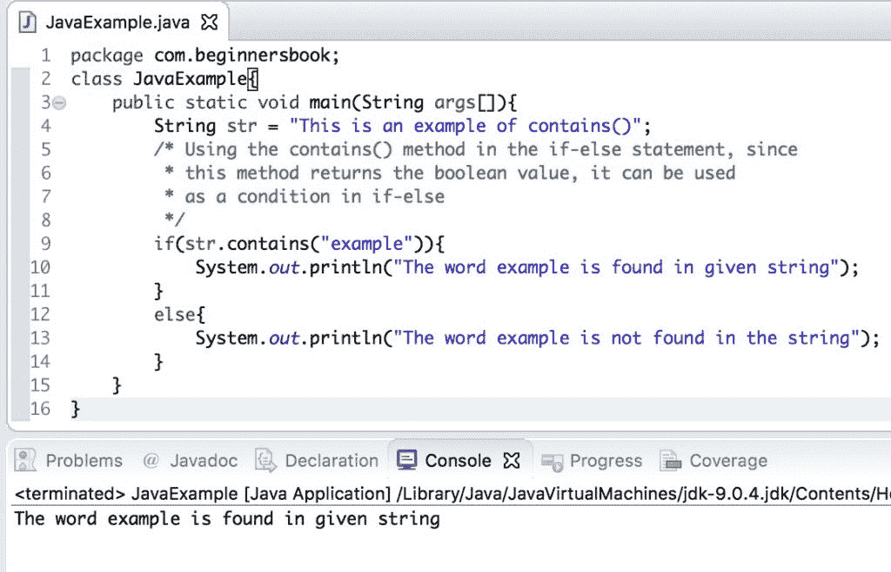

# Java `String contains()`方法

> 原文： [https://beginnersbook.com/2017/10/java-string-contains-method/](https://beginnersbook.com/2017/10/java-string-contains-method/)

Java `String contains()`方法检查特定字符序列是否是给定字符串的一部分。如果给定字符串中存在指定的字符序列，则此方法返回`true`，否则返回`false`。

**例如：**

```java
String str = "Game of Thrones";  

//This will print "true" because "Game" is present in the given String
System.out.println(str.contains("Game"));

/* This will print "false" because "aGme" is not present, the characters
 * must be present in the same sequence as specified in the contains method
 */
System.out.println(str.contains("aGme"));

```

## `contains()`方法的语法

```java
public boolean contains(CharSequence str)
```

返回类型是`boolean`，这意味着此方法返回`true`或`false`。当在给定字符串中找到字符序列时，此方法返回`true`，否则返回`false`。

如果`CharSequence`为`null`，则此方法抛出`NullPointerException`。
例如：像这样调用此方法会抛出`NullPointerException`。

```java
str.contains(null);
```

## Java `String contains()`方法示例

第二个`print`语句显示为`false`，因为`contains()`方法区分大小写。 **您也可以使用`contains()`方法进行不区分大小写的检查**，我已经在本教程末尾介绍了。

```java
class Example{  
   public static void main(String args[]){  
	String str = "Do you like watching Game of Thrones";  
	System.out.println(str.contains("like"));

	/* this will print false as the contains() method is
	 * case sensitive. Here we have mentioned letter "l" 
	 * in upper case and in the actual string we have this
	 * letter in the lower case. 
	 */
	System.out.println(str.contains("Like")); 
	System.out.println(str.contains("Game")); 
	System.out.println(str.contains("Game of")); 
   }
}
```

**输出：**

```java
true
false
true
true
```

## 示例 2：在`if-else`语句中使用 Java `String contains()`方法

我们知道`contains()`方法返回一个布尔值，我们可以将此方法用作[`if-else`语句](https://beginnersbook.com/2017/08/if-else-statement-in-java/)中的条件。

```java
class JavaExample{  
   public static void main(String args[]){  
	String str = "This is an example of contains()";  
	/* Using the contains() method in the if-else statement, since
	 * this method returns the boolean value, it can be used
	 * as a condition in if-else
	 */
	if(str.contains("example")){
		System.out.println("The word example is found in given string");
	}
	else{
		System.out.println("The word example is not found in the string");
	}
   }
}

```

**输出：**



## Java `String contains()`方法，用于不区分大小写的检查

我们在上面已经看到`contains()`方法区分大小写，但是通过一个小技巧，您可以使用此方法进行不区分大小写的检查。让我们举个例子来理解这个：

这里我们使用[`toLowerCase()`方法](https://beginnersbook.com/2013/12/java-string-tolowercase-method-example/)将两个字符串转换为小写，以便我们可以使用`contains()`方法执行不区分大小写的检查。我们也可以使用`toUpperCase()`方法实现同样的目的，如下例所示。

```java
class Example{  
  public static void main(String args[]){  
	String str = "Just a Simple STRING"; 
	String str2 = "string";
	//Converting both the strings to lower case for case insensitive checking
	System.out.println(str.toLowerCase().contains(str2.toLowerCase()));

	//You can also use the upper case method for the same purpose.
	System.out.println(str.toUpperCase().contains(str2.toUpperCase()));
  }
}
```

输出：

```java
true
true
```

#### 参考：

[`String Contains()`方法 JavaDoc](https://docs.oracle.com/javase/7/docs/api/java/lang/String.html#contains(java.lang.CharSequence))