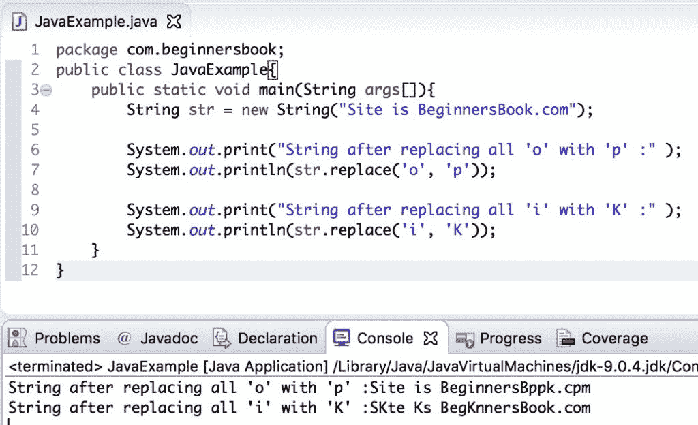
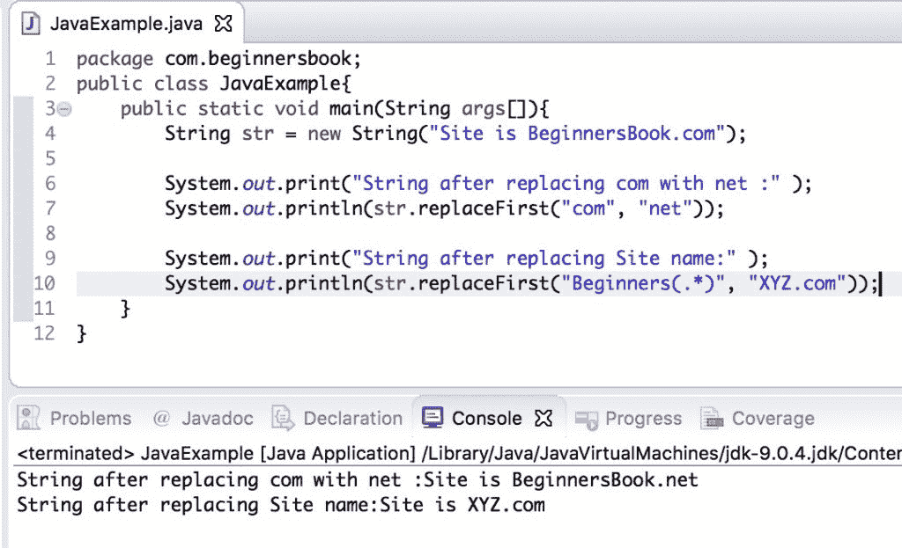
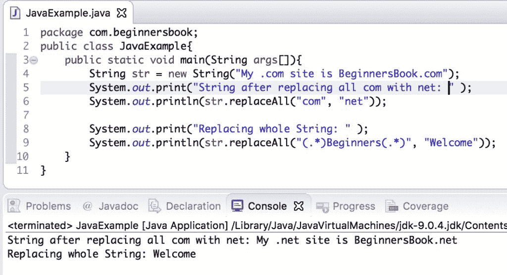

# Java String replace（），replaceFirst（）和 replaceAll（）方法

> 原文： [https://beginnersbook.com/2013/12/java-string-replace-replacefirst-replaceall-method-examples/](https://beginnersbook.com/2013/12/java-string-replace-replacefirst-replaceall-method-examples/)

在本教程中，我们将讨论`replace()`，`replaceFirst()`和`replaceAll()`方法。所有这些 [Java String](https://beginnersbook.com/2013/12/java-strings/) 方法主要用于用另一个 String 替换 String 的一部分。

## Java String 替换方法签名

`String replace(char oldChar, char newChar)`：它用 newChar 字符替换所有出现的 oldChar 字符。对于例如`"pog pance".replace('p', 'd')`将返回`dog dance`。

`String replaceFirst(String regex, String replacement)`：它用替换字符串替换符合指定[正则表达式](https://docs.oracle.com/javase/7/docs/api/java/util/regex/Pattern.html#sum)的第一个子字符串。 [`PatternSyntaxException`](https://docs.oracle.com/javase/7/docs/api/java/util/regex/PatternSyntaxException.html "class in java.util.regex") 如果指定的正则表达式（正则表达式）无效。

`String replaceAll(String regex, String replacement)`：它用替换 String 替换所有符合给定正则表达式的子串。

## Java String replace（）方法示例

在下面的例子中，我们有一个字符串`str`，我们正在演示使用 String str 的 replace（）方法。我们用 char'p'替换了所有出现的 char'o'。在第二个 print 语句中，我们用 char'K'替换了所有出现的 char'i'。

这里我们使用 print 语句显示修改后的字符串，但我们实际上没有更改字符串`str`，为了实现我们需要在字符串中分配返回的 replace（）方法字符串，然后该字符串可以进行永久性更改。

```java
public class JavaExample{
   public static void main(String args[]){
	String str = new String("Site is BeginnersBook.com");

	System.out.print("String after replacing all 'o' with 'p' :" );
	System.out.println(str.replace('o', 'p'));

	System.out.print("String after replacing all 'i' with 'K' :" );
	System.out.println(str.replace('i', 'K'));
   }
}

```

**输出：**



## Java String replaceFirst（）方法示例

在下面的示例中，我们将演示如何使用 replaceFirst（）方法。此方法用新指定的字符串替换字符串的一部分。 replaceFirst（）和 replaceAll（）方法之间的**区别在于 replaceFirst（）替换第一个匹配项，而 replaceAll（）替换所有匹配项。**

```java
public class JavaExample{
   public static void main(String args[]){
	String str = new String("Site is BeginnersBook.com");

	System.out.print("String after replacing com with net :" );
	System.out.println(str.replaceFirst("com", "net"));

	System.out.print("String after replacing Site name:" );
	System.out.println(str.replaceFirst("Beginners(.*)", "XYZ.com"));
   }
}

```

**输出：**



## Java String replaceAll（）方法示例

在下面的示例中，我们使用`replaceAll()`方法用新字符串替换给定子字符串的所有出现。

replace（）和 replaceAll（）方法之间的**区别在于`replace()`方法用新 char 替换所有出现的旧 char，而`replaceAll()`方法用新字符串替换所有出现的旧字符串。基本上，replace（）适用于替换字符，而 replaceAll（）适用于替换部分字符串。**

```java
public class JavaExample{
   public static void main(String args[]){
	String str = new String("My .com site is BeginnersBook.com");
	System.out.print("String after replacing all com with net: " );
	System.out.println(str.replaceAll("com", "net"));

	System.out.print("Replacing whole String: " );
	System.out.println(str.replaceAll("(.*)Beginners(.*)", "Welcome"));
   }
}
```

**输出：**

