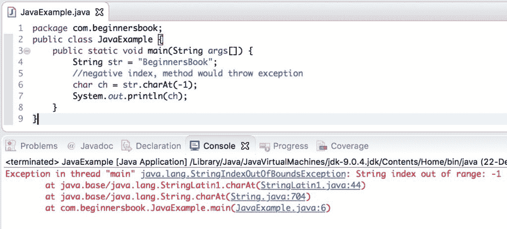
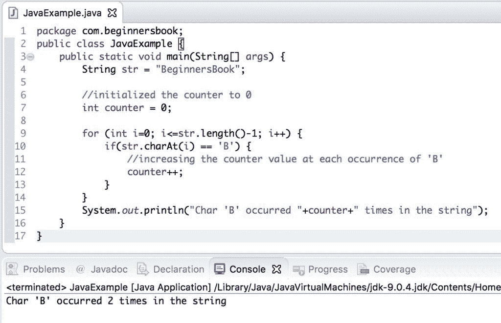

# Java `String charAt()`方法

> 原文： [https://beginnersbook.com/2013/12/java-string-charat-m​​ethod-example/](https://beginnersbook.com/2013/12/java-string-charat-method-example/)

Java `String charAt(int index)`方法返回字符串中指定索引处的字符。我们在此方法中传递的索引值应介于 0 和（`string`的长度 -1）之间。例如：`s.charAt(0)`将返回实例`s`表示的字符串的第一个字符。如果在`charAt()`方法中传递的索引值小于 0 或大于等于字符串的长度（`index < 0 || index >= length()`），则 Java `String charAt`方法抛出[`IndexOutOfBoundsException`](https://docs.oracle.com/javase/7/docs/api/java/lang/IndexOutOfBoundsException.html)。

## Java `String charAt()`方法示例

让我们举一个例子来理解`charAt()`方法的使用。在这个例子中，我们有一个字符串，我们使用`charAt()`方法打印字符串的第 1，第 6，第 12 和第 21 个字符。

```java
public class CharAtExample {
   public static void main(String args[]) {
	String str = "Welcome to string handling tutorial";
	//This will return the first char of the string
	char ch1 = str.charAt(0);

	//This will return the 6th char of the string
	char ch2 = str.charAt(5);

	//This will return the 12th char of the string
	char ch3 = str.charAt(11);

	//This will return the 21st char of the string
	char ch4 = str.charAt(20);

	System.out.println("Character at 0 index is: "+ch1);
	System.out.println("Character at 5th index is: "+ch2);
	System.out.println("Character at 11th index is: "+ch3);
	System.out.println("Character at 20th index is: "+ch4);
   }
}
```

**输出：**

```java
Character at 0 index is: W
Character at 5th index is: m
Character at 11th index is: s
Character at 20th index is: n
```

## 使用`charAt()`方法时的`IndexOutOfBoundsException`

当我们传递负索引或大于`length() - 1`的索引时，`charAt()`方法抛出`IndexOutOfBoundsException`。在下面的示例中，我们在`charAt()`方法中传递负索引，让我们看看我们在输出中得到了什么。

```java
public class JavaExample {
   public static void main(String args[]) {
	String str = "BeginnersBook";
	//negative index, method would throw exception
	char ch = str.charAt(-1);
	System.out.println(ch);
   }
}

```

**输出：**



## Java `String charAt()`示例打印字符串的所有字符

为了打印字符串的所有字符，我们运行[`for`循环](https://beginnersbook.com/2015/03/for-loop-in-java-with-example/)从 0 到字符串的长度 -1，并使用`charAt()`方法在循环的每次迭代中显示字符。

```java
public class JavaExample {
   public static void main(String args[]) {
	String str = "BeginnersBook";
	for(int i=0; i<=str.length()-1; i++) {
		System.out.println(str.charAt(i));
	}
   }
}
```

输出：

```java
B
e
g
i
n
n
e
r
s
B
o
o
k
```

## Java `String charAt()`示例计算字符的出现次数

在此示例中，我们将使用`charAt()`方法计算给定字符串中特定字符的出现次数。这里我们有一个字符串，我们正在计算字符串中字符`'B'`的出现次数。

```java
public class JavaExample {
   public static void main(String[] args) {  
        String str = "BeginnersBook"; 

        //initialized the counter to 0
        int counter = 0;  

        for (int i=0; i<=str.length()-1; i++) {  
            if(str.charAt(i) == 'B') { 
            	//increasing the counter value at each occurrence of 'B'
                counter++;  
            }  
        }  
        System.out.println("Char 'B' occurred "+counter+" times in the string");  
   }  
}
```

**输出：**



#### 参考

[`String charAt()` javadoc](https://docs.oracle.com/javase/7/docs/api/java/lang/String.html#charAt(int))