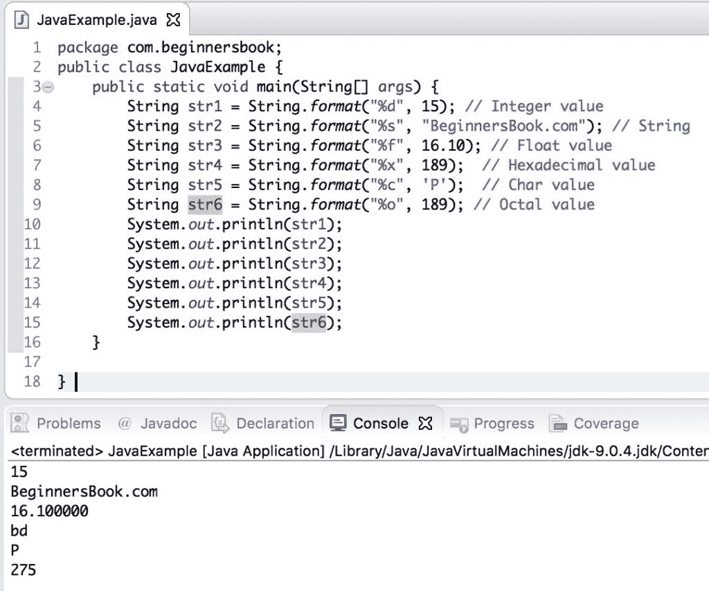

# Java String format（）方法用例子解释

> 原文： [https://beginnersbook.com/2017/10/java-string-format-method/](https://beginnersbook.com/2017/10/java-string-format-method/)

**Java String format（）**方法用于格式化 String。你可以用这个方法做很多事情，例如你可以[使用这种方法连接字符串](https://beginnersbook.com/2013/12/java-string-concat-method-example/)，同时你可以格式化连接字符串的输出。在本教程中，我们将看到 Java String format（）方法的几个示例。

## format（）方法的语法

```
public static String format(Locale l,
            String format,
            Object... args)
```

使用指定的语言环境，格式字符串和参数返回格式化的字符串。

和

```
public static String format(String format,
            Object... args)

```

使用指定的格式字符串和参数返回格式化字符串。

## Java String format（）方法的一个简单示例

```
public class Example{  
   public static void main(String args[]){  
	String str = "just a string";  

	//concatenating string using format
	String formattedString = String.format("My String is %s", str);  

	/*formatting the  value passed and concatenating at the same time
	 * %.6f is for having 6 digits in the fractional part
	 */
	String formattedString2 = String.format("My String is %.6f",12.121);

	System.out.println(formattedString); 
	System.out.println(formattedString2);  
   }
}
```

输出：

```
My String is just a string
My String is 12.121000
```

## Java String format（）连接字符串参数的示例

我们可以使用%1 $，%2 $，..格式说明符指定参数位置。这里%1 $表示第一个参数，%2 $表示第二个参数，依此类推。

```
public class Example{  
   public static void main(String args[]){  
	String str1 = "cool string";
	String str2 = "88";
	/* Specifying argument positions. %1$ is for the first argument and
	 * %2$ is for the second argument
	 */
	String fstr = String.format("My String is: %1$s, %1$s and %2$s", str1, str2);
	System.out.println(fstr);
   }
}
```

Output:

```
My String is: cool string, cool string and 88
```

正如您可以看到我们如何使用参数位置格式说明符在 format（）方法中两次传递字符串“cool string”。

## 使用字符串格式（）填充字符串

在这个例子中，我们用 0 填充一个数字并将数字转换为格式化的字符串。在上面的例子中，我们已经格式化了浮点数和字符串，在这个例子中，我们正在格式化一个整数。要记住的重要一点是，这些格式说明符是不同的。
%s - 对于字符串
%f - 对于浮点数
%d - 对于整数

```
public class Example{  
   public static void main(String args[]){  
	int str = 88;
	/* Left padding an integer number with 0's and converting it
	 * into a String using Java String format() method.
	 */
	String formattedString = String.format("%05d", str);
	System.out.println(formattedString);
   }
}
```

Output:

```
00088
```

## 使用 format（）方法显示 String，int，hexadecimal，float，char，octal 值

在以下示例中，我们使用不同的格式说明符来显示不同类型的值。这里我们展示了一些如何使用 format（）方法将整数值转换为八进制或十六进制值的示例。在此示例之后，我们共享了可用格式说明符的列表。

```
public class JavaExample {  
   public static void main(String[] args) {  
	String str1 = String.format("%d", 15); // Integer value  
	String str2 = String.format("%s", "BeginnersBook.com"); // String  
	String str3 = String.format("%f", 16.10); // Float value  
	String str4 = String.format("%x", 189);  // Hexadecimal value  
	String str5 = String.format("%c", 'P');  // Char value  
	String str6 = String.format("%o", 189); // Octal value
	System.out.println(str1);  
	System.out.println(str2);  
	System.out.println(str3);  
	System.out.println(str4);  
	System.out.println(str5);  
	System.out.println(str6); 
   }  
}
```

**输出：**


## Java 字符串格式说明符

%c - 字符
%d - 整数
%s - 字符串
%o - 八进制
%x - 十六进制
%f - 浮点数
%h - 一个哈希码值

#### 相关文章：

1.  [Java - 左边填充带空格和零的字符串](https://beginnersbook.com/2014/07/java-left-padding-a-string-with-spaces-and-zeros/)
2.  [Java - 右边填充带空格和零的字符串](https://beginnersbook.com/2014/07/java-right-padding-a-string-with-spaces-and-zeros/)

#### 参考文献：

*   [String format（）方法 - JavaDoc](https://docs.oracle.com/javase/7/docs/api/java/lang/String.html#format(java.util.Locale,%20java.lang.String,%20java.lang.Object...))
*   [使用 format（）方法](https://docs.oracle.com/javase/1.5.0/docs/api/java/util/Formatter.html#syntax)连接字符串
*   [String format（）填充示例](https://stackoverflow.com/questions/22416578/how-to-use-string-format-in-java)