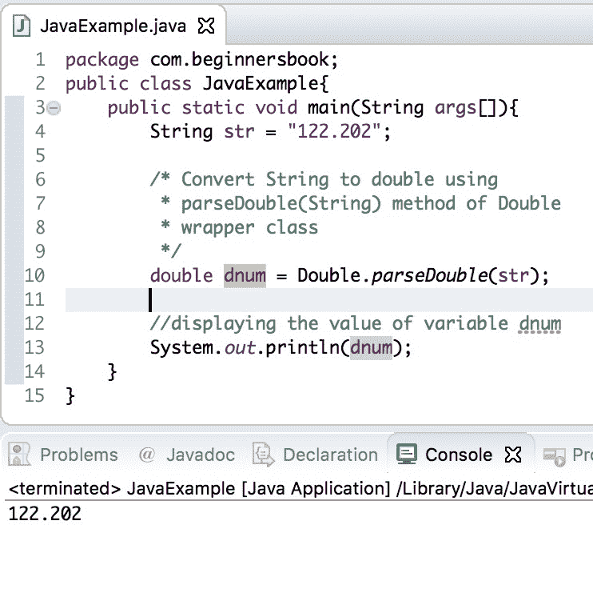
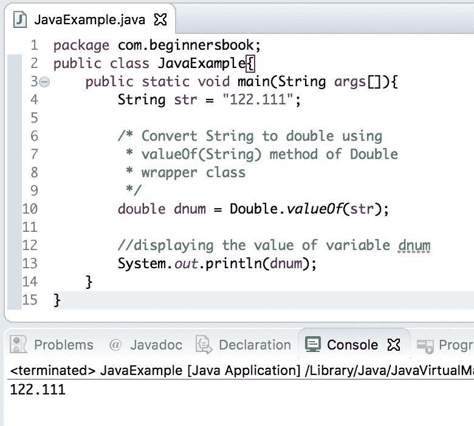

# Java 将 String 转换为 Double 示例

> 原文： [https://beginnersbook.com/2013/12/how-to-convert-string-to-double-in-java/](https://beginnersbook.com/2013/12/how-to-convert-string-to-double-in-java/)

在本指南中，我们将看到如何**在 Java** 中将 String 转换为 Double。将 String 转换为 double 有三种方法。

1\. Java - 使用 Double.parseDouble（String）方法将 String 转换为 Double
2.使用 Double.valueOf（String）
在 Java 中将 String 转换为 Double 3.使用 Double 类的构造函数将 Java 转换为 Double - **自 Java 版本 9** 以来，不推荐使用构造函数 Double（String）

## 1.使用 Double.parseDouble（String）将 Java 转换为 Double

```
public static double parseDouble(String str) throws NumberFormatException
```

此方法返回传递的 String 参数的双精度表示。如果指定的 String str 为空，则此方法抛出 [`NullPointerException`](https://docs.oracle.com/javase/7/docs/api/java/lang/NullPointerException.html) ，如果字符串格式无效，则抛出 [`NumberFormatException`](https://docs.oracle.com/javase/7/docs/api/java/lang/NumberFormatException.html) 。例如，如果字符串是“122.20ab”，则此方法将抛出 NumberFormatException。

```
String str="122.202";
double dnum = Double.parseDouble(str);
```

转换后，double 类型的变量`dnum`的值为 122.202。

让我们看一下使用 parseDouble（String）方法进行转换的完整示例。

### 示例 1：使用 parseDouble（String）将 String 转换为 double 的 Java 程序

```
public class JavaExample{
   public static void main(String args[]){
	String str = "122.202";

	/* Convert String to double using 
	 * parseDouble(String) method of Double
	 * wrapper class
	 */
	double dnum = Double.parseDouble(str);

	//displaying the value of variable dnum
	System.out.println(dnum);
   }
}

```

输出：



## 2.使用 Double.valueOf（String）将 Java 转换为 Double

Java 中 Double [包装类的 valueOf（）方法与我们在上面](https://beginnersbook.com/2017/09/wrapper-class-in-java/) [java 示例](https://beginnersbook.com/2017/09/java-examples/)中看到的 parseDouble（）方法类似。

```
String str = "122.111";
double dnum = Double.valueOf(str);
```

转换后`dnum`的值为 122.111

让我们看看使用 Double.valueOf（String）方法的完整转换示例。

### 示例 2：使用 valueOf（String）将 String 转换为 double 的 Java 程序

```
public class JavaExample{
   public static void main(String args[]){
	String str = "122.111";

	/* Convert String to double using 
	 * valueOf(String) method of Double
	 * wrapper class
	 */
	double dnum = Double.valueOf(str);

	//displaying the value of variable dnum
	System.out.println(dnum);
   }
}

```

输出：



## 3\. Java 使用 Double 类的构造函数将 String 转换为 double

注意：**自 Java 版本 9** 以来，不推荐使用构造函数 Double（String）

```
String str3 = "999.333";
double var3 = new Double(str3);
```

Double 类有一个构造函数，它解析我们在构造函数中传递的 String 参数，并返回一个等效的 double 值。

```
public Double(String s) throws NumberFormatException
```

使用这个构造函数，我们可以通过传递我们想要转换的 String 来创建 Double 类的新对象。

### 示例 3：使用 Double 类的构造函数将 String 转换为 double 的 Java 程序

在这个例子中，我们创建了一个 Double 类的对象，将 String 值转换为 double 值。

```
public class Example{
   public static void main(String args[]){
       String str3 ="999.333";
       double var3 = new Double(str3);
       System.out.println(var3);
   }
}

```

输出：

```
999.333

```

#### 参考文献：

*   [parseDouble（String）JavaDoc](https://docs.oracle.com/javase/7/docs/api/java/lang/Double.html#parseDouble(java.lang.String))
*   [Double.valueOf（String）JavaDoc](https://docs.oracle.com/javase/7/docs/api/java/lang/Double.html#valueOf(java.lang.String))
*   [new Double（String）JavaDoc](https://docs.oracle.com/javase/7/docs/api/java/lang/Double.html#Double(java.lang.String))