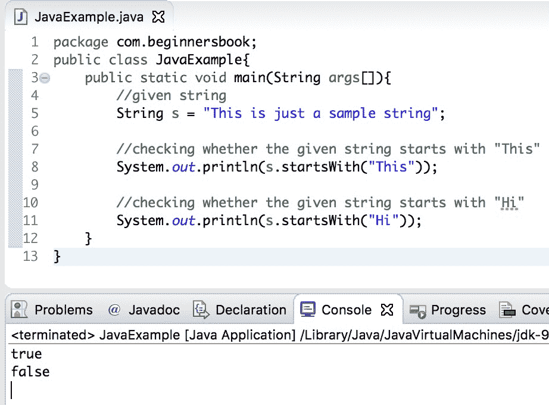

# Java String startsWith（）方法示例

> 原文： [https://beginnersbook.com/2013/12/java-string-startswith-method-example/](https://beginnersbook.com/2013/12/java-string-startswith-method-example/)

**startsWith（）方法**的[字符串类](https://beginnersbook.com/2013/12/java-strings/)用于检查字符串的前缀。它根据给定的字符串是否以指定的字母或单词开头，返回布尔值 true 或 false。

**例如：**

```
String str = "Hello";

//This will return true because string str starts with "He"
str.startsWith("He"); 

```

## Java String startsWith（）方法

StarsWith（）方法有两种变体。

`boolean startsWith(String str)`：如果 String str 是 String 的前缀，则返回 true。

`boolean startsWith(String str, index fromIndex)`：如果 String 以 str 开头，则返回 true，它从指定的索引“fromIndex”开始查找。例如，假设 String s 的值是“Hi there”，我们调用这样的 starsWith（）方法 - s.startsWith（“there”，3）然后这将返回 true，因为我们已经将值 3 作为 fromIndex 传递，搜索关键字“there”从给定字符串 s 的索引 3 开始，并在字符串 s 的开头找到。

## startsWith（）方法的一个简单示例

这是一个简单的例子，我们有一个字符串 s，我们正在使用 startsWith（）方法检查字符串 s 是否以特定的单词开头。

```
public class JavaExample{  
   public static void main(String args[]){ 
	//given string
	String s = "This is just a sample string";  

	//checking whether the given string starts with "This"
	System.out.println(s.startsWith("This"));  

	//checking whether the given string starts with "Hi"
	System.out.println(s.startsWith("Hi"));  
   }
}
```

**输出：**



## Java String startsWith（）方法示例

让我们举一个例子，我们使用 startsWith（）方法的两种变体。

```
public class StartsWithExample{
   public static void main(String args[]) {
       String str= new String("quick brown fox jumps over the lazy dog");
       System.out.println("String str starts with quick: "+str.startsWith("quick"));
       System.out.println("String str starts with brown: "+str.startsWith("brown"));
       System.out.println("substring of str(starting from 6th index) has brown prefix: "
+str.startsWith("brown", 6));
       System.out.println("substring of str(starting from 6th index) has quick prefix: "
+str.startsWith("quick", 6));

   }
}
```

**输出：**

```
String str starts with quick: true
String str starts with brown: false
substring of str(starting from 6th index) has brown prefix: true
substring of str(starting from 6th index) has quick prefix: false

```