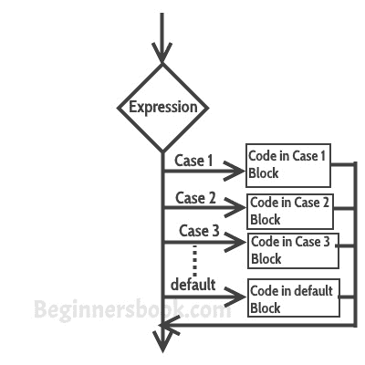

# Java 中的`switch-case`语句

> 原文： [https://beginnersbook.com/2017/08/java-switch-case/](https://beginnersbook.com/2017/08/java-switch-case/)

当我们有多个选项（或选项）时，会使用 **`Switch case`语句**，我们可能需要为每个选项执行不同的任务。

`Switch case`语句的语法如下所示：
```java
switch (variable or an integer expression)
{
     case constant:
     //Java code
     ;
     case constant:
     //Java code
     ;
     default:
     //Java code
     ;
}
```

> `Switch Case`语句主要用于[`break`语句](https://beginnersbook.com/2017/08/java-break-statement/)，即使它是可选的。我们将首先看到一个没有`break`语句的例子，然后我们将讨论`switch case`和`break`。

## 一个简单的`switch case`

```java
public class SwitchCaseExample1 {

   public static void main(String args[]){
     int num=2;
     switch(num+2)
     {
        case 1:
	  System.out.println("Case1: Value is: "+num);
	case 2:
	  System.out.println("Case2: Value is: "+num);
	case 3:
	  System.out.println("Case3: Value is: "+num);
        default:
	  System.out.println("Default: Value is: "+num);
      }
   }
}
```

**输出：**

```java
Default: Value is: 2
```

**说明：**在`switch`中我给出了一个表达式，你也可以给变量。我给了`num + 2`，其中`num`值是 2，并且在添加之后表达式得到 4.由于没有用值 4 定义的情况，所以执行了默认情况。这就是为什么我们应该在`switch case`中使用`default`，这样如果没有匹配条件，则执行默认块。

## `switch case`流程图

首先，求值在`switch`括号中提供的变量，值或表达式，然后根据结果，执行与结果匹配的相应`case`块。




## `switch-case`中的`break`语句

在 switch case 中，break 语句是可选的，但几乎每次处理 switch case 时都会使用它。在我们讨论 break 语句之前，让我们看看下面的例子，我没有使用 break 语句：

```java
public class SwitchCaseExample2 {

   public static void main(String args[]){
      int i=2;
      switch(i)
      {
	 case 1:
	   System.out.println("Case1 ");
	 case 2:
	   System.out.println("Case2 ");
	 case 3:
	   System.out.println("Case3 ");
	 case 4:
           System.out.println("Case4 ");
	 default:
	   System.out.println("Default ");
      }
   }
}

```

**输出：**

```java
Case2 
Case3 
Case4 
Default 

```

> 在上面的程序中，我们已经将整数值 2 传递给了`switch`，所以控制切换到了`case 2`，但是在`case 2`之后我们没有使用`break`语句导致流程传递到后续`case`直到结束。这个问题的解决方案是`break`语句

当您希望程序流从`switch`主体中出来时，使用`Break`语句。每当在`switch`主体中遇到`break `语句时，执行流程将直接从`switch`中出来，忽略其余的情况。

让我们采用相同的例子，但这次使用`break`语句。

## `break`语句的示例

```java
public class SwitchCaseExample2 {

   public static void main(String args[]){
      int i=2;
      switch(i)
      {
	 case 1:
	   System.out.println("Case1 ");
	   break;
	 case 2:
	   System.out.println("Case2 ");
	   break;
	 case 3:
	   System.out.println("Case3 ");
	   break;
	 case 4:
           System.out.println("Case4 ");
           break;
	 default:
	   System.out.println("Default ");
      }
   }
}
```

**输出：**

```java
Case2
```

现在您可以看到只有`case 2`已被执行，其余`case`被忽略。

**为什么我默认后不使用`break`语句？**

控制流本身会在默认情况下从`switch`中出来，所以我没有使用它，但是如果您仍然想在默认情况下使用`break`，那么您可以使用它，这样做没有坏处。

## 有关`switch-case`的几点意见

1）`case`并不总是需要顺序 1,2,3 等。它可以在`case`关键字后面包含任何整数值。此外，`case`不需要始终按升序排列，您可以根据要求以任何顺序指定它们。

2）您也可以在`switch case`中使用字符。例如：

```java
public class SwitchCaseExample2 {

   public static void main(String args[]){
      char ch='b';
      switch(ch)
      {
	 case 'd':
	   System.out.println("Case1 ");
	   break;
	 case 'b':
	   System.out.println("Case2 ");
	   break;
	 case 'x':
	   System.out.println("Case3 ");
	   break;
	 case 'y':
           System.out.println("Case4 ");
           break;
	 default:
	   System.out.println("Default ");
      }
   }
}
```

3）`switch`内部给出的表达式应该是一个常量值，否则它将无效。

例如：

**`switch`的有效表达式：**

```java
switch(1+2+23)
switch(1*2+3%4)
```

**无效的`switch`表达式：**

```java
switch(ab+cd)
switch(a+b+c)
```

4）允许嵌套`switch`语句，这意味着你可以在另一个`switch`内部使用`switch`语句。但是应该避免使用嵌套的`switch`语句，因为它会使程序更复杂，更不易读。

看看这些相关的 [java 程序](https://beginnersbook.com/2017/09/java-examples/)：

1.  [Java 程序：使用`Switch Case `检查字符是元音还是辅音](https://beginnersbook.com/2017/09/java-program-to-check-vowel-and-consonant-using-switch-case/)
2.  [Java 程序：使用`Switch Case`制作简单计算器](https://beginnersbook.com/2017/09/java-program-to-make-a-calculator-using-switch-case/)