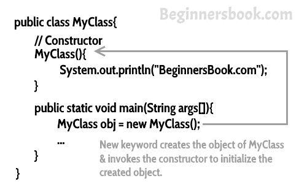
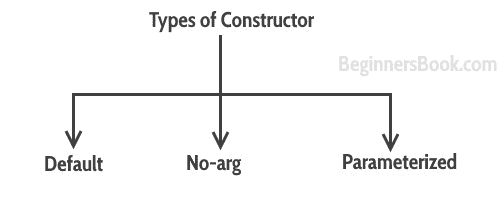
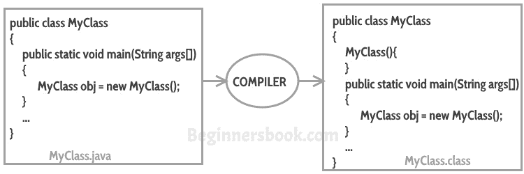
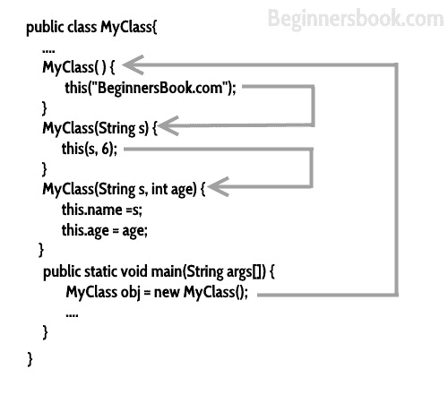
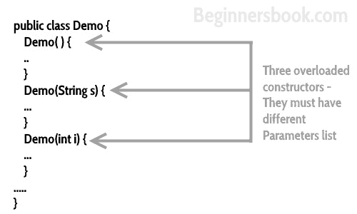

# Java 中的构造函数 - 一个完整的研究!!

> 原文： [https://beginnersbook.com/2013/03/constructors-in-java/](https://beginnersbook.com/2013/03/constructors-in-java/)

构造函数是一个初始化新创建对象的代码块。构造函数类似于 java 中的实例方法，但它不是一个方法，因为它没有返回类型。简而言之，构造函数和方法是不同的（本指南末尾有更多内容）。人们经常在 Java 中将构造函数称为特殊类型的方法。

构造函数与类具有相同的名称，在 java 代码中看起来像这样。

```java
public class MyClass{
   //This is the constructor
   MyClass(){
   }
   ..
}
```

> 请注意，构造函数名称与类名称匹配，并且它没有返回类型。

## 构造函数如何工作

为了理解构造函数的工作，我们举个例子。假设我们有一个班级`MyClass`。
当我们像这样创建`MyClass`的对象时：

```java
MyClass obj = new MyClass()
```

**new 关键字**在这里创建类`MyClass`的对象并调用构造函数来初始化这个新创建的对象。

你可能会在这里丢失一些，因为我没有向你展示任何初始化示例，让我们看看下面的代码：

### java 中的一个简单的构造函数程序

这里我们创建了类`Hello`的对象`obj`，然后我们显示了对象的实例变量`name`。正如您所看到的那样，输出是`BeginnersBook.com`，这是我们在构造函数初始化期间传递给`name`的内容。这表明当我们创建对象`obj`时，构造函数被调用了。在这个例子中我们使用了**这个关键字**，它引用了当前对象，在这个例子中是对象`obj`。我们将在下一个教程中详细介绍此关键字。

```java
public class Hello {
   String name;
   //Constructor
   Hello(){
      this.name = "BeginnersBook.com";
   }
   public static void main(String[] args) {
      Hello obj = new Hello();
      System.out.println(obj.name);
   }
}
```

**输出：**

```java
BeginnersBook.com
```



## 构造函数的类型

构造函数有三种类型：Default，No-arg 构造函数和 Parameterized。


### 默认构造函数

如果您没有在类中实现任何构造函数，Java 编译器会代表您将[默认构造函数](https://beginnersbook.com/2014/01/default-constructor-java-example/)插入到代码中。此构造函数称为默认构造函数。您不会在源代码（java 文件）中找到它，因为它将在编译期间插入到代码中并存在于.class 文件中。该过程如下图所示：


> 如果实现任何构造函数，则不再从 Java 编译器接收默认构造函数。

### 无参数构造函数：

没有参数的构造函数称为 **no-arg 构造函数**。签名与默认构造函数相同，但是 body 可以具有任何代码，而不像构造函数的主体为空的默认构造函数。

> 虽然你可能会看到有些人声称默认和 no-arg 构造函数是相同的，但实际上它们不是，即使你在类`Demo`中编写 **public Demo（）{}** 它也无法调用默认构造函数，因为你已经编写了它的代码。

#### 示例：无参构造函数

```java
class Demo
{
     public Demo()
     {
         System.out.println("This is a no argument constructor");
     }
     public static void main(String args[]) {
    	 new Demo();
     }
}

```

输出：
这是一个无参构造函数

### 参数化构造函数

带参数的构造函数（或者你可以说参数）被称为[参数化构造函数](https://beginnersbook.com/2014/01/parameterized-constructor-in-java-example/)。

#### 示例：参数化构造函数

在这个例子中，我们有一个带有两个参数`id`和`name`的参数化构造函数。在创建对象`obj1`和`obj2`时，我传递了两个参数，以便在创建 obj1 和 obj2 之后调用此构造函数。

```java
public class Employee {

   int empId;  
   String empName;  

   //parameterized constructor with two parameters
   Employee(int id, String name){  
       this.empId = id;  
       this.empName = name;  
   }  
   void info(){
        System.out.println("Id: "+empId+" Name: "+empName);
   }  

   public static void main(String args[]){  
	Employee obj1 = new Employee(10245,"Chaitanya");  
	Employee obj2 = new Employee(92232,"Negan");  
	obj1.info();  
	obj2.info();  
   }  
}

```

**输出：**

```java
Id: 10245 Name: Chaitanya
Id: 92232 Name: Negan
```

#### 示例 2：参数化构造函数

在这个例子中，我们有两个构造函数，一个默认构造函数和一个参数化构造函数。当我们在使用 new 关键字创建对象时不传递任何参数时，将调用默认构造函数，但是当您传递参数时，将调用与传递的参数列表匹配的参数化构造函数。

```java
class Example2
{
      private int var;
      //default constructor
      public Example2()
      {
             this.var = 10;
      }
      //parameterized constructor
      public Example2(int num)
      {
             this.var = num;
      }
      public int getValue()
      {
              return var;
      }
      public static void main(String args[])
      {
              Example2 obj = new Example2();
              Example2 obj2 = new Example2(100);
              System.out.println("var is: "+obj.getValue());
              System.out.println("var is: "+obj2.getValue());
      }
}

```

**输出：**

```java
var is: 10
var is: 100

```

## 如果在类中仅实现参数化构造函数，该怎么办？

```java
class Example3
{
      private int var;
      public Example3(int num)
      {
             var=num;
      }
      public int getValue()
      {
              return var;
      }
      public static void main(String args[])
      {
              Example3 myobj = new Example3();
              System.out.println("value of var is: "+myobj.getValue());
      }
}
```

**输出**：会抛出编译错误。原因是，语句`Example3 myobj = new Example3()`正在调用我们程序中没有的默认构造函数。当您没有在类中实现任何构造函数时，编译器会将默认构造函数插入到您的代码中，但是当您实现任何构造函数时（在上面的示例中，我已经使用 int 参数实现了参数化构造函数），那么您不会收到默认构造函数通过编译器进入你的代码。

如果我们从上面的代码中删除参数化构造函数，那么程序运行正常，因为编译器会将默认构造函数插入到代码中。

## 构造函数链接

当构造函数调用同一个类的另一个构造函数时，这称为构造函数链接。在这里阅读更多相关信息 [](https://beginnersbook.com/2013/12/java-constructor-chaining-with-example/) 。


## `super()`

每当调用子类构造函数时，它都会隐式调用父类的构造函数。您还可以说编译器在子类构造函数的开头插入`super();`语句。

```java
class MyParentClass {
   MyParentClass(){
	System.out.println("MyParentClass Constructor");
   }
}
class MyChildClass extends MyParentClass{
   MyChildClass() {
	System.out.println("MyChildClass Constructor");
   }
   public static void main(String args[]) {
	new MyChildClass();
   }
}
```

**输出：**

```java
MyParentClass Constructor
MyChildClass Constructor
```

在这里阅读更多关于[超级关键字的信息](https://beginnersbook.com/2014/07/super-keyword-in-java-with-example/)。

## 构造函数重载

构造函数重载是一个具有多个具有不同参数列表的构造函数的概念，以这种方式使每个构造函数执行不同的任务。


有关详细信息，请参阅示例的[构造函数重载。](https://beginnersbook.com/2013/05/constructor-overloading/)

## Java 复制构造函数

复制构造函数用于将一个对象的值复制到另一个对象。

```java
class JavaExample{  
   String web; 
   JavaExample(String w){  
	web = w;
   }  

   /* This is the Copy Constructor, it 
    * copies the values of one object
    * to the another object (the object
    * that invokes this constructor)
    */
   JavaExample(JavaExample je){  
	web = je.web; 
   }  
   void disp(){
	System.out.println("Website: "+web);
   }  

   public static void main(String args[]){  
	JavaExample obj1 = new JavaExample("BeginnersBook");  

	/* Passing the object as an argument to the constructor
	 * This will invoke the copy constructor
	 */
	JavaExample obj2 = new JavaExample(obj1);  
	obj1.disp();  
	obj2.disp();  
   }  
}
```

输出：

```java
Website: BeginnersBook
Website: BeginnersBook
```

## 快速回顾

1.  每个类都有一个构造函数，无论它是普通类还是抽象类。
2.  构造函数不是方法，它们没有任何返回类型。
3.  构造函数名称应与类名匹配。
4.  构造函数可以使用任何访问说明符，也可以将它们声明为私有。私有构造函数在 java 中是可能的，但是范围只在类中。
5.  **类似构造函数方法也可以具有与类名相同的名称，但它们仍然具有返回类型，尽管我们可以识别它们是方法而不是构造函数。**
6.  如果你没有在类中实现任何构造函数，编译器将执行它。
7.  **this（）和 super（）应该是构造函数代码中的第一个语句。** 如果您不提及它们，编译器会相应地为您执行此操作。
8.  构造函数重载是可能的，但是无法覆盖。这意味着我们可以在类中重载构造函数，但是我们不能覆盖构造函数。
9.  构造函数不能被继承。
10.  如果 Super 类没有 no-arg（默认）构造函数，那么编译器不会像在正常情况下那样在子类中插入默认构造函数。
11.  接口[没有构造函数](https://beginnersbook.com/2013/12/java-constructor-in-interface/)。
12.  抽象类可以有构造函数，当实现接口的类被实例化时，它会被调用。 （即具体类的对象创建）。
13.  构造函数也可以调用同一个类的另一个构造函数 - 使用 this（）。如果你想调用一个参数化的构造函数，那么就这样做： **this（参数列表）**。

**有关构造函数的更多信息：**

*   [私有构造函数](https://beginnersbook.com/2013/12/java-private-constructor-example/)
*   [我们可以在 Java 中使用静态构造函数吗？](https://beginnersbook.com/2013/05/static-constructor/)

## 构造函数和方法之间的区别

我知道我应该在本指南的开头提到它，但我想要涵盖流程中的所有内容。希望你不要介意:)

1.  构造函数的目的是初始化类的对象，而方法的目的是通过执行 java 代码来执行任务。
2.  方法可以是构造函数，不能是抽象的，最终的，静态的和同步的。
3.  当方法有时，构造函数没有返回类型。