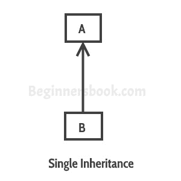
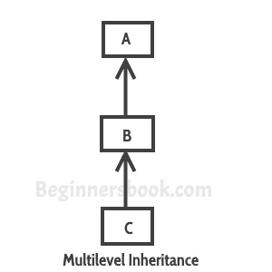
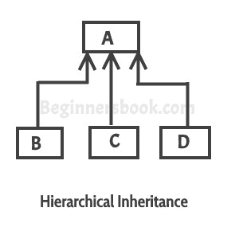
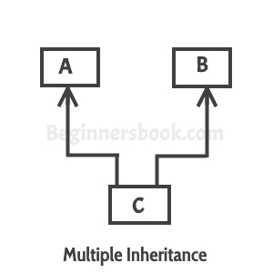

# Java 编程中的继承

> 原文： [https://beginnersbook.com/2013/03/inheritance-in-java/](https://beginnersbook.com/2013/03/inheritance-in-java/)

一个类获取另一个类的属性（数据成员）和功能（方法）的过程称为**继承**。继承的目的是提供代码的可重用性，以便类只需要编写唯一的特性，其余的公共属性和功能可以从另一个类扩展。

**子类：**

扩展另一个类的特性的类称为子类，子类或派生类。

**父类：**

其属性和功能由另一个类使用（继承）的类称为父类，超类或基类。

> 继承是通过扩展其公共数据成员和方法，基于现有类定义新类的过程。
> 
> 继承允许我们重用代码，它提高了 java 应用的可重用性。
> 
> 注意：继承的最大**优势是，基类中已经存在的代码不需要在子类中重写。**

这意味着父类的数据成员（实例变量）和方法可以在子类中使用。

> 如果您发现很难理解什么是类和对象，那么请参考我在面向对象编程上分享的指南：[OOP 概念](https://beginnersbook.com/2013/04/oops-concepts/)。

让我们回到主题：

## 语法：Java 中的继承

要继承一个类，我们使用`extends`关键字。这里的类`XYZ`是子类，类`ABC`是父类。`XYZ`类继承了`ABC`类的属性和方法。

```java
class XYZ extends ABC
{
}
```

## 继承示例

在这个例子中，我们有一个基类`Teacher`和一个子类`PhysicsTeacher`。由于类`PhysicsTeacher`扩展了基类的`designation`和`collegeName`属性以及`does()`方法，我们不需要在子类中声明这些属性和方法。

这里我们有`collegeName`，`designation`和`does()`方法，这些方法对于所有老师都是通用的，所以我们在基类中声明了它们，这样像`MathTeacher`，`MusicTeacher`和`PhysicsTeacher`这样的子类不会需要编写此代码，可以直接从基类中使用。

```java
class Teacher {
   String designation = "Teacher";
   String collegeName = "Beginnersbook";
   void does(){
	System.out.println("Teaching");
   }
}

public class PhysicsTeacher extends Teacher{
   String mainSubject = "Physics";
   public static void main(String args[]){
	PhysicsTeacher obj = new PhysicsTeacher();
	System.out.println(obj.collegeName);
	System.out.println(obj.designation);
	System.out.println(obj.mainSubject);
	obj.does();
   }
}

```

输出：

```java
Beginnersbook
Teacher
Physics
Teaching

```

> 基于上述例子，我们可以说`PhysicsTeacher` **IS-A** `Teacher`。这意味着子类与父类具有 IS-A 关系。这是继承被称为子类和父类之间的 **IS-A 关系**

**注意：**
派生类继承声明为`public`或`protected`的所有成员和方法。如果超类的成员或方法声明为`private`，则派生类不能直接使用它们。私有成员只能在自己的类中访问。只能使用公共或受保护的超类获取器和设置器方法访问此类私有成员，如下例所示。

```java
class Teacher {
   private String designation = "Teacher";
   private String collegeName = "Beginnersbook";
   public String getDesignation() {
	return designation;
   }
   protected void setDesignation(String designation) {
	this.designation = designation;
   }
   protected String getCollegeName() {
	return collegeName;
   }
   protected void setCollegeName(String collegeName) {
	this.collegeName = collegeName;
   }
   void does(){
	System.out.println("Teaching");
   }
}

public class JavaExample extends Teacher{
   String mainSubject = "Physics";
   public static void main(String args[]){
	JavaExample obj = new JavaExample();
	/* Note: we are not accessing the data members 
	 * directly we are using public getter method 
	 * to access the private members of parent class
	 */
	System.out.println(obj.getCollegeName());
	System.out.println(obj.getDesignation());
	System.out.println(obj.mainSubject);
	obj.does();
   }
}

```

输出是：

```java
Beginnersbook
Teacher
Physics
Teaching

```

在上面的例子中需要注意的重要一点是，子类能够通过父类的**受保护方法**访问父类的私有成员。当我们创建一个实例变量（数据成员）或方法**受保护**时，这意味着它们只能在类本身和子类中访问。这些公共，受保护，私有等都是访问说明符，我们将在接下来的教程中讨论它们。

## 继承的类型

要详细了解继承类型，请参阅： [Java 中的继承类型](https://beginnersbook.com/2013/05/java-inheritance-types/)。

**单一继承**：指的是一个子类和父类关系，其中一个类扩展另一个类。



[多级继承](https://beginnersbook.com/2013/12/multilevel-inheritance-in-java-with-example/)：指一个类扩展子类的子类和父类关系。例如，`C`类扩展了`B`类，`B`类扩展了`A`类。



[分层继承](https://beginnersbook.com/2013/10/hierarchical-inheritance-java-program/)：指的是子类和父类关系，其中多个类扩展同一个类。例如，`B`，`C`和`B`类。`D`扩展了相同的`A`类。



**多重继承** ：指一个类扩展多个类的概念，这意味着子类有两个父类。例如，类`C`扩展了类`A`和`B`. Java 不支持多重继承，请阅读[多重继承](https://beginnersbook.com/2013/05/java-multiple-inheritance/) 。



[混合继承](https://beginnersbook.com/2013/10/hybrid-inheritance-java-program/)：在单个程序中组合多种类型的继承。例如`A`类和`A`类。`B`扩展了类`C`，另一个类`D`扩展了类`A`，然后这是一个混合继承示例，因为它是单继承和层次继承的组合。

## 构造函数和继承

当我们创建子类的对象时，会调用子类的[构造函数](https://beginnersbook.com/2013/03/constructors-in-java/)，它默认调用超类的默认构造函数。因此，在继承中，对象是自上而下构造的。可以使用[`super`关键字](https://beginnersbook.com/2014/07/super-keyword-in-java-with-example/)显式调用超类构造函数，但它应该是构造函数中的第一个语句。`super`关键字指的是超类，紧接在层次结构中的调用类之上。不允许使用多个`super`关键字来访问除直接父级之外的祖先类。

```java
class ParentClass{
   //Parent class constructor
   ParentClass(){
	System.out.println("Constructor of Parent");
   }
}
class JavaExample extends ParentClass{
   JavaExample(){
	/* It by default invokes the constructor of parent class
	 * You can use super() to call the constructor of parent.
	 * It should be the first statement in the child class
	 * constructor, you can also call the parameterized constructor
	 * of parent class by using super like this: super(10), now
	 * this will invoke the parameterized constructor of int arg
	 */
	System.out.println("Constructor of Child");
   }
   public static void main(String args[]){
	//Creating the object of child class
	new JavaExample();
   }
}
```

输出：

```java
Constructor of Parent
Constructor of Child
```

## 继承和方法覆盖

当我们在父类中已经存在的子类中声明相同的方法时，这称为[方法覆盖](https://beginnersbook.com/2014/01/method-overriding-in-java-with-example/)。在这种情况下，当我们从子类对象调用该方法时，将调用该方法的子类版本。但是我们可以使用`super`关键字调用父类方法，如下例所示：

```java
class ParentClass{
   //Parent class constructor
   ParentClass(){
	System.out.println("Constructor of Parent");
   }
   void disp(){
	System.out.println("Parent Method");
   }
}
class JavaExample extends ParentClass{
   JavaExample(){
	System.out.println("Constructor of Child");
   }
   void disp(){
	System.out.println("Child Method");
        //Calling the disp() method of parent class
	super.disp();
   }
   public static void main(String args[]){
	//Creating the object of child class
	JavaExample obj = new JavaExample();
	obj.disp();
   }
}

```

输出是：

```java
Constructor of Parent
Constructor of Child
Child Method
Parent Method

```