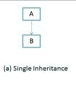
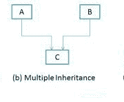
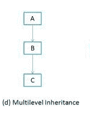
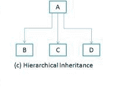
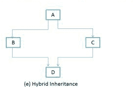

# Java 中的继承类型：单一，多重，多级和混合

> 原文： [https://beginnersbook.com/2013/05/java-inheritance-types/](https://beginnersbook.com/2013/05/java-inheritance-types/)

以下是 Java 中的各种类型的继承。我们将在示例和流程图的帮助下逐一看到它们中的每一个。

### 1）单一继承

**单继承**很容易理解。当一个类只扩展另一个类时，我们称之为单个继承。下面的流程图显示 B 类只扩展了一个 A 类。这里 A 是 B 的**父类**，B 是 A 的**子类**。

### [](https://beginnersbook.com/wp-content/uploads/2013/05/Single-Inheritance.png)

**Java 中的单一继承示例程序**

```java
Class A
{
   public void methodA()
   {
     System.out.println("Base class method");
   }
}

Class B extends A
{
   public void methodB()
   {
     System.out.println("Child class method");
   }
   public static void main(String args[])
   {
     B obj = new B();
     obj.methodA(); //calling super class method
     obj.methodB(); //calling local method
  }
}
```

### 2）多重继承

“**多重继承**”是指一个类扩展（或继承）多个基类的概念。我们之前学到的继承具有一个基类或父类的概念。 “多重继承”的问题是派生类必须管理对两个基类的依赖。

[](https://beginnersbook.com/wp-content/uploads/2013/05/Multiple-Inheritance.png)

注 1：在软件项目中很少使用多重继承。使用多重继承通常会导致层次结构中出现问题。当进一步扩展课程时，这会导致不必要的复杂性。

注 2：大多数新的 OO 语言如 **Small Talk，Java，C＃不支持多重继承**。 C ++支持多重继承。

### 3）多级继承

**多级继承**是指 OO 技术中的一种机制，可以从派生类继承，从而使这个派生类成为新类的基类。正如您在下面的流程图中所见，C 是 B 的子类或子类，B 是 A 的子类。有关更多详细信息和示例，请参阅 - [Java 中的多级继承](https://beginnersbook.com/2013/12/multilevel-inheritance-in-java-with-example/ "Multilevel")。

[](https://beginnersbook.com/wp-content/uploads/2013/05/Multilevel-Inheritance.png)

**Java 中的多级继承示例程序**

```java
Class X
{
   public void methodX()
   {
     System.out.println("Class X method");
   }
}
Class Y extends X
{
public void methodY()
{
System.out.println("class Y method");
}
}
Class Z extends Y
{
   public void methodZ()
   {
     System.out.println("class Z method");
   }
   public static void main(String args[])
   {
     Z obj = new Z();
     obj.methodX(); //calling grand parent class method
     obj.methodY(); //calling parent class method
     obj.methodZ(); //calling local method
  }
}
```

### 4）分层继承

在这种类型的继承中，一个类由许多**子类**继承。在下面的例子 B 类中，C 和 D **继承**相同的 A 类.A 是 B，C&amp; A 的**父类（或基类）**。 D.阅读更多 - [java 中的分层继承与示例程序](https://beginnersbook.com/2013/10/hierarchical-inheritance-java-program/ "Hierarchical")。

[](https://beginnersbook.com/wp-content/uploads/2013/05/Hierarchical-Inheritance.png)

### 5）混合继承

简单来说，你可以说混合遗传是**单**和**多** **遗传的组合。** 典型的流程图如下所示。可以在 java 中实现混合继承，就像多继承一样！使用接口。是的，你听到了。通过使用**接口**，您可以在 Java 中拥有多个以及**混合继承**。

阅读完整的文章 - 使用示例程序在 java 中进行[混合继承。](https://beginnersbook.com/2013/10/hybrid-inheritance-java-program/ "Hybrid")

[](https://beginnersbook.com/wp-content/uploads/2013/05/Hybrid-inheritance.png)