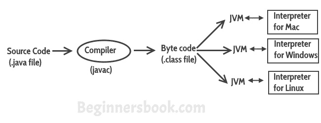
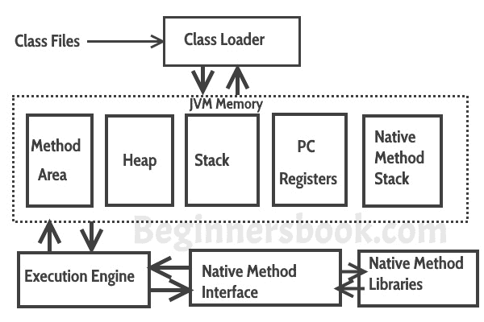
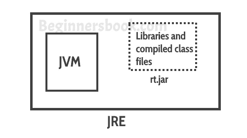
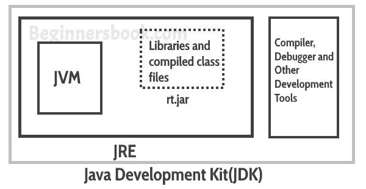

# Java 虚拟机（JVM），JDK 差异，JRE 和 JVM - 核心 Java

> 原文： [https://beginnersbook.com/2013/05/jvm/](https://beginnersbook.com/2013/05/jvm/)

Java 是一种高级编程语言。用高级语言编写的程序不能直接在任何机器上运行。首先，需要将其翻译成特定的机器语言。 **javac 编译器**做了这件事，它需要 java 程序（包含源代码的.java 文件）并将其转换为机器代码（称为字节代码或.class 文件）。

Java 虚拟机（JVM）是​​驻留在真实机器（您的计算机）中的虚拟机，而 JVM 的**机器语言是字节代码**。这使编译器更容易，因为它必须为 JVM 生成字节代码，而不是为每种类型的机器生成不同的机器代码。 JVM 执行编译器生成的字节代码并生成输出。 **JVM 是独立于 Java 平台的**。

所以，现在我们知道 JVM 的主要功能是执行编译器生成的字节代码。 **每个操作系统都有不同的 JVM，但是在执行字节代码后它们产生的输出在所有操作系统中都是相同的。** 这意味着在 Windows 上生成的字节代码可以在 Mac OS 上运行，反之亦然。这就是我们将 java 称为平台无关语言的原因。同样的事情可以在下图中看到：

> **总结一切：** Java 虚拟机（JVM）是​​在实际机器（您的计算机）上运行并执行 Java 字节代码的虚拟机。 JVM 不了解 Java 源代码，这就是我们需要使用 javac 编译器来编译* .java 文件以获取包含 JVM 理解的字节代码的* .class 文件的原因。 JVM 使 java 可移植（一次编写，随处运行）。每个操作系统都有不同的 JVM，但是在执行字节代码后它们产生的输出在所有操作系统中都是相同的。

## JVM 架构

**让我们看看 JVM 是如何工作的**：
**类加载器：**类加载器读取.class 文件并将字节代码保存在**方法区域中**。

**方法区**：JVM 中只有一个方法区域在所有类之间共享。这保存了每个.class 文件的类级别信息。

**堆**：堆是分配对象的 JVM 内存的一部分。 JVM 为每个.class 文件创建一个 Class 对象。

**Stack** ：Stack 也是 JVM 内存的一部分，但与 Heap 不同，它用于存储临时变量。

**PC 寄存器**：用于跟踪已执行的指令以及将要执行的指令。由于指令由线程执行，因此每个线程都有一个单独的 PC 寄存器。

**Native 方法堆栈：**本机方法可以访问虚拟机的运行时数据区域。

**Native Method 接口**：它使 java 代码能够被本机应用程序调用或调用。本机应用程序是特定于系统的硬件和操作系统的程序。

**垃圾收集**：类代码由 java 代码显式创建，使用后会被垃圾收集自动销毁以进行内存管理。

## JVM 与 JRE 对比 JDK

JRE：JRE 是 java 虚拟机运行的环境。 JRE 包含 Java 虚拟机（JVM），类库和其他文件，不包括编译器和调试器等开发工具。
这意味着您可以在 JRE 中运行代码，但无法在 JRE 中开发和编译代码。

JVM：如上所述，JVM 使用 JRE 提供的类，库和文件来运行程序。

JDK：JDK 是 JRE 的超集，它包含 JRE 与开发工具（如编译器，调试器等）的所有内容。
