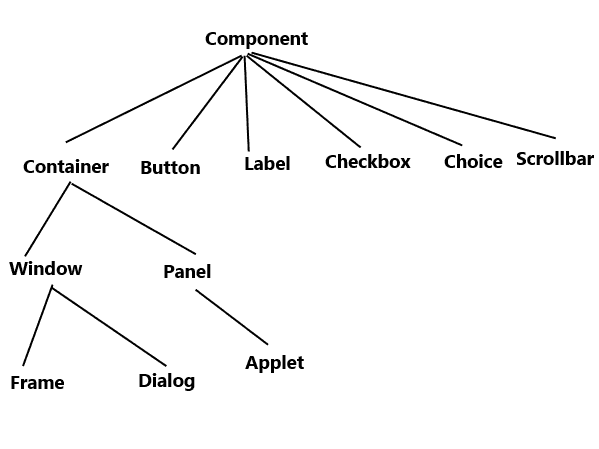
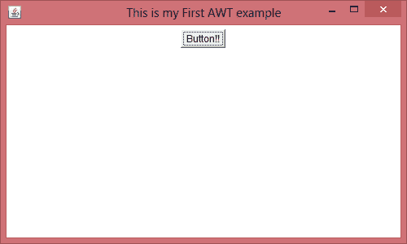
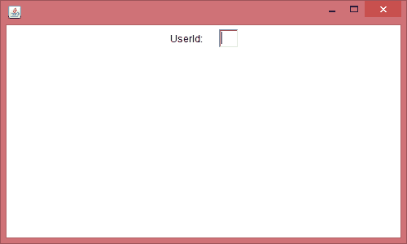

# Java AWT 初学者教程

> 原文： [https://beginnersbook.com/2015/06/java-awt-tutorial/](https://beginnersbook.com/2015/06/java-awt-tutorial/)

**AWT** 代表**抽象窗口工具包**。它是一个依赖于平台的 API，用于为 Java 程序创建图形用户界面（GUI）。

**为什么 AWT 与平台有关？** Java AWT 调用本机平台（操作系统）子程序，用于创建文本框，复选框，按钮等组件。例如，具有按钮的 AWT GUI 在诸如 Windows，Mac OS 和 Windows 等平台之间具有不同的外观和感觉。 Unix，这是因为这些平台的原生按钮具有不同的外观和感觉，AWT 直接调用创建按钮的原生子程序。简单来说，基于 AWT 的应用在 Windows 上运行时看起来就像一个 Windows 应用，但在 Mac OS 上运行时，相同的应用看起来就像是 Mac 应用。

AWT 现在很少使用，因为它具有平台依赖性和重量级特性。 AWT 组件被认为是重量级的，因为它们是由底层操作系统（OS）生成的。例如，如果您在 AWT 中实例化一个文本框，这意味着您实际上要求操作系统为您创建一个文本框。

Swing 是基于窗口的应用的首选 API，因为它具有平台独立性和轻量级特性。 Swing 基于 AWT API 构建，但它提供与底层平台无关的外观。它具有比 AWT 更强大，更灵活的组件。除了熟悉的组件，如按钮，复选框和标签，Swing 还提供了几个高级组件，如选项卡式面板，滚动窗格，树，表和列表。我们将在单独的教程中详细讨论 Swing。

## AWT 层次结构




## 组件和容器

按钮，文本字段，滚动条等所有元素都称为组件。在 AWT 中，我们为每个组件提供了类，如上图所示。要将屏幕上的所有内容放置到特定位置，我们必须将它们添加到容器中。容器就像一个屏幕，我们在其中放置按钮，文本字段，复选框等组件。简而言之，容器包含并控制组件的布局。容器本身是一个组件（如上面的层次结构图所示），因此我们可以在容器内添加一个容器。

**容器类型：**

如上所述，容器是我们添加文本字段，按钮，复选框等组件的地方。AWT 中有四种类型的容器：窗口，框架，对话框和小组。如上面的层次结构图所示，`Frame`和`Dialog`是`Window`类的子类。

**窗口：** `Window`类的一个实例没有边框也没有标题
**对话框：** `Dialog`类有边框和标题。没有`Frame`类的关联实例，`Dialog`类的实例不能存在。
**面板：**面板不包含标题栏，菜单栏或边框。它是用于保持组件的通用容器。`Panel`类的实例提供了一个要添加组件的容器。
**框架：**框架有标题，边框和菜单栏。它可以包含几个组件，如按钮，文本字段，滚动条等。这是在 AWT 中开发应用时使用最广泛的容器。

## Java AWT 示例

我们可以用两种方式使用`Frame`创建一个 GUI：

1）通过扩展`Frame`类

2）通过创建`Frame`类的实例
让我们看一下每个示例。

## AWT 示例 1：通过扩展`Frame`类来创建`Frame`

```java
import java.awt.*;
/* We have extended the Frame class here,
 * thus our class "SimpleExample" would behave
 * like a Frame
 */
public class SimpleExample extends Frame{
    SimpleExample(){  
        Button b=new Button("Button!!"); 

        // setting button position on screen
        b.setBounds(50,50,50,50);  

        //adding button into frame 
        add(b); 

        //Setting Frame width and height
        setSize(500,300); 

        //Setting the title of Frame
        setTitle("This is my First AWT example"); 

        //Setting the layout for the Frame
        setLayout(new FlowLayout());

        /* By default frame is not visible so 
         * we are setting the visibility to true 
         * to make it visible.
         */
        setVisible(true);  
    }  
    public static void main(String args[]){  
         // Creating the instance of Frame
         SimpleExample fr=new SimpleExample();  
    }
}
```

**输出：**



## AWT 示例 2：通过创建`Frame`类的实例来创建`Frame`

```java
import java.awt.*;
public class Example2 {
   Example2()
   {
      //Creating Frame    
      Frame fr=new Frame();       

      //Creating a label
      Label lb = new Label("UserId: "); 

      //adding label to the frame
      fr.add(lb);           

      //Creating Text Field
      TextField t = new TextField();

      //adding text field to the frame
      fr.add(t);

      //setting frame size
      fr.setSize(500, 300);  

      //Setting the layout for the Frame
      fr.setLayout(new FlowLayout());

      fr.setVisible(true);                
   }
   public static void main(String args[])
   {
       Example2 ex = new Example2(); 
   }
}
```

**输出：**

