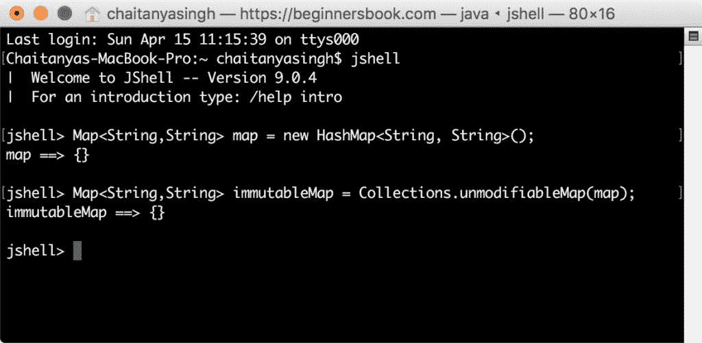
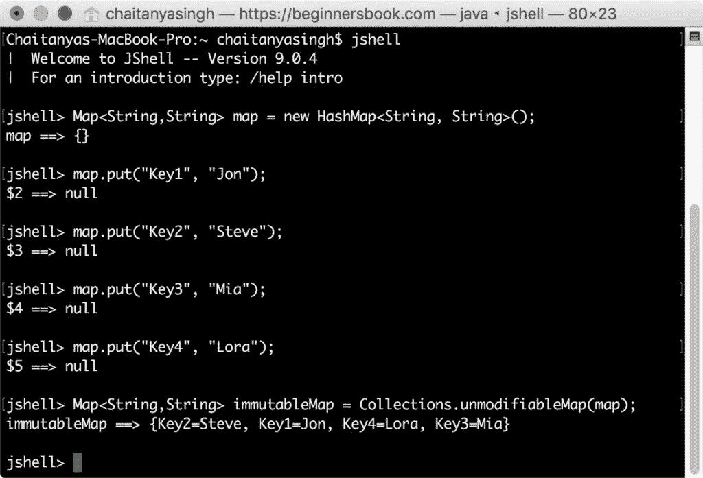

# Java 9 - 用于创建不可变映射的工厂方法

> 原文： [https://beginnersbook.com/2018/04/java-9-factory-methods-to-create-immutable-map/](https://beginnersbook.com/2018/04/java-9-factory-methods-to-create-immutable-map/)

在之前的教程中，我们了解了 **Java 9 中引入的**工厂方法**创建[不可变 List](https://beginnersbook.com/2018/04/java-9-factory-method-to-create-immutable-list/) 和[不可变 Set](https://beginnersbook.com/2018/04/java-9-factory-methods-to-create-immutable-set/) 。在本指南中，我们将学习**如何使用 Java 9 Factory 方法**创建不可变 Map 和 Map.Entry。**

## 1.在 Java 9 之前创建不可变映射

在我们看到如何使用 Java 9 工厂方法创建不可变 Map 之前，让我们看看我们在 Java 9 之前如何创建它们**。**

### 1.1 在 Java 之前创建空映射 9

我们曾经使用 [Collections](https://beginnersbook.com/java-collections-tutorials/) 类的 unmodifiableMap（）方法来创建不可修改的（不可变的）Map。

```
Map<String,String> map = new HashMap<String, String>();
Map<String,String> immutableMap = Collections.unmodifiableMap(map);
```

让我们在 [JShell](https://beginnersbook.com/2018/04/java-9-jshell-repl/) 中测试一下。


### 1.2 在 Java 之前创建非空映射 9

```

Map<String,String> map = new HashMap<String, String>();
map.put("Key1", "Jon");
map.put("Key2", "Steve");
map.put("Key3", "Mia");
map.put("Key4", "Lora");
Map<String,String> immutableMap = Collections.unmodifiableMap(map);
```

让我们在 JShell 中测试它。


## 2\. Java 9 Factory 方法创建不可变 Map

Java 9 中引入了几种有用的工厂方法来创建不可修改的 Map。我们将采用与上面相同的示例来比较 Java 9 中的事情变得更容易。在 Java 9 之前编写的代码行在工厂方法的帮助下大大减少了。

### 2.1 Java 9 - 使用 Map.of（）工厂方法的不可变空映射

**我们用于空地图的方法：**

```
static <K,V> Map<K,V> of()
```

**示例：**

```
Map<String,String> immutableMap = Map.of()
```

**在 JShell 中测试：**

```
jshell> Map<String,String> immutableMap = Map.of()
immutableMap ==> {}
```

### 2.2 Java 9 - 使用 Map.of（Key，Value ...）工厂方法的不可变非空映射

```
static <K,V> Map<K,V> of(K k1, V v1, K k2, V v2...)
```

**示例：**
为了演示使用 Map.of（）工厂方法，我们采用了与上面使用 unmodifiableMap（）方法相同的示例。正如您所看到的，它在 Java 9 中是多么简单。我们在一行中减少了 6 行代码。

```
Map<String, String> immutableMap = 
Map.of("Key1", "Jon", "Key2", "Steve", "Key3", "Mia", "Key4", "Lora")
```

**Testing in JShell:**

```
jshell> Map<String, String> immutableMap = 
Map.of("Key1", "Jon", "Key2", "Steve", "Key3", "Mia", "Key4", "Lora")
immutableMap ==> {Key3=Mia, Key4=Lora, Key1=Jon, Key2=Steve}
```

## 什么是不可变的地图？

1.不可变映射不允许添加，删除和更新其元素。如果您尝试执行这些操作，程序将抛出`UnsupportedOperationException`。

```
jshell> Map<String, String> immutableMap = 
Map.of("Key1", "Jon", "Key2", "Steve", "Key3", "Mia", "Key4", "Lora")
immutableMap ==> {Key3=Mia, Key4=Lora, Key1=Jon, Key2=Steve}

jshell> immutableMap.put("Key5", "Chaitanya");
| java.lang.UnsupportedOperationException thrown:
| at ImmutableCollections.uoe (ImmutableCollections.java:71)
| at ImmutableCollections$AbstractImmutableMap.put 
(ImmutableCollections.java:558)
| at (#2:1)
```

2.他们不允许 null 元素。添加 null 元素会抛出相同的`UnsupportedOperationException`。