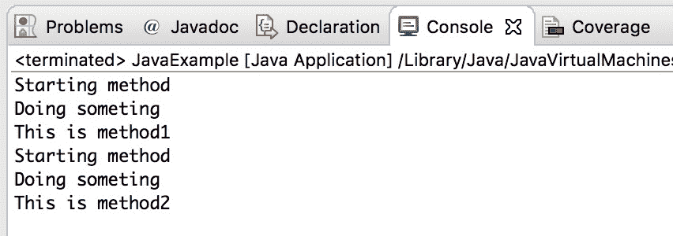
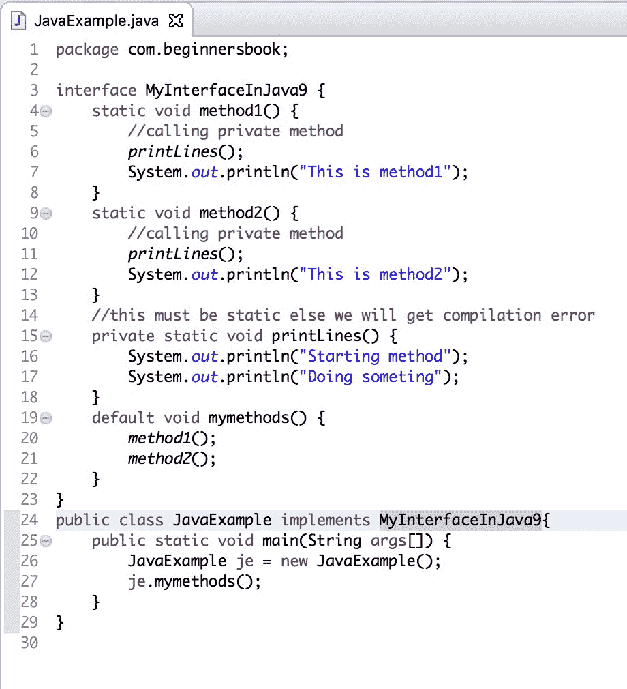

# Java 9 - 接口中的私有方法（带示例）

> 原文： [https://beginnersbook.com/2018/05/java-9-private-methods-in-interfaces-with-examples/](https://beginnersbook.com/2018/05/java-9-private-methods-in-interfaces-with-examples/)

我们知道 [Java 8](https://beginnersbook.com/2017/10/java-8-features-with-examples/) 允许我们在 Interface 中创建[默认和静态方法。目的是在接口上添加新方法，而不会破坏已经实现这些接口的类。](https://beginnersbook.com/2017/10/java-8-interface-changes-default-method-and-static-method/) [Java 9](https://beginnersbook.com/2018/04/java-9-features-with-examples/) 引入了另一个新功能，Java 9 SE 以后我们可以在接口中拥有**私有方法。在本指南中，我们将了解为什么他们添加了此功能，它的用途以及如何使用它。**

## 为什么 Java 9 允许我们在接口中使用私有方法？

Java 9 在**的接口中引入了私有方法，通过私有方法共享多个默认方法的公共代码来删除冗余**。

为了理解这一点，我们必须在 Java 8 中使用一个示例（没有私有方法），然后我们将使用 Java 9（使用私有方法）采用相同的示例。

**Java 8 中的示例 - 具有重复代码的多个默认方法（公共代码）**
在此示例中，我们将看到默认方法如何具有重复代码，这些代码不必要地增加代码行并使代码更少 - 可读。我们将使用私有方法再次使用相同的示例来查看私有方法如何帮助我们避免重复的代码。

```java
interface MyInterfaceInJava8 {
   default void method1() {
	System.out.println("Starting method");
	System.out.println("Doing someting");
	System.out.println("This is method1");
   }
   default void method2() {
	System.out.println("Starting method");
	System.out.println("Doing someting");
	System.out.println("This is method2");
   }
}
public class JavaExample implements MyInterfaceInJava8{
   public static void main(String args[]) {
	JavaExample je = new JavaExample();
	je.method1();
	je.method2();
   }
}
```

输出：


**Java 9 中的示例 - 使用私有方法共享公共代码的默认方法**
我们采用的是上面我们看到的相同示例。这次我们将介绍一种私有方法来共享公共代码。

```java
interface MyInterfaceInJava9 {
   default void method1() {
	//calling private method
	printLines();
	System.out.println("This is method1");
   }
   default void method2() {
	//calling private method
	printLines();
	System.out.println("This is method2");
   }
   private void printLines() {
	System.out.println("Starting method");
	System.out.println("Doing someting");
   }
}
public class JavaExample implements MyInterfaceInJava9{
   public static void main(String args[]) {
	JavaExample je = new JavaExample();
	je.method1();
	je.method2();
   }
}
```

输出：

```java
Starting method
Doing someting
This is method1
Starting method
Doing someting
This is method2
```

如您所见，输出相同，代码大小已减少。

基于此，我们可以说在接口中拥有私有方法的**优点是：
1.允许默认方法共享公共代码以避免重复代码（冗余）
2.提高可读性码。**

## Java 9 - 私有静态方法

到目前为止，我们已经倾向于如何在接口中使用私有方法来共享默认方法的公共代码。 Java 9 还允许我们在接口中使用**私有静态方法。**

从 java 8 开始，我们可以在接口中使用静态方法和默认方法。我们不能使用非静态私有方法共享静态方法的公共代码，我们必须使用私有静态方法来做到这一点。

让我们举一个例子来理解这一点。

```java
interface MyInterfaceInJava9 {
   static void method1() {
	//calling private method
	printLines();
	System.out.println("This is method1");
   }
   static void method2() {
	//calling private method
	printLines();
	System.out.println("This is method2");
   }
   //this must be static else we will get compilation error
   private static void printLines() {
	System.out.println("Starting method");
	System.out.println("Doing someting");
   }
   default void mymethods() {
	method1();
	method2();
   }
}
public class JavaExample implements MyInterfaceInJava9{
   public static void main(String args[]) {
	JavaExample je = new JavaExample();
	je.mymethods();
   }
}
```

Output:

```java
Starting method
Doing someting
This is method1
Starting method
Doing someting
This is method2
```

这是 Eclipse Oxygen 的截图。
