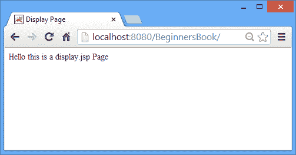
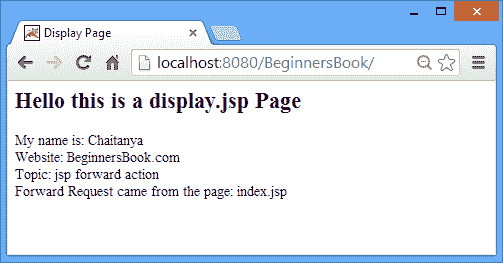

# JSP `forward`动作标签

> 原文： [https://beginnersbook.com/2013/11/jsp-forward-action-tag/](https://beginnersbook.com/2013/11/jsp-forward-action-tag/)

JSP `forward`动作标签用于将请求转发到另一个资源（它可以是 JSP，静态页面，如 HTML 或 Servlet）。可以使用或不使用参数转发请求。在本教程中，我们将看到`<jsp:forward>`的示例。动作标签。

**语法：**

1）带参数的转发。

```html
<jsp:forward page="display.jsp"> 
<jsp:param ... /> 
<jsp:param ... /> 
<jsp:param ... /> 
...
<jsp:param ... /> 
</jsp:forward>
```

2）没有参数的转发。

```html
<jsp:forward page="Relative_URL_of_Page" />
```

`Relative_URL_of_Page`：如果页面位于主页面所在的同一目录中，则使用页面名称本身，就像我在下面的示例中所做的那样。

### JSP 转发示例 1 - 不传递参数

在这个例子中，我们有两个 JSP 页面 - `index.jsp`和`display.jsp`。我们使用了`index.jsp`中的动作标签`<jsp:forward>`，用于将请求转发给`display.jsp`。这里我们在使用动作标签时没有传递任何参数。在下一个示例中，我们还将参数传递给另一个资源。

`index.jsp`

```html
<html> 
<head>
<title>JSP forward action tag example</title>
</head>
<body> 
<p align="center">My main JSP page</p>
<jsp:forward page="display.jsp" /> 
</body> 
</html>
```

`display.jsp`

```html
<html>
<head>
<title>Display Page</title>
</head>
<body>
Hello this is a display.jsp Page
</body>
</html>
```

**输出：**

下面是上面代码的输出。它基本上是`display.jsp`的内容，它清楚地表明`index.jsp`在将请求转发到`display.jsp`页面时没有显示。



### JSP 转发示例 2 - 带参数

这里我们传递参数和前向请求。对于传递参数，我们使用<jsp:param>`动作标签。在这个例子中，我们传递了 4 个参数并转发，后来我们在转发的页面上显示它们。为了获取`display.jsp`页面上的参数，我们使用[`request`隐式对象](https://beginnersbook.com/2013/11/jsp-implicit-object-request-with-examples/)的`getParameter`方法。

`index.jsp`

```html
<html> 
<head>
<title>JSP forward example with parameters</title>
</head>
<body> 
<jsp:forward page="display.jsp"> 
<jsp:param name="name" value="Chaitanya" /> 
<jsp:param name="site" value="BeginnersBook.com" /> 
<jsp:param name="tutorialname" value="jsp forward action" /> 
<jsp:param name="reqcamefrom" value="index.jsp" /> 
</jsp:forward> 
</body> 
</html>
```

`display.jsp`

```html
<html>
<head>
<title>Display Page</title>
</head>
<body>
<h2>Hello this is a display.jsp Page</h2>
My name is: <%=request.getParameter("name") %><br>
Website: <%=request.getParameter("site") %><br>
Topic: <%=request.getParameter("tutorialname") %><br>
Forward Request came from the page: <%=request.getParameter("reqcamefrom") %>
</body>
</html>
```

**输出：**

上面的代码直接显示了`display.jsp`页面，它显示了从`index.jsp`页面传递的参数。

